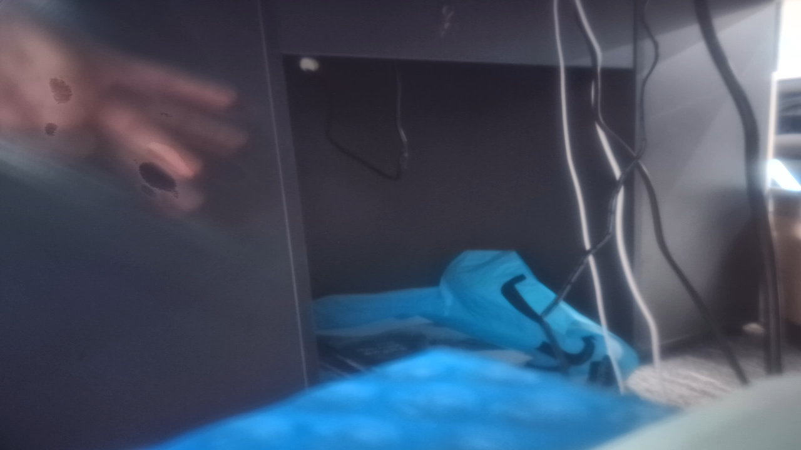
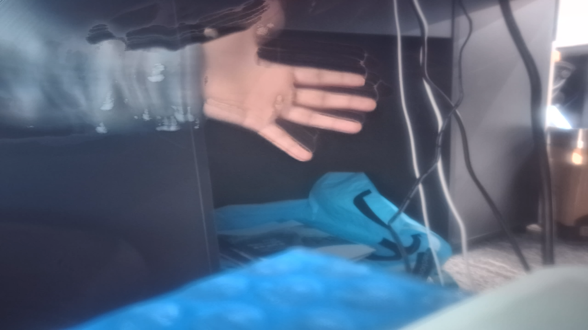
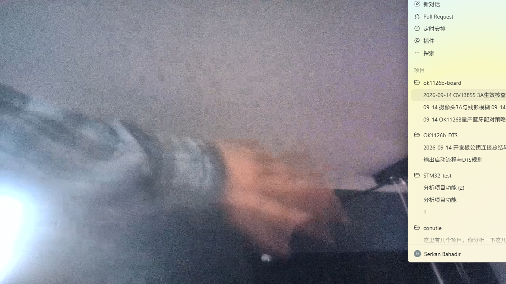

# 09-14 摄像头 3A、残影与模糊调试总结

**日期：** 2026-09-14
**设备：** `root@192.168.137.2`，OV13855，RKAIQ/ISP 3.5
**本机接收端：** `192.168.137.1`，VLC

## 问题：VLC 只读秒、没有画面或画面不稳定

### 现象

最初 RTP/UDP 接收端没有可用的 SDP/参数集，VLC 可能只显示计时；随后即便有画面，日志出现大量 TS 连续性中断和“picture is too late”。这类问题会制造马赛克、卡顿和假性残影，不能用于判断 ISP 画质。

### 调试中的卡点

- UDP 使用所有接口/双栈绑定时，短时间看似正常，延长观察后仍出现连续性中断。
- 发送端编码正常不等于接收端没有丢包；必须以 VLC 日志中的 TS 连续性和迟到帧统计为准。

### 解决方法

**改动 1：将测试流改为 MPEG-TS，并重复插入 H.264 SPS/PPS。**

目的：让 VLC 在中途接入时也能获得解码参数，而不是长期等待关键帧配置。

```bash
h264parse config-interval=-1 ! mpegtsmux alignment=7
```

**改动 2：将最终测试链路由 UDP 改为 TCP。**

目的：排除 UDP 报文丢失、乱序和 VLC 双栈接收带来的传输伪影；这不是 ISP 调参。

```bash
gst-launch-1.0 -e \
  v4l2src device=/dev/video23 ! \
  video/x-raw,format=NV12,width=1280,height=720,framerate=15/1 ! \
  mpph264enc bps=6000000 ! \
  h264parse config-interval=-1 ! \
  mpegtsmux alignment=7 ! \
  tcpserversink host=0.0.0.0 port=5001 sync=true async=false
```

VLC 使用：

```text
tcp://192.168.137.2:5001
```

并固定软件解码及 1000 ms 网络缓存：

```text
--avcodec-hw=none --network-caching=1000
```

### 解决后现象

最终 6 Mb/s TCP 日志复核：TS 中断 `2` 次（接收端刚加入时发生，后续未增长），损坏帧 `0`、迟到帧 `0`、解码错误 `0`。因此，后续截图中的残影和噪点不是网络丢包或 VLC 解码错误造成的。

---

## 问题：怀疑 3A 没有生效，且启动画面偏暗/发灰

### 现象



早期 IQ 文件中的初始曝光曾被调整为较长曝光与较高增益，画面仍显得低反差、偏糊。该现象本身不能证明 3A 未运行：镜头炫光、暗场高增益和错误的初始参数也会出现类似观感。

### 调试中的卡点

- 仅凭一帧画面无法区分“3A 未启动”“3A 正在工作但已触及曝光限制”和“光学/照明问题”。
- 传感器驱动的 `horizontal_blanking` 报告出现无符号回绕值，不能据此可靠地单独推导精确行时。

### 解决方法

**改动 1：先备份已修改 IQ，再恢复原始 OV13855 IQ。**

目的：消除此前 `30 ms / 8×` 初始曝光改动对判断的干扰，建立可回滚基线。

```bash
# 已保存：修改前的 IQ
/userdata/iq_backup/ov13855_default_default.json.pre_ab_20260914_074143

# 恢复原始基线
cp -f /userdata/iq_backup/ov13855_default_default.json.orig \
  /etc/iqfiles/ov13855_default_default.json
/etc/init.d/S40rkaiq_3A stop
/etc/init.d/S40rkaiq_3A start
```

**改动 2：用连续帧和实时 V4L2 控制量验证 AE。**

目的：以实际曝光和增益变化判断 3A，而不是以主观画面亮度判断。

```bash
v4l2-ctl -d /dev/v4l-subdev5 --list-ctrls | \
  grep -E 'exposure|vertical_blanking|analogue_gain'
```

### 解决后现象

已验证事实：

- `rkaiq_3A_server` 持续运行，并加载 `ov13855_default_default.json`。
- AE 会从低曝光/低增益逐步提高并收敛，说明 AE 不是“没有运行”。
- 最新复核时，`exposure=9642/9642`、`analogue_gain=1984/1984`，均达到允许上限，表明当前有效照度不足，AE 已无更多余量。

因此，**“画面不好”不能归因于 3A 没启动；更准确的结论是 3A 已运行但处于暗场极限。**

---

## 问题：动态画面存在多重残影、斑驳和油画感

### 现象



动态手部出现多个相对清晰、彼此分离的轮廓，并伴随不规则斑块。这种“前帧残留”的形态不同于普通单帧运动模糊。

### 调试中的卡点

- 当时同时存在暗场、高增益、长曝光、BTNR、YNR/CNR、H.264 编码和 UDP 传输等变量。
- 必须先解决传输问题，再一次只改一个 ISP 变量；否则无法判定残影来自网络、编码还是时域降噪。
- 设备库中能找到 BTNR 强度 API 符号，但当前系统未提供已验证的安全命令行客户端；`rkaiq_tool_server --help` 异常退出。因此没有猜测 ISP 3.5 深层融合字段含义后直接批量调权重。

### 解决方法

**改动：在三个场景中将 `bayertnr.en` 从 `1` 改为 `0`。**

目的：仅关闭 Bayer 时域降噪（BTNR），验证多重残影是否由跨帧融合造成。正常、夜景和 HDR 三个场景都同步修改，避免场景切换后测试条件改变。

```diff
 "bayertnr": {
   "opMode": "RK_AIQ_OP_MODE_AUTO",
-  "en": 1,
+  "en": 0,
   "bypass": 0
 }
```

改动前已备份：

```text
/userdata/iq_backup/ov13855_default_default.json.pre_btnr_off_20260914_075146
SHA-256: 02183d781c631b851369f842b2e9e20d3708406283dcb40d2cad0bd6e78dcb42
```

当前测试 IQ 的 SHA-256：

```text
513c3a6a880f095da56016330f1d17c214c8e9391ecad583b16bfee274c963bc
```

### 解决后现象



已验证事实：

- 关闭 BTNR 后，原有“多个分离的清晰手部轮廓”和油画状残留明显减弱。
- 同时，平坦墙面出现强烈随机颗粒；这与模拟增益已满值一致。
- 手部仍有宽而连续的拖糊；结合曝光已达到每帧上限，这是长曝光运动模糊，不能靠关闭 BTNR 消除。

合理推测：BTNR 是多重残影的主要来源之一，但并非唯一画质问题；剩余模糊主要受长曝光影响。镜头是否失焦目前未证实，因为测试主体主要是无纹理墙面和运动手部。

---

## 下一步

1. 保留当前 TCP、6 Mb/s、15 fps 链路作为稳定画质测试基线。
2. 不把 `bayertnr.en=0` 作为最终配置。应恢复 BTNR，并通过已验证的运行时强度接口或对应版本的 ISP3.5 文档，将时域降噪调到中等强度；不能猜测深层融合字段。
3. 单独限制自动曝光上限至约 `1/30 s`，以减少动态拖糊。代价是画面会更暗或需要更高增益，因此必须配合照明测试。
4. 将灯移到摄像头后方、均匀照亮被摄物，避免强光直接进入镜头造成炫光、过曝和测光冲突。
5. 在均匀强光下，对准印刷文字或棋盘格拍摄静态图；若仍软，才进入镜头保护膜、镜头污渍和固定焦距位置的光学排查。

## 当前状态

- 网络/解码链路：已稳定。
- 3A 是否运行：已确认运行。
- BTNR 残影来源：已通过开关 A/B 得到强证据。
- 成品 IQ：尚未完成；当前 `BTNR=0` 仅为诊断状态，存在不可接受的噪声。
