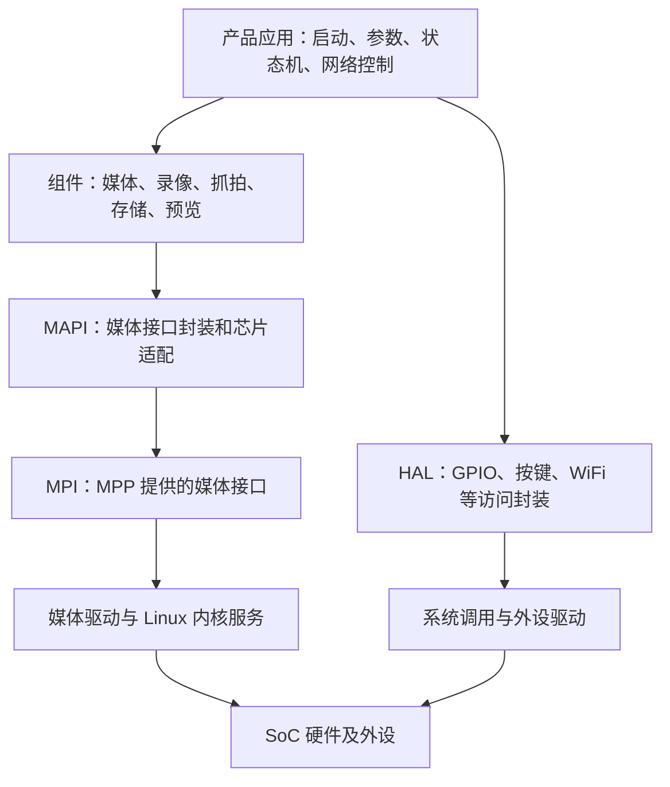
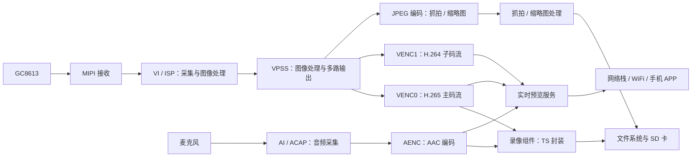

# Hi3516CV610 与 HC112 从零入门

> 从 C、Linux 基础走到项目框架、音视频通路和问题定位。  
> 阅读对象：希望从基础开始，逐步掌握本项目代码实现的开发者。  
> 教学主线：Hi3516CV610、Linux、128 MiB、GC8613 单摄、无屏录像。  
> 核对工程：`Z:\HC1XX_SPC020`；核对日期：2026-09-23。  
> 当前工程选择的是 IMX675 单摄；GC8613 是本文选用的教学案例。本次只读源码和资料，未编译、未连接板端验证。

## 0. 怎么使用这份文档

目标是逐渐获得三种能力：知道一个功能属于哪一层；能沿配置、调用和数据找到相关代码；能用证据判断问题并解释修改原因。

第一次阅读只求建立整体印象，不要求记住所有缩写。按下面的顺序分段学习：

| 阅读轮次 | 阅读内容 | 本轮完成标准 |
|---|---|---|
| 第一轮，约 30～60 分钟 | [配置基线](#baseline)、[整体架构](#architecture)、[工程地图](#source-map)、[音视频](#media) | 能画出芯片、Linux、应用的关系，以及一条录像数据流 |
| 第二轮，分几次完成 | [C 基础](#c-basics)、[Linux 与启动](#linux-boot)、[参数生效](#configuration) | 能看懂一个带结构体指针的函数，解释程序怎样启动、参数怎样生效 |
| 第三轮，边看边搜索代码 | [内存](#memory)、[GPIO 驱动](#gpio)、[应用层](#application) | 能跟踪一次取流回调和一次 GPIO 读取 |
| 后续按问题查阅 | [排查方法](#troubleshooting)、[学习验收](#learning)、[专题导航](#references)、[问题卡](#questions) | 能提交完整的问题记录，并设计一次能区分假设的检查 |

零基础时，一次只跟踪一条线。例如先看“录像启动”，再看“每一帧怎样写入文件”。遇到不懂的 C 语法，回到第 4 节补对应概念，不需要先把整本 C 教材学完。

<a id="baseline"></a>

## 1. 先确定自己正在看哪套系统

### 1.1 三种信息要分别记录

- **源码事实**：本次在当前文件中查到了什么。
- **教学配置**：选择 GC8613 文件来解释其预期行为，不代表当前固件采用它。
- **运行事实**：必须由该板当前启动日志、配置打印、proc 状态或实际文件确认。本次没有新增板端实测。

以前文档中的串口输出属于当时的采样。代码可以说明“会怎样配置”，不能单独证明“板上已经这样运行”。

### 1.2 当前工程与教学案例

| 项目 | 本次查到的事实 | 怎么判断 |
|---|---|---|
| 芯片 | Hi3516CV610 | [config.conf][cfg] 的 `CONFIG_HI3516CV610=y` |
| 系统 | Linux SMP；musl 用户态库 | 同文件 `CONFIG_SMP_LINUX=y`、`CONFIG_MUSL=y` |
| CPU 架构 | SDK 按 ARM A7 构建，内核配置为 ARMv7 | [SDK cfg.mak][sdk-cfg]、[内核配置][kernel-config]；实际在线核心数查板端 `/proc/cpuinfo` |
| 内核源码 | Linux 5.10.221 | [内核 Makefile][kernel-make]；板端版本另查 `uname -a` |
| U-Boot 源码选择 | 2022.07 | [平台构建配置][platform-build] |
| 内存划分配置 | 总计 128 MiB，其中 Linux 44 MiB、MMZ 84 MiB | [config.conf][cfg] 中的内存配置；实际划分还要对启动参数和加载日志 |
| 当前 Sensor | IMX675 单摄 | `CONFIG_SNS0_IMX675=y`、`CONFIG_SNS1_NONE=y` |
| 本文教学 Sensor | GC8613 单摄 | [GC8613 参数目录][ini-gc]；无需切换当前工程也可以阅读 |
| 产品应用 | `main_app` | [应用 Makefile][app-make] 和 [bootapp][bootapp] |

**第一个判断练习：型号字符串能证明使用了 GC8613 吗？**

不能。当前 `CONFIG_DEVICE_MODEL` 仍含 GC8613，但 Sensor 选择宏已经是 IMX675。判断时继续跟踪：配置开关 → 构建选中的 Sensor 与参数目录 → 打包内容 → 启动日志 → 实际采集状态。这里是在解释不一致，本文不修改该字符串或 Sensor 配置。

<a id="architecture"></a>

## 2. 一颗海思芯片在整个设备中做什么

### 2.1 先认识硬件角色

SoC 是把 CPU、媒体处理单元和多种接口控制器集成在一起的芯片。摄像头、存储和无线器件还需要通过接口与它连接。

| 名词 | 先这样理解 | 本项目中的作用 |
|---|---|---|
| CPU | 执行程序指令 | 跑 Linux、状态机、网络协议和控制逻辑 |
| DDR | 程序运行时使用的内存 | 放代码运行数据、图像帧、音频和缓存；断电不保留 |
| Flash | 保存固件和参数的存储器 | 放 U-Boot、内核、文件系统和参数；当前配置选择 SPI NOR |
| SD 卡 | 录像文件的存储介质 | 保存录像和照片，不等同于 DDR 或固件 Flash |
| Sensor | 把光变成图像信号的器件 | GC8613 / IMX675；输出格式、尺寸、时序由模式决定 |
| MIPI 接收器 | 接收 Sensor 发来的高速图像数据 | 检查 lane、数据格式和输入时序等 |
| ISP | 图像信号处理单元 | 对 RAW 图像做去马赛克、白平衡等处理，参与形成可供后级使用的图像 |
| VPSS | 视频处理模块 | 处理、缩放、裁剪图像，产生不同输出尺寸 |
| VENC | 视频编码模块 | 产生 H.264、H.265 或 JPEG 等编码结果 |
| GPIO / I2C / SPI / UART | 外设接口 | 分别用于电平控制、器件寄存器访问、外设通信、串口等 |
| 时钟 / 复位 / 管脚复用 | 外设工作前提 | 驱动接口调用正常，也不意味着这些硬件前提一定正确 |

I2C 常用于配置 Sensor 寄存器，MIPI 常用于传输图像。两者都与摄像头有关，但数据和职责不同。

**怎么判断：**CPU 占用低，不代表编码器或 DDR 带宽没有压力。视频编码可以由硬件单元处理；分析性能要分别看 CPU、媒体模块、内存带宽、存储和网络。

### 2.2 软件层次与两条访问路线



图表示主要职责关系，省略了其他组件调用；不同接口的内部实现并不完全相同。

- **Linux 内核**负责调度、内存管理、文件系统、网络和驱动等基础机制。
- **驱动**将硬件操作接入内核；可能配置寄存器、处理设备中断、管理缓冲等。
- **MPP**是媒体处理平台，**MPI**是其提供给上层使用的接口。它们不是两个连续的视频加工模块。
- **MAPI**在本工程中进一步封装媒体生命周期、回调和芯片适配。
- **MEDIA**把产品参数转换成媒体配置；**RECMNG**组织录像任务；应用层决定何时使用这些能力。

应用一般通过库接口和系统调用请求内核服务。看到 `SS_MEDIA_*`、`SS_MAPI_*`、`ss_mpi_*` 时，先辨认所在层，再搜索实现。

### 2.3 寄存器、中断、DMA 各解决什么问题

寄存器用于配置或读取硬件状态；中断用于通知 CPU 某类硬件事件；DMA 使设备能够在配置好的条件下访问或搬运内存数据，减少 CPU 逐字节搬运的工作。

三者常配合使用：CPU 设置缓冲和硬件参数，设备处理数据，再通过中断或可查询状态报告进展。具体模块也可能使用轮询或其他同步方式，不能看到驱动就假设一定采用中断。

<a id="source-map"></a>

## 3. 先认识工程地图，再打开文件

| 目录 | 主要职责 | 初学时先找什么 |
|---|---|---|
| [source/camera/demo/dronecam/modules][product-modules] | 产品行为和业务编排 | `init`、`param`、`statemng`、`ui`、`netctrl` |
| [source/camera/component][components] | 可复用相机组件 | `media`、`recordmng`、`photomng`、`storagemng`、`liveserver` |
| [source/camera/hal][hal] | 外设访问封装 | GPIO、按键、WiFi 等接口 |
| [source/camera/driver][drivers] | 项目提供的部分内核驱动 | GPIO 字符设备实例 |
| [platform/middleware][middleware] | 中间件、MAPI、录像及流媒体相关能力 | `ndk/code/mediaserver` 中对应媒体模块 |
| [platform/sdk/smp/a7_linux/source][sdk-source] | 芯片 SDK | `mpp`、`interdrv`、`out/include`、`out/ko` |
| [Linux 源码目录][kernel-dir] | 操作系统与通用驱动实现 | 需要深入时再进入 `drivers`、`fs`、`mm` |
| [source/camera/demo/dronecam/rootfs][rootfs] | 文件系统组装、启动脚本和参数打包 | `S10mpp`、`bootapp`、`Makefile` |
| [cmake/build][build-config] | 平台和配置到构建变量的映射 | `kconfig.mak`、芯片对应的 `.mak` |
| [config.conf][cfg] | 默认构建使用的项目配置入口 | 当前启用项与未启用项 |

根目录 `README.md` 主要是 Codeup 使用说明，不是此项目架构介绍。SDK 里同时有样例、多芯片代码和输出目录，文件存在不代表已被当前产品使用。

**读一个文件前先回答：它属于哪一层、是谁调用它、当前配置会不会选中它？**

文件名也有提示作用：`.c` 通常放实现，`.h` 放类型和声明，`.a` 是静态库，`.so` 是动态库，`.ko` 是内核模块。部分 SDK 功能只交付库或内核模块；找到公开头文件和调用边界，也是一条有效的阅读终点，不必假设所有底层实现都在仓库中。

<a id="c-basics"></a>

## 4. 为读懂项目而补 C 基础

### 4.1 第一批需要掌握的语法

| C 概念 | 在代码里看什么 | 它解决什么问题 |
|---|---|---|
| 函数、参数、返回值 | `ret = 函数(...)`，之后检查 `ret` | 传递请求并判断是否成功；先查接口约定 |
| `typedef` | `td_s32`、`td_u32`、`td_void` | 给类型起项目统一名称；位宽和符号以定义为准 |
| `struct` | 一组媒体配置或一帧的描述 | 把有关字段放在同一对象中 |
| 指针 `*`、取地址 `&` | `&cfg`、`*bitVal` | 访问对象、传入输出位置；要关注有效期和容量 |
| `.` 和 `->` | `cfg.width`、`cfgPtr->width` | 前者访问对象成员，后者通过指针访问成员 |
| 数组和长度 | `dataPack[i]`、`packCount` | 多个数据项；访问前确认索引范围 |
| 函数指针 | `procDataCB` | 将“收到数据后做什么”交给另一个模块 |
| 宏和条件编译 | `#ifdef`、`CONFIG_*` | 编译时选取代码；与运行时 `if` 有区别 |
| 资源生命周期 | `Init/Deinit`、`Get/Release` | 申请和归还要成对考虑，失败分支同样重要 |

先学会读小函数，不需要立刻写一个驱动。遇到陌生类型时搜索定义；遇到宏时看展开逻辑，不要仅根据名字猜含义。

### 4.2 一个教学小例子：对象、指针和修改

以下是独立教学代码，不是项目原函数，也没有进行编译：

```c
typedef struct {
    unsigned int width;
    unsigned int height;
} ImageSize;

void SetWidth(ImageSize *size, unsigned int width)
{
    if (size == 0) {
        return;                 /* 空指针不能访问成员 */
    }
    size->width = width;        /* 通过指针修改调用者的对象 */
}

void Example(void)
{
    ImageSize size = {1920, 1080};
    SetWidth(&size, 1280);       /* 传入对象地址，调用后宽度变为 1280 */
}
```

判断过程：`size` 是对象；`&size` 是对象地址；函数参数接收到这个地址；`size->width` 访问地址所指对象的成员。对象仍只有一个。这里只修改宽度，并不代表实际图像尺寸已经改变；真实媒体配置还需要调用接口使其生效。

### 4.3 用真实录像代码认识回调

[recordmng_source.c 的 RECMNG_StartVenc][rec-callback] 中有下面几句；中文注释为本文补充：

```c
vencCb.procDataCB = RECMNG_ProcVencData;       /* 保存以后处理视频数据的函数地址 */
vencCb.privateData = (td_void *)recmngTrackSrc; /* 保存本次录像上下文的地址 */
ret = SS_MAPI_VENC_RegisterCallback(trackSrc->s32PrivateHandle, &vencCb);
```

这时主要做的是**登记回调**。以后取流流程拿到编码数据，再通过函数指针调用 `RECMNG_ProcVencData`。调用位置在 [MAPI_VENC_VStreamProcess][venc-os]。

为什么这样设计：编码模块不必了解文件命名、TS 封装等录像业务；录像模块登记一个入口，数据到来时再接收处理。

这里的注册实现保存函数指针和上下文指针的值，没有复制整个录像上下文对象。局部 `vencCb` 不必一直存在，但 `privateData` 指向的对象必须在回调仍可能发生时保持有效。

练习：找到登记者、回调执行者、回调参数和上下文。仅搜索 `RECMNG_ProcVencData(` 的直接调用可能遗漏函数指针这条路径。

### 4.4 读指针时多问三件事

指向什么对象？谁拥有这块内存？什么时候失效？

例如本项目这一取流流程会在回调返回后调用 `ReleaseStream`，归还编码器的码流资源。如果要异步处理，必须确认复制、引用或保留机制；把地址存到全局变量，不会自动延长原数据的有效期。

<a id="linux-boot"></a>

## 5. Linux 基础与从上电到 main_app

### 5.1 三个环境不要混淆

| 环境 | 做什么 | 应该在哪里执行命令 |
|---|---|---|
| 当前 Windows 工作区 | 阅读和编辑 `Z:\HC1XX_SPC020` | PowerShell、编辑器 |
| 配有交叉工具链的构建环境 | 把源码生成 ARM 程序、库和固件 | 按项目既有构建环境操作；编译由你执行 |
| 板端 Linux | 运行固件和应用、输出设备状态 | 设备串口或已配置好的终端连接 |

交叉编译是“在一种开发机器上生成面向另一种目标环境的程序”。Windows 路径不是板端路径，板上的 `/app/bin/main_app` 也不是 Windows 可执行程序。

### 5.2 用户态、内核态、进程和线程

- **用户态**：普通应用及其库运行的环境。`main_app` 的参数、状态机、媒体封装等代码大多在这里执行。
- **内核态**：Linux 内核和驱动执行的环境，负责受控访问硬件及系统资源。
- **进程**：程序运行后的实例，具有自己的地址空间等资源。
- **线程**：进程内的执行流；多个线程通常共享进程内的数据，因而需要锁或消息协调。
- **文件描述符 fd**：`open` 等接口返回的句柄，用于后续 `read`、`write`、`ioctl` 等操作。
- **系统调用**：应用请求内核服务的入口；库函数可能封装系统调用，也可能完全在用户态完成。

回调是一种函数调用组织方式；线程是一种执行机制。注册回调不会自动产生一个新线程，必须去看是谁、在哪个执行流中调用它。

### 5.3 启动链：先有系统，后有产品应用

```text
上电 / 芯片启动流程
  → U-Boot：准备启动条件，加载 Linux 等
  → Linux：初始化内核和驱动，挂载根文件系统，启动用户态 init
  → /etc/inittab 指定 /etc/init.d/rcS
  → rcS 执行 S10mpp 等启动脚本
  → S10mpp 加载模块并执行 /app/bootapp
  → bootapp 在 /app/bin 启动 ./main_app &
  → main()：预初始化、初始化，随后由线程和事件持续驱动业务
```

前半段是启动角色说明；后半段可以在当前工程逐项核对：

| 查看位置 | 重点 |
|---|---|
| [inittab][inittab] | 指定系统启动脚本 |
| [rcS][rcs] | 遍历并执行满足条件的 `S[0-9][0-9]*` 脚本 |
| [S10mpp][s10] | 挂载 `/app`、执行 `load_module -a`、执行 `bootapp` |
| [bootapp][bootapp] | 启动 `main_app`；`&` 表示让程序在 shell 后台运行 |
| [ss_product_main.c][main] | 找 `main`、`PDT_INIT_PreInit`、`PDT_INIT_Init` |

这是脚本模板及源码所描述的启动路线。板上烧入的版本是否相同，要与本次启动日志核对。

### 5.4 产品应用内部怎样启动

在 [ss_product_main.c][main] 中，先看顺序，再深入函数：

```text
main
  → PDT_INIT_PreInit
       → 芯片预初始化
       → 外设初始化
       → 服务预初始化，包括参数准备
  → PDT_INIT_Init
       → OS 相关初始化
       → 事件机制初始化
       → 媒体等服务初始化
       → 芯片后初始化
       → PDT_Init：状态机、存储等业务及延迟服务线程
  → 主线程进入含 sleep 的循环
```

**为什么主线程睡眠时还能录像？**初始化时已经建立线程、回调和事件处理流程，业务不需要由 `main()` 每一帧调用一次。含 `sleep` 的等待循环也不能直接等同于 CPU 一直忙转。

<a id="configuration"></a>

## 6. 配置怎样变成真正生效的行为

### 6.1 配置有三个阶段

| 阶段 | 典型内容 | 核查方式 |
|---|---|---|
| 构建选择 | 芯片、Sensor、单/双摄、哪些功能参与构建 | `config.conf`、Makefile 和 `.mak` 映射 |
| 参数生成与持久化 | INI 默认值、参数 bin、Flash 中保存的当前配置 | INI 入口、转换/打包逻辑、参数加载逻辑 |
| 运行时应用 | 工作模式、用户设置、最终下发给媒体模块的值 | 参数合成函数、接口参数、返回值、proc 和实际输出 |

“文件里写了什么”“固件带了什么”“设备当前用了什么”分别属于不同证据。

### 6.2 当前到底选哪个参数目录

[kconfig.mak][kconfig] 默认引入根 `config.conf`，把 Sensor 配置映射为 `CFG_SENSOR_TYPE0`。随后 [base.mak][product-base] 按单摄规则拼接：

```text
modules/param/inicfg/<芯片>/<产品类型>/<Sensor>_<内存>M
```

有后缀配置时还会追加后缀。当前结果是 [imx675_128M][ini-imx]，本文教学读取 [gc8613_128M][ini-gc]。这两个目录都存在，不能只因打开了某个 INI 就认定当前正在使用它。

### 6.3 从 INI 到媒体参数的真实短链

```text
构建选择
  → 选中的 INI 目录
  → config_cfgaccess_entry.ini 列出需要读取的文件
  → 构建阶段运行 ini2bin，解析并填充 PARAM_Cfg
  → 生成 param.bin、paramdef.bin
  → bin2image 封装参数镜像，打包 rawparam / rawparambak
  → 板端参数初始化：加载默认文件、读取 Flash 当前配置
  → 按工作模式合成 OT_PARAM_MediaCfg
  → MEDIA → MAPI → MPI 配置媒体模块
```

对应入口：[GC8613 配置入口][ini-entry]、[rootfs 参数生成规则][param-build]、[ini2bin 实现][ini2bin]、[参数初始化][param-init]、[Flash 参数模块][param-flash]、[媒体配置合成][param-media]。

当前未启用 `CONFIG_PARAM_FROM_FILE` / `CONFIG_PARAM_READ_ONLY`。正常流程优先加载 Flash 中保存的当前参数；读取失败或校验发现 magic、大小、版本不匹配等情况时，才按代码恢复默认。默认文件本身也会在初始化时加载，并参与部分字段的取值。

这不是每次启动都重新解析源码目录里的 INI，也不是把新默认值逐字段合并进旧参数。设备信息、OTA、GPS 等又有默认值优先的特殊逻辑，因此不能概括成“所有字段都永远以旧 Flash 为准”。

**为什么改了 INI 可能没有效果？**可能改错目录，参数未重新生成或部署，设备仍使用保存值，或者运行逻辑又调整了值。应逐段找证据，而不是连续修改更多 INI。

### 6.4 练习：追踪 GC8613 的默认帧率

1. 打开 [GC8613 录像工作模式][ini-rec]，找到 `OT_PARAM_MEDIAMODE_2160P_25`。
2. 看 [配置入口][ini-entry] 选择了哪些媒体规格文件。
3. 打开 [2160p30 文件][ini-4k]，查看其中模式名及 `src_framerate`、`dst_framerate`。
4. 得出限定结论：虽然文件名含 `30`，这个教学配置的主要 4K 视频字段是 25 fps。
5. 要证明板端也输出 25 fps，还要检查最终接口配置、模块状态及实际码流。

帧率、码率、JPEG 触发、录像帧率可能属于不同对象。不能拿某一个名为 `framerate` 的字段解释整条链路。

<a id="media"></a>

## 7. 音视频通路：先认数据，再认模块

### 7.1 数据格式速查

| 名词 | 表示什么 | 不应混淆的对象 |
|---|---|---|
| RAW | Sensor 采集后的原始图像数据类型 | 不是 H.265 文件 |
| YUV | 描述亮度和色度的图像格式家族 | 尚未等同于 H.264/H.265 压缩码流 |
| H.264 / H.265 | 视频编码格式 | 不是文件封装格式 |
| JPEG | 静态图像编码格式 | 通常从图像编码获得，不必先生成 H.265 |
| PCM | 未经过 AAC 等压缩编码的音频采样表示 | 与图像像素无关 |
| AAC | 音频编码格式 | 由音频编码链产生，不是视频编码器的输出 |
| TS / MP4 | 容纳音视频等轨道的封装格式 | 同为 H.265，也可以采用不同封装 |
| RTSP / RTP | 会话控制及实时媒体传输相关协议 | APP 预览不是简单把 TS 录像文件发过去 |
| PTS | 表示何时呈现媒体内容的时间戳 | 不能直接拿视频帧号等同于音频时间 |

### 7.2 GC8613 单摄教学数据流



图中缩略图的实际去向由业务决定；GC8613 普通录像配置选择嵌入式缩略图，因此并非每次 JPEG 编码都会独立生成一个照片文件。音频是否进入录像、预览也受开关和会话配置影响。

VI 侧有设备、pipe 和通道，VPSS 有组和输出通道，VENC 有编码通道。数字 `0` 在不同模块中各自有含义；`VI pipe 0`、`VPSS group 0`、`VENC 0` 不是同一个对象。绑定关系告诉你它们怎样连接。

### 7.3 教学配置中最先看懂的两路

以下值来自当前仓库的 GC8613 INI，说明默认配置意图：

| 项目 | 主视频 | 子视频 |
|---|---|---|
| VENC 句柄 | 0 | 1 |
| 输入绑定 | VPSS 组 0 的输出 0 | VPSS 组 0 的输出 1 |
| 编码类型 | H.265 | H.264 |
| 2160P25 规格中的编码尺寸 | 3840 × 2160 | 1024 × 576 |
| 该规格中的输入/目标帧率字段 | 25 / 25 | 25 / 25 |
| 普通录像选路 | 录像配置选择 VENC0 | 不在该普通录像视频源列表中 |

绑定和格式见 [cam0_comm_record][ini-comm-record]；尺寸与帧率见 [2160P25 规格][ini-4k]；录像选路见 [workmode_record][ini-rec]。主子流预览是否活动，由实时预览请求和运行状态决定。

**怎么判断“APP 能看但录像没文件”？**预览可能走子流，录像可能走主流，因此先确认两项业务各自使用的通道。预览正常可以提供局部证据，但不能证明主编码、封装和 SD 写入都正常。

### 7.4 初始化链和每帧数据链要分别读

初始化是“把模块和连接准备好”：

```text
产品初始化 / 模式切换
  → 参数模块合成媒体配置
  → SS_MEDIA_InitVideoIn
       → MEDIA_InitVcap
       → MEDIA_InitVproc
       → MEDIA_InitVenc
  → 各模块进一步调用 MAPI / MPI
```

在 [ss_media_videoin.c][media-in] 可以找到上述调用。初始化成功还不等于业务已经启动、已经有数据或已经写入存储。

每帧数据处理是“取出编码结果并交给消费者”：

```text
VENC 产生编码数据
  → MAPI 取流流程
  → 通过登记的 procDataCB 调用 RECMNG_ProcVencData
  → 转成录像组件需要的帧描述，调用 SS_REC_WriteData
  → 录像组件缓存 / 调度 / 封装处理
  → TS 写帧接口
  → 文件系统 / 块设备 / SD 卡
```

数据入口在 [recordmng_source.c][rec-source]；TS 适配入口在 [recordmng_muxer_ts.c][rec-ts]。中间可能跨缓存和执行流，不能把这张概念链当成同一个线程的一串连续函数调用。

### 7.5 音频为什么单独成一路

录音主线是 `麦克风 → AI/ACAP → PCM → AENC → AAC → 录像或预览`。提示音则是 `音频资源 → ADEC → AO → 扬声器`。能播放提示音，并不能证明麦克风采集或录像音轨正常。

GC8613 默认音频配置包含 16 kHz、16 bit、单声道采集，AAC 目标码率字段为 48000 bit/s，见 [通用媒体参数][ini-common]。采样率描述每秒音频采样数量，视频帧率描述每秒图像数量，二者不能互换。

排查“有图无声”，先确认是录制文件、APP 预览还是本地播放没有声音，再沿相应通路核对。

### 7.6 换成 IMX675 时，哪些要重新确认

框架仍有采集、处理、编码、录像和预览这些角色，但以下内容必须跟着 Sensor 和产品配置重新核对：

| 对象 | GC8613 与 IMX675 对照重点 |
|---|---|
| 构建选择 | Sensor 宏、链接的 Sensor 库、选中的参数目录 |
| Sensor 实现 | [GC8613 CMOS 代码][gc-cmos] 与 [IMX675 CMOS 代码][imx-cmos]；模式、默认参数和回调 |
| 接入配置 | I2C 总线和地址、时钟/复位、MIPI lane、数据位宽、图像尺寸与时序 |
| 媒体与内存 | VI/ISP 模式、VPSS 输出、编码尺寸和帧率、VB/MMZ 需求 |
| 图像效果 | Sensor 对应的曝光、增益、标定和场景参数 |
| 实际运行 | 启动日志、图像状态、采集帧率和编码结果 |

“换了 Sensor 宏”不能单独证明适配完成。现有 IMX675 移植专题适合在学完本章与驱动基础后阅读。

<a id="memory"></a>

## 8. 内存：为什么有空闲内存仍可能报错

### 8.1 DDR、Linux 内存、MMZ、VB 的关系

```text
DDR 物理内存
  ├─ Linux 管理的区域：进程、堆栈、内核、文件缓存等
  └─ 本项目划给媒体使用的 MMZ 区域
       ├─ VB 缓冲池与缓冲块：供相应图像处理环节使用
       └─ 其他媒体分配：模块内部缓冲、码流等资源
```

当前构建配置的 44 MiB + 84 MiB = 128 MiB 是划分示例，不代表 `/proc/meminfo` 会显示 128 MiB，也不代表所有 MMZ 都是公共 VB。

- **Pool** 是缓冲池；**Block** 是池中的缓冲块。
- **Frame 描述**记录地址、宽高、stride、格式、时间戳等信息，不等同于图像字节本身。
- **stride** 是一行数据在内存中占用的步长，可能包含对齐空间。
- **DMA** 是访问/搬运数据的机制，不是接在 VB 后面的一种新文件格式。
- **物理地址、进程虚拟地址、设备可访问地址**属于不同概念，不能把一个整数地址强转成指针就假定可安全访问。

VB 初始化可以从 [mapi_sys_adapt.c][vb-init] 的 `ss_mpi_vb_set_cfg`、`ss_mpi_vb_init` 读起。实际图像缓冲需求还取决于格式、压缩、对齐、并发通道及 online/offline 等模式。

### 8.2 用数量级建立直觉

不计对齐和压缩时，一帧 8 bit YUV420 的理论数据量：

```text
3840 × 2160 × 1.5 = 12,441,600 字节 ≈ 11.87 MiB
```

这只是特定格式的理论图像数据量，不可直接拿来替换 SDK 的缓冲大小计算。RAW、其他位深、压缩格式和硬件工作模式都可能不同。

与之对比，假设视频编码码率为 20 Mbit/s，平均每秒约为 2.5 MB 编码数据，还未计音频和封装开销。**图像缓冲大小和编码文件增长速度计算的是不同对象。**降低码率不会按相同比例缩小输入图像的像素缓冲。

16 kHz、16 bit、单声道 PCM 的原始数据率是 `16000 × 2 × 1 = 32000 字节/秒`。AAC 压缩后的码率又是另一个量。

### 8.3 取流和归还：学习资源生命周期

[MAPI_VENC_GetVStream][venc-os] 的关键顺序是：

```text
查询当前码流状态
  → GetStream
  → 整理数据描述
  → 调用已登记的数据回调
  → ReleaseStream
```

为什么要及时归还：编码器的缓冲需要重复使用。没有归还、消费者处理过慢或生命周期出错，都可能让上游无法继续产生数据。

为什么不能在回调里随意长时间阻塞：同一取流流程可能要处理多个回调；一个消费者拖慢返回，会影响后续归还及处理。排查时看执行顺序、耗时和资源计数，不要看到“卡住”就只增大缓冲。

### 8.4 一个具体判断题

现象：Linux 看起来还有空闲内存，媒体分配仍失败。

可能原因包括：MMZ 可用空间不足、指定 VB 池没有可用块、块尺寸不匹配、块长期被占用。下一步应同时看 Linux 内存、MMZ/VB 状态和报错模块，单看 `free` 无法排除这些情况。

<a id="gpio"></a>

## 9. 用 GPIO 读懂一个 Linux 驱动边界

### 9.1 先看完整路线

这是在当前 HC1XX 工程重新核对的 GPIO 读取路径：

```text
用户态 HAL_GPIO_Init
  → open("/dev/ot_gpio", ...)
用户态 HAL_GPIO_GetBitVal
  → 组装 GPIO 组号、位号
  → ioctl(fd, GPIO_READ_BIT, &gpioData)
Linux 将请求交给设备操作函数
  → gpio_ioctl
  → copy_from_user 读取用户传入参数
  → ss_gpio_read_bit 读取相应寄存器位
  → copy_to_user 返回结果
用户态取 gpioData.value
```

| 文件 | 读代码时的锚点 |
|---|---|
| [hal_gpio.c][gpio-hal] | `HAL_GPIO_Init`、`HAL_GPIO_GetBitVal`、`ioctl` |
| [ss_gpio.h][gpio-header] | 参数结构、`GPIO_READ_BIT` 等请求编号 |
| [ss_gpio.c][gpio-driver] | `g_gpio_fops`、`gpio_ioctl`、`ss_gpio_read_bit`、`misc_register` |
| [模块加载脚本][module-load] | `insmod ot_gpio.ko` |
| [当前板级初始化][board] | `PDT_BOARD_KeyRegister`；本次源码登记的按键为 GPIO3_4 |

源码存在加载语句，证明有这条启动路径；是否加载成功、设备节点是否可用仍要看板端。

### 9.2 每个机制为什么存在

- `misc_register` 注册 misc 字符设备，并关联设备操作表；设备节点的呈现还依赖系统设备管理机制。
- `file_operations` 是一组函数指针，让内核知道打开、关闭、`ioctl` 等操作由谁处理。
- `.unlocked_ioctl = gpio_ioctl` 把用户请求连接到本驱动的命令处理函数。
- `copy_from_user` / `copy_to_user` 用于用户空间与内核空间的数据交换，不能把用户地址当作任意可信的内核地址直接解引用。
- 此驱动使用 `ioremap` 等代码建立寄存器访问映射，再读取相应位。

这个案例适合学习已有实现。它的 ioctl 宏类型与实际传递结构等细节带有工程历史，不应将片段直接照搬成通用驱动模板；以后自己写新驱动时还要核对接口布局、错误处理及寄存器访问规范。

### 9.3 HAL 为什么还要封装一层

业务模块想知道“按键是否按下”，不应该到处重复写设备路径、GPIO 组号、方向配置和 ioctl。HAL 把这些细节集中起来，便于板级变化时保持上层接口相对稳定。

本目录已有的《HC101 按键 GPIO 调用链》分析的是另外一个工程。它的调用链阅读方法可以借鉴，其中的按键数量和管脚不能直接套到这里。

### 9.4 Sensor 驱动为什么看起来又不一样

“Sensor 驱动”在海思资料中也可能指运行于用户态的 Sensor 适配库：向 ISP 注册回调、设置曝光/增益、通过 I2C 接口操作器件。它会进一步使用 Linux 的 I2C 等驱动。看到 `*_cmos.c` 不能就认定它是一个 `.ko` 内核模块。

同样，MIPI 接收驱动、Linux I2C 控制器驱动、Sensor 用户态适配、ISP 算法各自承担不同工作。定位摄像头问题时先分清这一点。

<a id="application"></a>

## 10. 应用层：为什么功能不是一条 main 顺序流程

应用层负责组织“何时做什么”：开始录像、停止录像、切换设置、卡插拔、网络请求、关机等。

| 角色 | 在项目里的职责 | 阅读入口 |
|---|---|---|
| PARAM | 提供和保存配置、合成媒体参数 | [参数核心目录][param-core] |
| STATEMNG | 根据当前状态处理命令和状态转换 | [ss_product_statemng.c][statemng] |
| UI / 事件处理 | 将按键、存储、其他模块事件转换成产品行为 | [产品模块目录][product-modules] 下 `ui`；无屏也可能需要 UI 业务逻辑 |
| NETCTRL | 处理手机等网络控制请求 | 同目录 `netctrl` |
| RECMNG | 管理录像任务及其数据输入 | [录像组件目录][record-dir] |
| STORAGEMNG | 管理存储设备状态等 | [组件目录][components] 下 `storagemng` |

**消息**通常表达请求，例如开始录像；**事件**通常报告状态或结果，例如 SD 可用。实际接口名称与行为要看实现，不能仅凭这两个词判断同步或异步。

从 [SS_PDT_STATEMNG_SendMessage][statemng] 追踪一个请求时，继续找消息 ID、接收/分发位置、当前工作状态的处理函数、最终操作和结果事件。[录像状态实现][state-rec] 是后续阅读入口。

**为什么发出“开始录像”请求不等于文件已经开始增长？**请求可能排队，当前状态可能不接受，SD 可能还没准备好，媒体或录像任务也可能返回失败。需要检查请求是否到达、是否执行以及结果是否成功。

以后读异步功能，记下五项：发起者、消息内容、执行者、共享数据/锁、完成通知。它们比单纯列出函数名字更有助于定位问题。

<a id="troubleshooting"></a>

## 11. 学习解决问题：从证据缩小范围

### 11.1 固定使用六步

1. **描述现象**：哪个版本、模式、通道、操作步骤下，预期和实际分别是什么。
2. **画出相关链路**：只画与这次问题有关的控制流或数据流。
3. **提出少量假设**：列出两三种最可能的原因，不急于改代码。
4. **选择能区分假设的证据**：日志、返回值、计数增量、参数来源、线程状态等。
5. **定位后做最小修改**：说明为何修改这一层，以及它如何解释现象。
6. **验证原问题与相关功能**：由你编译和板端测试，再根据结果更新结论。

例如“保存下来的录像没有声音”，优先区分采集无数据、编码无数据、录像未选音轨、封装或播放器问题。先确认 AAC 是否产生，比直接调整麦克风增益更能缩小范围。

### 11.2 常见现象与第一批证据

| 现象 | 首先区分什么 | 优先查的证据 | 此时不宜直接下的结论 |
|---|---|---|---|
| 所有视频都没有 | 采集链未启动，还是后级没有输出 | Sensor/MIPI/VI 初始化返回、采集计数、VPSS/VENC 状态 | 一定是 Sensor 坏了 |
| 预览正常但录像异常 | 两者是否用同一通道 | VENC 句柄、录像请求结果、回调、封装和存储日志 | 编码肯定没问题 |
| 有图无声 | 哪项业务无声 | AI、AENC 活动状态、录音开关、音轨选路 | 扬声器能响所以录音也正常 |
| 修改 INI 不生效 | 是否选中、打包、加载并最终采用 | 配置目录、参数版本、Flash 保存值、最终参数 | 程序没有读任何配置 |
| 内存分配失败 | Linux、MMZ、VB 中哪种资源不足 | 返回位置、pool 大小/块数/占用、MMZ 状态 | 只需要增加 malloc 内存 |
| 录像偶发卡顿 | 编码、取流、缓存、SD 哪一段停顿 | 时间戳、队列积压、回调耗时、写入耗时 | 平均码率不高所以卡无问题 |
| 按键无反应 | 电平未变化还是事件未传到业务 | GPIO 读值、扫描结果、事件与状态处理 | 一定是 UI 没处理 |
| 改功能后崩溃 | 错误指针、生命周期、越界或并发 | 最早异常日志、调用栈、对象创建/释放和共享访问 | 最后报错函数就是根因 |

一个计数值只能说明采样时的状态。间隔一段时间采两次，看计数是否增长，再与操作时刻对照。分析日志时找最早偏离预期的位置；后面的多个失败可能只是连锁反应。

### 11.3 只读检查命令：标清在哪里执行

**在 Windows 工程目录的 PowerShell 中：**

```powershell
Set-Location 'Z:\HC1XX_SPC020'
rg -n 'CONFIG_HI3516CV610|CONFIG_SNS0_|CONFIG_MEM_TOTAL_SIZE' config.conf
rg -n 'SS_MEDIA_InitVideoIn' source/camera
rg -n 'RECMNG_ProcVencData|procDataCB' source/camera/component/recordmng platform/middleware/ndk/code/mediaserver/venc
```

第一条搜索确认配置；第二条找声明、定义、调用；第三条同时找回调名字和函数指针字段。搜索结果要点开上下文，别把声明当实现。

**在板端 Linux 终端中，按需要分项执行：**

```sh
uname -a
cat /proc/cmdline
cat /proc/cpuinfo
cat /proc/meminfo
cat /proc/mtd
ps
dmesg
ls /proc/umap
```

若实际存在对应节点，再读它们：

```sh
cat /proc/umap/vi
cat /proc/umap/vpss
cat /proc/umap/venc
cat /proc/umap/vb
```

这些是待你在板端执行的检查示例，本次没有执行。节点名称和字段随 SDK/模块加载状态变化；节点不存在时先检查版本和模块加载，不直接等同于硬件故障。查看命令不会代替业务测试，也不要把 Windows 主机的结果当成板端结果。

<a id="learning"></a>

## 12. 分阶段学习与验收

每天学习时间不固定时，按“完成标准”推进，不按日历硬赶。每次学习都留下一个小成果：一张图、一段注释、一条调用链或一份问题记录。

| 阶段 | 本阶段任务 | 项目练习 | 完成标准 |
|---|---|---|---|
| A：C 阅读基础 | 函数、结构体、指针、宏和返回值 | 逐行解释 `HAL_GPIO_GetBitVal`，暂不深入寄存器 | 能解释输入、输出、失败分支以及 `&`、`*`、`->` |
| B：Linux 与启动 | 用户/内核、进程/线程、设备节点、启动脚本 | 画 `inittab → rcS → S10mpp → bootapp → main` | 能说明 `main` 睡眠后谁继续工作 |
| C：配置与源码导航 | 条件编译、INI、参数 bin、Flash 和运行值 | 完成第 6.4 节帧率追踪 | 能解释文件名、配置值与实测值为何可能不同 |
| D：音视频主通路 | RAW/YUV/编码/封装，音频和视频分路 | 从 VENC0 跟到录像回调、写帧接口 | 能区分初始化链和数据链 |
| E：资源与驱动 | VB/MMZ、资源归还、ioctl 和驱动操作表 | 画 GPIO 用户态到内核态边界，标出 Get/Release | 能指出数据和缓冲由谁拥有、何时归还 |
| F：应用与排障 | 消息、状态机、事件、证据与最小修改 | 选一次真实问题，写第 14 节问题卡 | 能说明排除了什么、为何改这一处、怎样验证 |

建议第一天只完成三件事：在 `config.conf` 找出当前芯片和 Sensor；画出 `GC8613 → VI/ISP → VPSS → VENC → TS → SD`；用自己的话说明“编码”和“封装”的区别。画不出的节点就是下一次提问的范围。

### 自测题与核对要点

| 自测题 | 核对要点 |
|---|---|
| 为什么不能把全部处理理解成 CPU 循环处理每个像素？ | 还有媒体硬件单元、DMA 和内存交互 |
| `vencCb.procDataCB = 函数名` 是否立即处理一帧？ | 登记函数地址，执行时机取决于后续回调调用者 |
| `open("/dev/ot_gpio")` 是打开普通文本文件吗？ | 路径对应设备节点，操作会进入关联驱动 |
| 配置设为 25 fps 能证明文件是 25 fps 吗？ | 只能证明相关配置意图，还要验证运行链和输出 |
| 降低编码码率是否同等减少 YUV 缓冲？ | 不是同一资源；YUV 大小主要与尺寸、格式等有关 |
| APP 预览正常能否排除 SD 写入故障？ | 不能，数据消费者和后续路径不同 |
| 当前配置选 IMX675，为什么本文仍讲 GC8613？ | 这是明确选择的教学基线，不是当前运行状态声明 |

<a id="references"></a>

## 13. 已有文档和官方资料怎样接着读

### 13.1 先看主题，再核对工程标签

| 资料 | 建议用途 | 适用范围提醒 |
|---|---|---|
| [HC112 单录 GC8613 媒体系统源码地图][doc-map] | 从本入门继续定位各节点的源文件 | HC1XX / GC8613 教学图；已注明当前 IMX675 差异 |
| [02 音视频通路][doc-av] | 深入媒体模块、绑定和回调 | 以 GC8613 单摄分析为主，历史运行结论按其日期理解 |
| [06 VB 配置与修改][doc-vb] | 学习池、块和容量分析 | 修改前重算当前模式需求，不照抄参数 |
| [05 H264 H265 参数][doc-codec] | 学习码率、GOP、QP 等 | 先理解编码、帧率和码率概念 |
| [08 PROC 与 INI 对照][doc-proc] | 用板端状态核对配置 | 其中串口实测是历史快照 |
| [03 HC112_B 启动流程][doc-boot] | 比较产品初始化组织方式 | 原工程 HC112_B，GC4653 + AHD 双摄；不能直接照搬分支 |
| [04 HC112 媒体学习文档][doc-deep] | 参数和媒体系统的专题深读 | 包含 HC112_B 及多次增补，应先看章节基线 |
| [09 HC112_B 线程与状态机][doc-threads] | 深入消息、线程和状态转换 | 实际线程数量需看当前程序 |
| [07 VB、DMA 到 SD 录像][doc-storage] | 缓冲、存储和录像时序 | HC112_B 专题，按问题取用 |
| [09 HC101 按键 GPIO][doc-gpio] | 对照学习驱动到应用的调用链 | HC101_A / X10；与当前板级按键配置不同 |
| [如何移植 IMX675][doc-imx] | 在基础完成后学习 Sensor 接入 | HC1XX，具体接口与版本仍核对当前代码 |
| [IMX675 代码逐层分析][doc-imx-code] | 查模式、回调和适配实现 | 包含特定日期提交的分析 |
| [内存优化分享][doc-mem] | 后续理解优化思路 | 正文含 HC111_A / 64M 案例，不可直接套到 128M |

旧 `01_README.md` 中有几个专题链接仍使用改名前的编号。上表按本次实际文件名建立链接；本次没有覆盖或重写旧文档。

### 13.2 官方资料也要先看适用芯片和版本

| 资料 | 本次核对与阅读建议 |
|---|---|
| [Hi3516CV610/Hi3516CV608 快速入门指南][pdf-quick] | 本地版本 01，2025-03-19；主要是文档路线图。先读第 2、3 章，遇到具体问题再找它指向的专题 |
| [MPP 媒体处理软件 V6.0 开发参考][pdf-mpp] | 本地版本 00B05，2023-09-15；前言明确适用 Hi3519DV500 / Hi3516DV500。第 1 章、2.3.1 缓冲池、2.3.2 绑定可辅助理解通用概念；不能据此断定 CV610 的功能上限、接口支持或寄存器 |
| [MAPI V1.0 媒体处理开发参考][pdf-mapi] | 本地版本 00B06，2024-01-30；适合查接口作用、参数和错误码。签名和可用性与当前头文件核对 |
| [Camera 中间件开发参考][pdf-camera] | 后续按录像、存储、事件等组件查阅；本次未逐章复核 |

本次参考了 MPP 的系统分层、缓冲与绑定概念；项目路径、配置与调用顺序以当前源码为证据。不要将 Hi3519DV500 用户指南中的专属能力或寄存器表直接当作 CV610 的资料。

<a id="questions"></a>

## 14. 以后提问和更新文档的方式

### 14.1 不懂一个概念时

可以直接这样问：“我在第 4.3 节，知道函数指针保存地址，但不明白回调什么时候执行，请沿这份代码解释。”不用先整理一份大报告；给出当前卡住的概念或几行代码即可。

讲解顺序建议固定为：概念在系统中的位置 → 简单例子 → 本项目真实代码 → 怎么判断 → 一个检验理解的小问题。需要补充信息时，一次只追问一个问题。

### 14.2 遇到真实故障时，填写一张问题卡

```text
问题名称：
工程 / 代码版本 / 芯片 / Sensor：
工作模式及相关通道：
复现步骤：
预期结果：
实际结果：
最近一次改动：
已有证据：日志、报错码、参数、proc、录制文件等
当前假设：
下一次检查：它能够区分哪两个假设？
定位结论：证据是什么，还有什么未确认？
修改说明：为什么改这里，影响哪些功能？
验证结果：由我编译，记录板端原问题及相关功能测试
```

### 14.3 把解决过的问题变成自己的知识

每次只补充本次确认的内容，并注明工程、Sensor、日期、代码入口和证据类型。把“根据源码推断”与“板端已经验证”分开记录。写明曾经怀疑什么、哪条证据排除了它，能帮助以后遇到相似问题时自行判断。

本轮文档只新增学习入口，没有修改工程源码、配置或既有文档，也没有编译。后续需要修改代码时，新增注释使用中文，并保留原文件换行符；每次说明判断依据、修改原因及待你验证的结果。

---

## 源码导航说明

下列链接指向当前电脑的绝对路径。行号是本次核对时的定位点；代码后续变化时，以正文给出的函数名或配置键再次搜索。`Z:` 盘未挂载时，工程链接需要在重新挂载后打开。

[cfg]: <Z:/HC1XX_SPC020/config.conf:4>

[sdk-cfg]: <Z:/HC1XX_SPC020/platform/sdk/smp/a7_linux/source/cfg.mak:24>

[kernel-config]: <Z:/HC1XX_SPC020/platform/sdk/open_source/linux/linux-5.10.y/.config:307>

[kernel-make]: <Z:/HC1XX_SPC020/platform/sdk/open_source/linux/linux-5.10.y/Makefile:2>

[platform-build]: <Z:/HC1XX_SPC020/cmake/build/base_hi3516cv610_smp.mak:34>

[app-make]: <Z:/HC1XX_SPC020/source/camera/demo/dronecam/modules/init/smp/linux/Makefile:362>

[bootapp]: <Z:/HC1XX_SPC020/source/camera/demo/dronecam/rootfs/appfs_priv/bootapp:28>

[product-modules]: <Z:/HC1XX_SPC020/source/camera/demo/dronecam/modules>

[components]: <Z:/HC1XX_SPC020/source/camera/component>

[hal]: <Z:/HC1XX_SPC020/source/camera/hal>

[drivers]: <Z:/HC1XX_SPC020/source/camera/driver>

[middleware]: <Z:/HC1XX_SPC020/platform/middleware>

[sdk-source]: <Z:/HC1XX_SPC020/platform/sdk/smp/a7_linux/source>

[kernel-dir]: <Z:/HC1XX_SPC020/platform/sdk/open_source/linux/linux-5.10.y>

[rootfs]: <Z:/HC1XX_SPC020/source/camera/demo/dronecam/rootfs>

[build-config]: <Z:/HC1XX_SPC020/cmake/build>

[rec-callback]: <Z:/HC1XX_SPC020/source/camera/component/recordmng/src/recordmng_source.c:241>

[venc-os]: <Z:/HC1XX_SPC020/platform/middleware/ndk/code/mediaserver/venc/os/single/mapi_venc_os.c:21>

[inittab]: <Z:/HC1XX_SPC020/platform/sdk/smp/a7_linux/source/bsp/rootfs_scripts/rootfs_base/etc/inittab:56>

[rcs]: <Z:/HC1XX_SPC020/platform/sdk/smp/a7_linux/source/bsp/rootfs_scripts/rootfs_base/etc/init.d/rcS:7>

[s10]: <Z:/HC1XX_SPC020/source/camera/demo/dronecam/rootfs/rootfs_priv/etc/init.d/S10mpp:5>

[main]: <Z:/HC1XX_SPC020/source/camera/demo/dronecam/modules/init/smp/src/ss_product_main.c:808>

[kconfig]: <Z:/HC1XX_SPC020/cmake/build/kconfig.mak:12>

[product-base]: <Z:/HC1XX_SPC020/source/camera/demo/dronecam/build/base.mak:82>

[param-build]: <Z:/HC1XX_SPC020/source/camera/demo/dronecam/rootfs/Makefile:723>

[ini2bin]: <Z:/HC1XX_SPC020/source/camera/demo/dronecam/modules/param/ini2bin/src/product_iniparam_ini2bin.c:30>

[param-init]: <Z:/HC1XX_SPC020/source/camera/demo/dronecam/modules/param/core/src/ss_product_param_comm.c:2233>

[param-flash]: <Z:/HC1XX_SPC020/source/camera/demo/dronecam/modules/param2flash/host/ss_param2flash.c:367>

[param-media]: <Z:/HC1XX_SPC020/source/camera/demo/dronecam/modules/param/core/src/ss_product_param_comm.c:1951>

[media-in]: <Z:/HC1XX_SPC020/source/camera/component/media/src/ss_media_videoin.c:221>

[rec-source]: <Z:/HC1XX_SPC020/source/camera/component/recordmng/src/recordmng_source.c:193>

[rec-ts]: <Z:/HC1XX_SPC020/source/camera/component/recordmng/src/recordmng_muxer_ts.c:155>

[gc-cmos]: <Z:/HC1XX_SPC020/platform/sdk/smp/a7_linux/source/mpp/cbb/isp/user/sensor/hi3516cv610/galaxycore_gc8613/gc8613_cmos.c>

[imx-cmos]: <Z:/HC1XX_SPC020/platform/sdk/smp/a7_linux/source/mpp/cbb/isp/user/sensor/hi3516cv610/sony_imx675/imx675_cmos.c>

[vb-init]: <Z:/HC1XX_SPC020/platform/middleware/ndk/code/mediaserver/adapt/h9/mapi_sys_adapt.c:183>

[gpio-hal]: <Z:/HC1XX_SPC020/source/camera/hal/common/src/hal_gpio.c:33>

[gpio-header]: <Z:/HC1XX_SPC020/source/camera/driver/gpio/ss_gpio.h:19>

[gpio-driver]: <Z:/HC1XX_SPC020/source/camera/driver/gpio/ss_gpio.c:214>

[module-load]: <Z:/HC1XX_SPC020/source/camera/demo/dronecam/rootfs/appfs_priv/komod/load_module_hi3516cv610_linux_smp:98>

[board]: <Z:/HC1XX_SPC020/source/camera/demo/dronecam/modules/init/smp/src/board/hi3516cv610_demb.c:57>

[param-core]: <Z:/HC1XX_SPC020/source/camera/demo/dronecam/modules/param/core>

[statemng]: <Z:/HC1XX_SPC020/source/camera/demo/dronecam/modules/statemng/src/ss_product_statemng.c:119>

[state-rec]: <Z:/HC1XX_SPC020/source/camera/demo/dronecam/modules/statemng/src/workstate/product_statemng_state_rec.c>

[record-dir]: <Z:/HC1XX_SPC020/source/camera/component/recordmng>

[ini-gc]: <Z:/HC1XX_SPC020/source/camera/demo/dronecam/modules/param/inicfg/hi3516cv610/nonescreen/gc8613_128M>

[ini-imx]: <Z:/HC1XX_SPC020/source/camera/demo/dronecam/modules/param/inicfg/hi3516cv610/nonescreen/imx675_128M>

[ini-entry]: <Z:/HC1XX_SPC020/source/camera/demo/dronecam/modules/param/inicfg/hi3516cv610/nonescreen/gc8613_128M/config_cfgaccess_entry.ini>

[ini-rec]: <Z:/HC1XX_SPC020/source/camera/demo/dronecam/modules/param/inicfg/hi3516cv610/nonescreen/gc8613_128M/config_product_workmode_record.ini>

[ini-4k]: <Z:/HC1XX_SPC020/source/camera/demo/dronecam/modules/param/inicfg/hi3516cv610/nonescreen/gc8613_128M/config_product_mediamode_cam0_record_2160p30.ini>

[ini-comm-record]: <Z:/HC1XX_SPC020/source/camera/demo/dronecam/modules/param/inicfg/hi3516cv610/nonescreen/gc8613_128M/config_product_mediamode_cam0_comm_record.ini>

[ini-common]: <Z:/HC1XX_SPC020/source/camera/demo/dronecam/modules/param/inicfg/hi3516cv610/nonescreen/gc8613_128M/config_product_mediamode_common.ini>

[doc-av]: <C:/Users/Admin/Documents/月报/HC112_媒体学习文档/02_音视频通路.md>

[doc-vb]: <C:/Users/Admin/Documents/月报/HC112_媒体学习文档/06_VB配置与修改.md>

[doc-codec]: <C:/Users/Admin/Documents/月报/HC112_媒体学习文档/05_H264_H265参数.md>

[doc-proc]: <C:/Users/Admin/Documents/月报/HC112_媒体学习文档/08_PROC与INI对照.md>

[doc-boot]: <C:/Users/Admin/Documents/月报/HC112_媒体学习文档/03_HC112_B_启动入口与启动流程分析_20260812.md>

[doc-deep]: <C:/Users/Admin/Documents/月报/HC112_媒体学习文档/04_HC112_媒体学习文档.md>

[doc-threads]: <C:/Users/Admin/Documents/月报/HC112_媒体学习文档/09_HC112_B_进程线程与状态机消息机制详解_20260910.md>

[doc-storage]: <C:/Users/Admin/Documents/月报/HC112_媒体学习文档/07_HC112_B_VB与DMA到SD卡录像及分段计时详解_20260910.md>

[doc-gpio]: <C:/Users/Admin/Documents/月报/HC112_媒体学习文档/09_HC101按键GPIO从驱动到应用调用链.md>

[doc-imx]: <C:/Users/Admin/Documents/月报/HC112_媒体学习文档/IMX675移植/如何移植一个新摄像头——以IMX675适配HC112为例.md>

[doc-imx-code]: <C:/Users/Admin/Documents/月报/HC112_媒体学习文档/IMX675移植/IMX675移植代码逐层分析_20260918.md>

[doc-mem]: <C:/Users/Admin/Documents/月报/HC112_媒体学习文档/02_CV610内存优化/内存优化分享.md>

[pdf-quick]: <C:/Users/Admin/Documents/月报/HC112_媒体学习文档/官方文件/Hi3516CV610╱Hi3516CV608 快速入门指南.pdf>

[pdf-mpp]: <C:/Users/Admin/Documents/月报/HC112_媒体学习文档/官方文件/MPP 媒体处理软件 V6.0 开发参考.pdf>

[pdf-mapi]: <C:/Users/Admin/Documents/月报/HC112_媒体学习文档/官方文件/MAPI V1.0 媒体处理开发参考.pdf>

[pdf-camera]: <C:/Users/Admin/Documents/月报/HC112_媒体学习文档/官方文件/Camera 中间件 开发参考.pdf>

[doc-map]: <C:/Users/Admin/Documents/月报/HC112/_媒体学习文档/HC112_单录GC8613_媒体系统源码地图.md>
