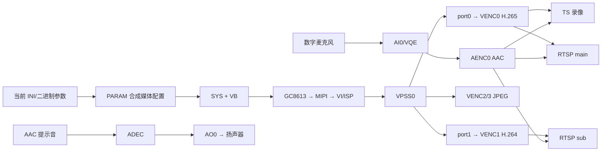

# HC112 媒体学习文档总目录

## 1. 文档目标

这套文档用于帮助刚入门的开发者读懂 `Z:\HC1XX_SPC020`（统称 HC112）的当前媒体配置，学习顺序按要求为 **2 → 3 → 4 → 1**：

1. 音视频通路；
2. VB 配置与修改；
3. H.264/H.265 参数；
4. proc 与 INI 对照。

只做学习分析，不修改源码、INI、构建产物或板端参数。

## 2. 阅读目录

1. [02 音视频通路](./02_音视频通路.md)  
   从名词入门，画出视频、音频和业务输出框架；说明 INI、应用层、MEDIA、MAPI、MPI、驱动/硬件怎样逐层调用。

2. [03 VB 配置与修改](./03_VB配置与修改.md)  
   解释 Pool/Block、当前 2160P25 的内存量、计算方法、安全修改流程和 `/proc/umap/vb` 诊断。

3. [04 H.264/H.265 参数](./04_H264_H265参数.md)  
   解释 codec、profile、CBR/VBR/QVBR、码率、GOP、QP、统计周期以及 HC112 的硬编码高级设置。

4. [01 proc 与 INI 对照](./01_PROC与INI对照.md)  
   逐字段解释 SYS、VB、VI、VPSS、VENC、RC、音频等 proc 的用途、错误位置和 INI 对应；已加入 2026-07-31 COM3 的 27 个节点及录像、RTSP、APP 拍照实测结果。

## 3. 分析基线

### 3.1 构建配置

`Z:\HC1XX_SPC020\config.conf`：

| 配置 | 当前值 | 含义 |
|---|---:|---|
| `CONFIG_HI3516CV610` | y（4 行） | SoC 为 Hi3516CV610 |
| `CONFIG_SNS0_GC8613` | y（26 行） | Sensor0 为 GC8613 |
| `CONFIG_SNS1_NONE` | y（30 行） | 单 Sensor |
| `CONFIG_NET_SUPPORT` | y（118 行） | 网络/RTSP 相关业务可编译 |
| `CONFIG_TS` | y（132 行） | TS 录像封装 |
| `CONFIG_DISABLE_AUDIO` | 未设置（159 行） | 音频未禁用 |
| `CONFIG_SCENEAUTO_SUPPORT` | y（165 行） | Scene Auto 支持 |
| `CONFIG_WORKMODE_RECORD_SUPPORT` | y（197 行） | 普通录像 |
| `CONFIG_WORKMODE_PHOTO_SUPPORT` | y（198 行） | Photo 状态代码编译 |
| `CONFIG_NONESCREEN` | y（205 行） | 无屏产品 |
| `CONFIG_DISP_SUPPORT` | 未定义 | VO/DISP 媒体文件不进入当前活动构建 |

### 3.2 默认运行参数

参数目录：

`Z:\HC1XX_SPC020\source\camera\demo\dronecam\modules\param\inicfg\hi3516cv610\nonescreen\gc8613_128M`

默认是普通录像，2160P25、TS、音频开启：

- `config_product_workmode_common.ini:3`
- `config_product_workmode_record.ini:6,17,22-43`
- `config_product_mediamode_cam0_record_2160p30.ini:3`
- `config_product_mediamode_common.ini:177-245`

文件名 `2160p30` 与内容的 `OT_PARAM_MEDIAMODE_2160P_25` 不一致，本文始终以文件内容和实际帧率 25 为准。

### 3.3 范围边界

包含：

- 上电媒体初始化；
- GC8613→VI/ISP→VPSS；
- VENC0 H.265 主流、VENC1 H.264 子流；
- VENC2/3 的录像模式内抓拍和缩略图；
- VENC0+AENC0 TS 普通录像；
- 普通录像工作模式内的 NORMAL、LAPSE、SLOW 分支；LAPSE/SLOW 文件不带音轨；
- RTSP 主/子流；
- AI→AENC AAC；
- ADEC→AO 启动提示音/语音播放；
- VB、VENC/RC 和各模块 proc。

不作为当前事实：

- Hi3519DV500、SS92x、双 Sensor 分支；
- VO/DISP/HDMI 显示通路；
- UVC：`config_product_workmode_usb.ini:3` 当前 `usb_mode=2` 为 storage，配置文件中保留 UVC 节点不等于当前启用；
- ADAS：`config_product_mediamode_cam0_comm.ini:9` 为 `enable=0`；
- 独立 Photo 工作模式的成功运行：它引用 `PHOTO_1440P/PHOTO_6000P`，但 `config_cfgaccess_entry.ini` 只加载 2160P25、1080P30 两份规格，需串口验证是否有外部参数资源或运行回退。
- NIGHTVISION：valueset 虽显示该选项，当前媒体规格 `aibnr_support=0`，代码在无 AIBNR/HNR 支持时明确返回不支持。

## 4. 一张图看懂 HC112



## 5. 建议的四轮学习

### 第一轮：只认模块

能回答：

- RAW 在哪里变成 YUV？
- YUV 在哪里缩放？
- YUV 在哪里变成 H.265/H.264？
- PCM 在哪里变成 AAC？

### 第二轮：只跟主录像

```text
GC8613 → VI/ISP → VPSS0/0 → VENC0 → MAPI 回调
                                └→ H.265 → TS
MIC → AI0 → AENC0 → AAC ─────────────────┘
```

### 第三轮：参数与资源

学习 VB、码率、GOP、QP，理解为什么分辨率、压缩模式、并发业务会共同影响内存和码流。

### 第四轮：用 proc 证明

不再只看代码“应该怎样”，而是把板端 proc 的实际通道、帧率、Bind、QP、码率、计数器、VB owner 与 INI 逐项对上。

## 6. 关键源码导航

| 层级 | 入口 |
|---|---|
| 应用启动 | `source\camera\demo\dronecam\modules\init\smp\src\ss_product_main.c:806` |
| 媒体初始化服务 | `...\init\smp\src\ss_product_init_service.c:696,764` |
| 状态管理媒体重置 | `...\statemng\src\component\product_statemng_media.c:857` |
| 参数合成 | `...\param\core\src\ss_product_param_comm.c:346,1942` |
| 媒体系统/VB | `source\camera\component\media\src\component\media_sys.c:46,69` |
| 视频总入口 | `source\camera\component\media\src\ss_media_videoin.c:221` |
| VCAP | `...\media\src\component\media_vcap.c:1241` |
| VPSS | `...\media\src\component\media_vproc.c:697` |
| VENC | `...\media\src\component\media_venc.c:454,793` |
| 音频 | `...\media\src\component\media_audio.c:55,124,202` |
| MAPI SYS | `platform\middleware\ndk\code\mediaserver\comm\mapi_sys.c:285` |
| MAPI→MPI 适配 | `platform\middleware\ndk\code\mediaserver\adapt\h9\` |
| 录像回调 | `source\camera\component\recordmng\src\recordmng_source.c:193,219` |
| RTSP 回调 | `source\camera\component\liveserver\src\liveserver_source.c:52,95` |
| 拍照回调 | `source\camera\component\photomng\src\ss_photomng.c:766` |

## 7. 参考资料怎样使用

| PDF | 本套文档用途 |
|---|---|
| `Camera 中间件 开发参考.pdf` | Camera 组件和上层媒体业务框架 |
| `MAPI V1.0 媒体处理开发参考.pdf` | MAPI 初始化、Bind、回调、音视频接口 |
| `MPP 媒体处理软件 V6.0 开发参考.pdf` | MPI 模块、VB、VENC/RC 和 proc 字段 |
| `Hi3516CV610╱Hi3516CV608 快速入门指南.pdf` | 当前 SoC 的入门和环境 |
| `Hi3519DV500 超高清智慧视觉 SoC 用户指南.pdf` | 只作通用 SoC 背景，专属功能不套用到 CV610 |
| `裸烧及非裸烧升级 使用手册.pdf` | 后续真正生成/部署参数时参考；本次不执行烧写 |

## 8. 当前完成状态

| 文档 | 静态分析 | 板端动态验证 |
|---|---:|---:|
| 02 音视频通路 | 完成 | 4K25 普通录像及主/副 RTSP 双编码已闭环；抓拍动态待补 |
| 03 VB | 完成 | 普通录像和双 RTSP 的 pool owner、free/min_free 已实测 |
| 04 H.264/H.265 | 完成 | H.265/H.264 同时活动及高级参数已核实 |
| 01 proc↔INI | 完成 | 27 个节点及双 RTSP 动态已备注；抓拍等状态待增量采样 |
