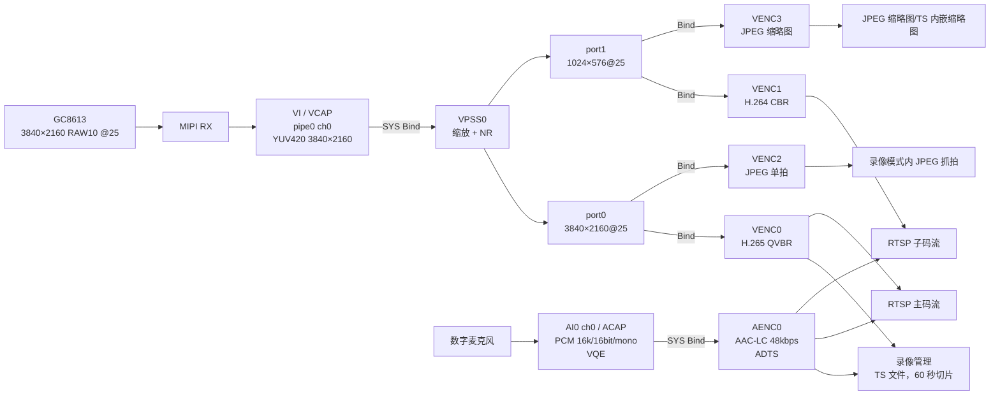
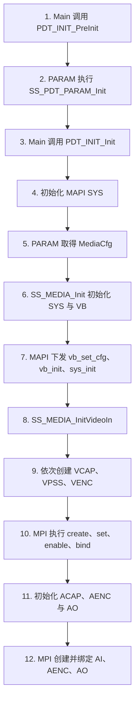
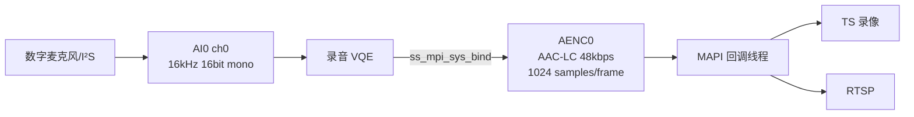
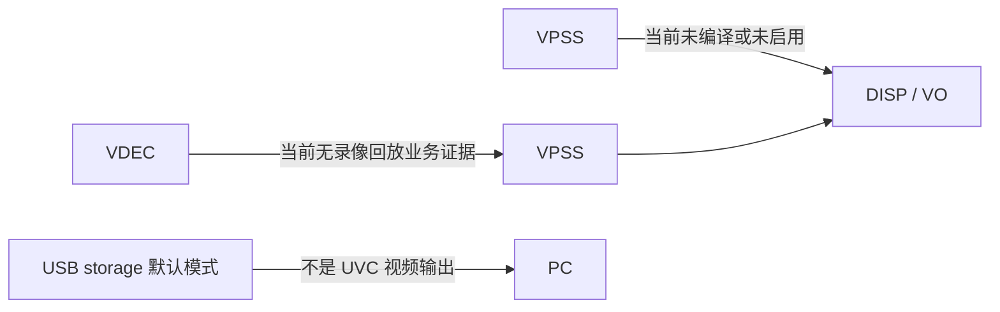
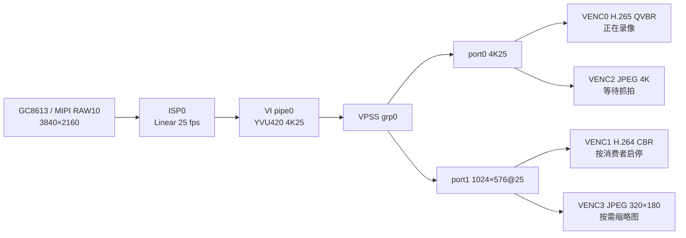
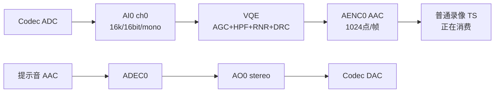

# HC112 音视频通路：从 INI 到芯片

> 学习顺序第 1 篇，对应原任务第 2 项。  
> 结论基于 `Z:\HC1XX_SPC020` 当前 `config.conf` 和 `hi3516cv610\nonescreen\gc8613_128M` 参数，只分析当前可达业务，不把 Hi3519DV500、SS92x、双 Sensor、屏显等未启用分支混进来。本文不改代码。

## 1. 先记住八个名词

| 名词 | 初学者理解 | HC112 当前实例 |
|---|---|---|
| VI / VCAP | 从 Sensor 收图，经过 MIPI、VI、ISP 得到视频帧 | GC8613 RAW10，3840×2160@25 |
| VPSS / VPROC | 对帧做缩放、降噪、裁剪等处理，一路输入可分多路输出 | VPSS0：端口 0 输出 4K，端口 1 输出 1024×576 |
| VENC | 把 YUV 帧压缩成 H.265/H.264/JPEG 码流 | VENC0/1/2/3 |
| VO / DISP | 把帧送到显示设备 | 当前构建不可达 |
| AI / ACAP | 从麦克风采集 PCM | AI0/chn0，16 kHz、16 bit、mono |
| AENC | 把 PCM 压缩成 AAC | AENC0，AAC-LC 48 kbps，ADTS |
| ADEC + AO | 解码音频并从扬声器播放 | 启动提示音等播放路径 |
| VB | 给 VI/VPSS 等视频模块共用的大块物理内存池 | 默认 2160P25 公共池约 27.40 MiB |

**Frame（帧）**是一次完整的未编码图像/音频数据；**Stream（码流）**是编码后的 H.265、H.264、JPEG 或 AAC 数据。  
**Bind（绑定）**是 MPP 内部的硬件/内核数据连接。绑定后，上游产生的数据自动进入下游，不需要应用逐帧 `Get` 再 `Send`。

## 2. 当前配置结论

配置入口：

- `Z:\HC1XX_SPC020\config.conf`：Hi3516CV610、GC8613、单 Sensor、TS、网络、录像、拍照、场景参数开启；没有 `CONFIG_DISP_SUPPORT`，也没有 `CONFIG_DISABLE_AUDIO`。
- `Z:\HC1XX_SPC020\source\camera\demo\dronecam\modules\param\inicfg\hi3516cv610\nonescreen\gc8613_128M\config_product_workmode_common.ini:3`：上电工作模式为普通录像。
- 同目录 `config_product_workmode_record.ini:6`：默认媒体模式 `OT_PARAM_MEDIAMODE_2160P_25`。
- 同目录 `config_product_workmode_record.ini:17`：封装格式为 TS。

当前活动通道如下：

| 通道 | 输入 | 输出/编码 | 主要消费者 |
|---|---|---|---|
| VI pipe0 ch0 | GC8613 RAW10 | YUV420 3840×2160@25 | VPSS0 |
| VPSS0 port0 | 4K YUV420 | 3840×2160@25 | VENC0、VENC2 |
| VPSS0 port1 | 4K YUV420 | 1024×576@25 | VENC1、VENC3 |
| VPSS0 port2 | 配置有 320×180 | `enable=0`，不可达 | 无 |
| VENC0 | VPSS0/0 | H.265、QVBR、4K@25、GOP 25、22528 kbps | TS 录像、RTSP 主码流 |
| VENC1 | VPSS0/1 | H.264、CBR、1024×576@25、GOP 25、2048 kbps | RTSP 子码流 |
| VENC2 | VPSS0/0 | JPEG 3840×2160 | 普通录像模式内的抓拍 |
| VENC3 | VPSS0/1 | JPEG 320×180 | 录像缩略图 |
| AI0 ch0 | 数字麦克风 | PCM 16 kHz/16 bit/mono + VQE | AENC0 |
| AENC0 | AI0 ch0 | AAC-LC 48 kbps、ADTS、1024 点/帧 | TS 录像、RTSP |
| AO0 ch0 | 解码/播放器 PCM | 16 kHz/16 bit/stereo | 启动提示音、语音播放 |

### 2.1 当前可选的另一条录像规格

`config_product_valueset.ini:27-32` 明确给 camera0 两个录像媒体模式，所以当前配置可达范围还包括 `OT_PARAM_MEDIAMODE_1080P_30`。模块拓扑和 codec/RC 不变，只替换规格：

| 项目 | 默认 2160P25 | 可选 1080P30 |
|---|---:|---:|
| VI/ISP | 3840×2160@25 | 1920×1080@30 |
| VPSS port0 | 3840×2160@25 | 1920×1080@30 |
| VPSS port1 | 1024×576@25 | 1024×576@30 |
| VENC0 | H.265 QVBR，22528 kbps，GOP25 | H.265 QVBR，10240 kbps，GOP30 |
| VENC1 | H.264 CBR，2048 kbps，GOP25 | H.264 CBR，2048 kbps，GOP30 |
| VENC2 JPEG | 3840×2160@20 | 1920×1080@30 |
| VENC3 JPEG | 320×180@20 | 320×180@20 |
| VI/VPSS mode | offline→online | offline→online |
| 公共 VB 静态量 | 27.40 MiB | 38.32 MiB |

规格来自 `config_product_mediamode_cam0_record_1080p30.ini:3,46-65,88-156`。后文用默认 2160P25 展开函数链；切换到 1080P30 不会换一套调用框架。

### 2.2 普通录像工作模式内的录像类型

`config_product_valueset.ini:203-212` 向上层暴露 NORMAL、LAPSE、SLOW、NIGHTVISION。静态代码和当前配置的结论不同：

| 类型 | 当前结论 | 对媒体链的影响 |
|---|---|---|
| NORMAL | 默认且配置闭合 | VENC0+AENC0 写 TS |
| LAPSE | 有完整代码路径 | `product_statemng_msgproc_rec.c:461-489` 把 VENC0 source fps/GOP 设为 5，并把 ISP 调为 5 fps；`product_statemng_record.c:740-745` 设置延时录像间隔/播放 fps |
| SLOW | 状态和录像管理路径存在，但当前 `slowrec_playfps=-1` 需实机确认含义 | 采集编码链不换模块，封装播放 fps 改变 |
| NIGHTVISION | valueset 可见，但当前构建不可用 | `product_statemng_msgproc_rec.c:223-259` 仅在 AIBNR/HNR 支持时成功；当前模式 `aibnr_support=0`，否则明确返回不支持 |

LAPSE 和 SLOW 都会在 `product_statemng_record.c:760-764` 把录像音轨数设为 0，所以文件中不带 AENC0 音频；AI/AENC 是否仍被 RTSP 使用取决于当时是否有直播消费者。

## 3. 总体框架图



注意：录像和 RTSP 可以同时注册到同一个 VENC/AENC 的回调表。`MEDIA_StartVencChn()` 和 `MEDIA_StartAencChn()` 使用引用计数，第二个消费者到来时不会重复创建通道；VENC 会请求新的 IDR，便于新客户端从关键帧开始。

## 4. 系统是怎样启动这条链的

### 4.1 应用层调用顺序



关键源码位置：

1. `Z:\HC1XX_SPC020\source\camera\demo\dronecam\modules\init\smp\src\ss_product_main.c:806` 的 `main()` 调用 `PDT_INIT_PreInit()`（815）和 `PDT_INIT_Init()`（829）。
2. `...\ss_product_init_service.c:764` 的 `SS_PDT_INIT_SERVICE_Init()` 先调用 `SS_MAPI_SYS_Init()`（771），再进入 `PDT_INIT_MediaInit()`（787）。
3. `...\ss_product_init_service.c:696` 的 `PDT_INIT_MediaInit()` 在 706、714 两次取得媒体配置，717 调 `PDT_INIT_ResetVideoWithoutBootLogo()`，724–727 初始化音频。
4. `...\ss_product_init_service.c:629` 的 `PDT_INIT_PreInitMedia()` 调 `SS_MEDIA_Init()`；后者在 `source\camera\component\media\src\ss_media_sys_comm.c:14` 进入 `MEDIA_Init()`。
5. `source\camera\component\media\src\component\media_sys.c:69` 的 `MEDIA_Init()` 把 INI 合成的 VI/VPSS 模式和 VB 配置转成 MAPI 结构，79 调 `SS_MAPI_SYS_InitMedia()`。
6. `platform\middleware\ndk\code\mediaserver\comm\mapi_sys.c:285` 在 298 调适配层初始化，305、311 再初始化视频和音频模块。
7. `platform\middleware\ndk\code\mediaserver\adapt\h9\mapi_sys_adapt.c:169` 依次调用 `ss_mpi_vb_set_cfg()`（183）、`ss_mpi_vb_init()`（194）、`ss_mpi_sys_init()`（197）、`ss_mpi_sys_set_vi_vpss_mode()`（225）。

`SS_PDT_PARAM_GetMediaCfg()` 位于 `...\param\core\src\ss_product_param_comm.c:1942`。它不是直接返回一份 INI，而是把“媒体公共配置 + 录像公共配置 + 2160P25 模式配置 + 当前运行参数”合成一个 `OT_PARAM_MediaCfg`。

### 4.2 视频模块的创建顺序

`source\camera\component\media\src\ss_media_videoin.c:221` 的 `SS_MEDIA_InitVideoIn()` 固定按以下顺序：

1. `MEDIA_InitVcap()`（235）：Sensor、MIPI、VI、ISP。
2. `MEDIA_InitVproc()`（242）：创建 VPSS group 和端口，绑定 VI→VPSS。
3. `MEDIA_InitVenc()`（250）：创建四个 VENC，绑定 VPSS→VENC。
4. `MEDIA_StartOsd()`（259）：把当前启用的时间/GPS OSD 叠加到 VENC 通道。

出错时按反方向回滚；正常退出也按 VENC→VPSS→VCAP 释放。

## 5. 视频链逐层拆解

### 5.1 Sensor → VI/ISP

INI：

- `config_product_mediamode_cam0_record_2160p30.ini:30-44`：GC8613、3840×2160、RAW10。
- 同文件 `:46-65`：pipe0 及 ch0 开启，25→25 fps。
- `config_product_mediamode_cam0_comm_record.ini:2-28`：MIPI RGB 输入，VI 输出 YUV420，pipe 低延迟开启。

函数链：

```text
SS_MEDIA_InitVideoIn
  └─ MEDIA_InitVcap                         media_vcap.c:1241
      ├─ MEDIA_InitVcapDevSensor            media_vcap.c:995
      ├─ MEDIA_InitVcapDev                  media_vcap.c:967
      └─ MEDIA_StartVcapDev                 media_vcap.c:803
           ├─ 初始化/启动 VI pipe、channel
           └─ MEDIA_StartIsp                media_vcap.c:588
```

MAPI 最终在 `platform\middleware\ndk\code\mediaserver\adapt\h9\mapi_vcap_adapt.c` 调用 MPI，例如 `ss_mpi_vi_set_dev_attr()`（560）、`ss_mpi_vi_set_chn_attr()`（628）、`ss_mpi_vi_enable_dev()`（674）和 VI pipe/ISP 相关接口。MPI 以下是内核驱动、MIPI/VI/ISP 硬件。

数据格式变化：

```text
光信号 → GC8613 Bayer RAW10 → MIPI CSI-2 → VI/ISP
→ 去马赛克、曝光/白平衡/降噪等 ISP 处理
→ YVU 半平面 4:2:0（代码枚举 OT_PIXEL_FORMAT_YVU_SEMIPLANAR_420）
```

INI 注释写“YUV420”，底层实际常见名称是 **YVU420SP/NV21 类半平面格式**；不能仅凭“YUV420”假定 UV 顺序，写裸帧工具时必须查 `pixel_format`。

### 5.2 VI → VPSS

当前 `vivpssmode=1`，即 VI offline、VPSS online，见 2160P25 INI `:5-10`。适配层 `mapi_sys_adapt.c:216-225` 还把所有模式项统一为 `OT_VI_OFFLINE_VPSS_ONLINE`。

创建链：

```text
MEDIA_InitVproc                                  media_vproc.c:697
  └─ MEDIA_InitVpss                             media_vproc.c:610
      ├─ SS_MAPI_VPROC_InitVpss                 media_vproc.c:623
      │   ├─ MAPI_ADAPT_VPROC_CreateVpss        mapi_vproc.c:300
      │   └─ MAPI_ADAPT_VPROC_StartVpss         mapi_vproc.c:305
      └─ SS_MAPI_VPROC_BindVcap                 media_vproc.c:630
```

底层：

- `mapi_vproc_adapt.c:269` → `ss_mpi_vpss_create_grp()`。
- `mapi_vproc_adapt.c:289` → `ss_mpi_vpss_start_grp()`。
- `mapi_vproc_adapt.c:319` → `ss_mpi_sys_bind()`，源为 VI，目标为 VPSS。
- `media_vproc.c:199-307` 设置每个端口的分辨率、帧率、镜像、翻转、VB wrap 后调用 `SS_MAPI_VPROC_StartPort()`（301）。

VPSS0 端口 0 不缩放，端口 1 从 4K 缩小为 1024×576。它们仍输出 YUV420 帧；这一步不是视频压缩。

### 5.3 VPSS → VENC

INI 绑定关系在 `config_product_mediamode_cam0_comm_record.ini:83-146`。`bindedmod=1` 表示源是 VPSS。

函数链：

```text
MEDIA_InitVenc                                 media_venc.c:793
  └─ MEDIA_InitVencChn                        media_venc.c:454
      ├─ SS_MAPI_VENC_Init                    media_venc.c:462
      │   └─ MAPI_ADAPT_VENC_CreateChn
      │       └─ ss_mpi_venc_create_chn       mapi_venc_adapt.c:405
      ├─ MEDIA_SetVencAttrEx                   media_venc.c:464
      └─ MEDIA_BindVencChn                    media_venc.c:466
          └─ SS_MAPI_VENC_BindVproc
              └─ ss_mpi_sys_bind              mapi_venc_adapt.c:596
```

通道创建不等于开始收帧。消费者注册回调后调用：

```text
MEDIA_StartVencChn                             media_venc.c:878
  └─ SS_MAPI_VENC_Start                       mapi_venc.c:639
      └─ MAPI_ADAPT_VENC_StartRecvFrame
          └─ ss_mpi_venc_start_chn            mapi_venc_adapt.c:564
```

编码数据由 `mapi_venc.c:132` 的 `ProcVDataThread()` 轮询 VENC fd；`MAPI_VENC_ProcVideoStream()`（87）在 110 取码流。适配层最终调用 `ss_mpi_venc_get_stream()`（`mapi_venc_adapt.c:1763`），分发给已注册回调，再调用 `ss_mpi_venc_release_stream()`（1779）。

### 5.4 编码输出去了哪里

#### 普通录像

`product_statemng_record.c:797` 创建录像任务，`:834` 开始任务。录像源在 `recordmng_source.c`：

- `RECMNG_StartVenc()`（241）在 248 注册 `RECMNG_ProcVencData()`。
- `RECMNG_StartAenc()` 附近 361–368 注册 `RECMNG_ProcAencData()`。
- 视频回调在 193–214 解析 slice、I/P 帧和时间戳，调用 `SS_REC_WriteData()`。
- 音频回调在 219–236 把 AAC stream 写入同一录像对象。
- TS 插件 `recordmng_muxer_ts.c:83-151` 将 H.265/AAC/JPEG 映射为 TS codec id 并创建 stream，`:155-175` 调 `SS_TS_WriteFrame()`。

当前录像只有 VENC0+AENC0，`config_product_workmode_record.ini:35-43`；60 秒切片，`:22-33`。

#### RTSP 主/子码流

`product_statemng_media.c:832` 的 `PDT_STATEMNG_AddLiveStream()` 添加：

- 主流：VENC0，名称 `main`。
- 子流：VENC1，名称 `sub`。
- 音频：ACAP/AENC 开启时两路均可带 AENC0。

`liveserver_source.c:125-132`、`:165-172` 注册并启动 VENC/AENC；视频回调 `LIVESVR_ProcVencData()`（52）和音频回调（95）最终调用 `SS_RTSPSVR_WriteFrame()`（86、108）。

#### 录像模式内的抓拍和缩略图

普通录像状态进入时会预创建照片任务。`ss_photomng.c:766-801`：

- VENC2 注册照片 JPEG 回调并按拍照张数启动。
- VENC3 注册缩略图 JPEG 回调。
- 主 JPEG 经过 EXIF muxer 写成照片；缩略图可作为录像 TS 内嵌缩略图。

#### 独立 Photo 工作模式存在一处静态配置不闭合

`config.conf` 编译了 `CONFIG_WORKMODE_PHOTO_SUPPORT`，`config_product_workmode_photo.ini:4` 又把独立拍照默认模式设为 `OT_PARAM_MEDIAMODE_PHOTO_1440P`。但 `config_cfgaccess_entry.ini:51-56` 实际只加载两份媒体规格：

- `config_product_mediamode_cam0_record_2160p30.ini` → `OT_PARAM_MEDIAMODE_2160P_25`
- `config_product_mediamode_cam0_record_1080p30.ini` → `OT_PARAM_MEDIAMODE_1080P_30`

当前目录没有被 entry 加载的 `PHOTO_1440P`/`PHOTO_6000P` 规格文件。`product_param_videoin.c:926-955` 会逐项查找相同的 media mode，找不到时返回失败。因此：

- **已证实可完整配置**：普通录像模式中的 VENC2 抓拍、VENC3 缩略图。
- **编译入口存在但静态配置不闭合**：切换到独立 Photo 工作模式。
- 是否有运行时回退、外部 binary 参数与源码目录不同，需在串口上实际切换前先读取日志/参数；本文不把独立 Photo 模式标为已验证可达。

## 6. 音频链逐层拆解

### 6.1 麦克风 → AI → AENC



INI 见 `config_product_mediamode_common.ini:177-222`。

创建与启动：

1. `product_statemng_media.c:46` 的 `PDT_STATEMNG_StartAudio()` 调 `SS_MEDIA_InitAudioIn()`（50）。
2. `ss_media_audio.c:22` 依次调用 `MEDIA_InitAcap()` 和 `MEDIA_InitAenc()`。
3. `media_audio.c:55-89`：`SS_MAPI_ACAP_Init()`、`SS_MAPI_ACAP_Start()`，VQE 开启时调用 `SS_MAPI_ACAP_EnableRecordVqe()`。
4. 适配层 `mapi_acap_adapt.c:152` 调 `ss_mpi_ai_set_pub_attr()`，`:184`/`:194` 开启 AI device/channel。
5. `media_audio.c:124-159` 注册 AAC 编码器并 `SS_MAPI_AENC_Init()`；`mapi_aenc_adapt.c:69` 调 `ss_mpi_aenc_create_chn()`。
6. 真正有录像/直播消费者时，`media_audio.c:368-405` 通过 `SS_MAPI_AENC_BindACap()`（384）绑定 AI→AENC，并 `SS_MAPI_AENC_Start()`（392）。
7. `mapi_aenc_adapt.c:104` 用 `ss_mpi_sys_bind()` 完成底层绑定。

`mapi_aenc.c:80-130` 的线程 `select()` AENC fd，取出 AAC stream 并分发回调。适配层接口为 `ss_mpi_aenc_get_stream()`（`mapi_aenc_adapt.c:191`）和 `ss_mpi_aenc_release_stream()`（217）。

音频格式变化：

```text
声压 → 数字麦克风采样 → PCM 16 kHz / signed 16-bit / mono
→ VQE → AAC-LC 48 kbps / ADTS / 1024 samples per frame
→ TS PES 或 RTSP/RTP 负载
```

1024 点在 16 kHz 下代表约 `1024 / 16000 = 64 ms` 音频。若改采样率、声道或点数，AI、AENC、封装/播放器必须保持兼容，不能只改一处。

### 6.2 ADEC → AO 播放

当前可达的是启动提示音/语音播放，不是摄像头采集回环：

```text
AAC/播放器输入 → ADEC → PCM → AO0 ch0 → I²S/Codec → 扬声器
```

- `ss_product_init_service.c:737-739` 根据 `bootSoundEnable` 调启动音播放；GC8613 由 G-sensor 唤醒时会在 731–735 跳过。
- `media_audio.c:233-248` 的 `MEDIA_AUDIO_BindAdecAndStartAo()` 创建 AAC-LC ADEC、初始化 AO、绑定 ADEC→AO 并启动。
- `mapi_adec_adapt.c:80` → `ss_mpi_adec_create_chn()`；`:103` → `ss_mpi_adec_send_stream()`。
- `mapi_ao_adapt.c:73` → `ss_mpi_ao_set_pub_attr()`；`:81`/`:91` 开启 AO；`:272` 用 `ss_mpi_sys_bind()` 连接 ADEC→AO。

AO INI 的 `sound_mode=stereo` 与采集的 mono 不矛盾：播放模块可以把 mono 映射到左右声道。它不是“录像音频变成双声道”。

## 7. 当前不可达的链路



- `config_product_mediamode_common.ini:139-172` 的 `disp.0` 和 window 都是 `enable=0`。
- `source\camera\component\media\linux.mak` 只有定义 `CONFIG_DISP_SUPPORT` 才编译 `ss_media_videoout.c`、`media_disp.c`、`media_hdmi.c`；当前配置未定义。
- USB 工作模式当前是存储模式，不应把配置文件中存在的 UVC 结构误判为正在输出 UVC。
- Hi3519DV500/SS92x 的 AIISP、FMU、更多 VPSS/VO 分支不属于 HC112 当前配置。

## 8. 上板只读验证

不写 proc，不改变参数。串口阶段建议按顺序执行：

```sh
cat /proc/umap/sys
cat /proc/umap/vi
cat /proc/umap/vpss
cat /proc/umap/venc
cat /proc/umap/h265e
cat /proc/umap/h264e
cat /proc/umap/jpege
cat /proc/umap/rc
cat /proc/umap/ai
cat /proc/umap/aenc
cat /proc/umap/ao
```

期望：

- VI：pipe0/chn0，3840×2160，25 fps，offline→online 模式。
- VPSS：grp0；chn0 3840×2160，chn1 1024×576；chn2 未开启。
- VENC：0=H.265 4K，1=H.264 1024×576，2/3=JPEG；是否显示 `started` 取决于当时有无录像/RTSP/拍照消费者。
- AI/AENC：AI0 ch0 16 kHz/16 bit/mono；录像或 RTSP 使用音频时 AENC0 有递增计数。
- AO/ADEC：只有播放提示音时才短暂活动。

如果 proc 中通道“存在但没 started”，先检查是否有消费者，而不是先怀疑通路创建失败；创建通道和启动收帧是两个阶段。

## 9. COM3 第一轮实测闭环

本次实机状态把静态函数分析与底层运行结果对上了：



音频实测为：



实机关键证据：

- SYS Bind 表与上述箭头一致；
- VI/VPSS 的帧计数持续增长且 error/lost=0；
- VENC0/H.265 和 AENC0/AAC 同时活动，对应含音频的普通录像；
- VENC1 未启动证明主、副通道按消费者独立启停；
- JPEGE ch3 的少量成功计数证明缩略图通道是单帧按需使用；
- ADEC/AO 有提示音历史计数，但采样时队列空闲。

随后连接主、副 RTSP 的第二轮快照又确认：

- VENC0、VENC1 同时 `started=Y`，两路均稳定输出 25 fps；
- VENC1 从空闲切到 H.264 编码，不需要重建 VI/VPSS；
- H.264 编码成功、取流和释放持续增长，lost/recode/积压均为 0；
- AI→AENC 继续正常工作，说明音频编码器可被录像和直播共享；
- 断开/连接消费者改变的是 VENC 接收与取流状态，不改变已经建立的 SYS Bind。

## 10. 初学者建议的阅读顺序

1. 先看本文第 2、3 节，能口述四条业务输出。
2. 对照三份 INI：公共录像、2160P25、媒体公共。
3. 只跟一条主链：`SS_MEDIA_InitVideoIn()` → VCAP → VPSS → VENC。
4. 再跟数据回调：`ss_mpi_venc_get_stream()` → MAPI 回调 → TS/RTSP。
5. 最后看引用计数和状态切换，理解为什么录像与 RTSP 能共享 VENC0/AENC0。

## 11. 本篇参考资料

- `Camera 中间件 开发参考.pdf`：Camera 组件和媒体中间件职责。
- `MAPI V1.0 媒体处理开发参考.pdf`：MAPI 模块、绑定、数据回调。
- `MPP 媒体处理软件 V6.0 开发参考.pdf`：VI/VPSS/VENC、AI/AENC/AO、VB 与 proc。
- `Hi3516CV610╱Hi3516CV608 快速入门指南.pdf`：CV610 平台环境。
- `Hi3519DV500 超高清智慧视觉 SoC 用户指南.pdf` 仅作概念背景；不把其专属通路当成当前 HC112 事实。
