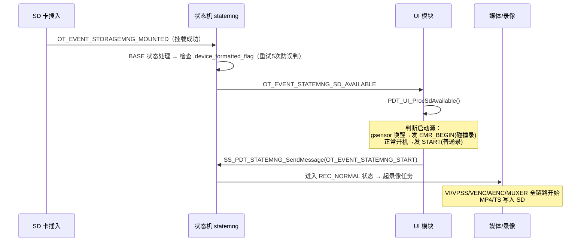
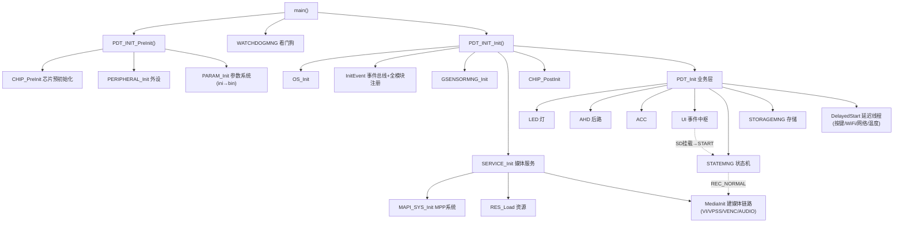

# HC112_B 启动入口与启动后调用流程分析

> 文档日期：2026-08-12
> 工程：`Z:\HC112_B_SPC020`（Hi3516CV610 双摄行车记录仪）
> 配套：`HC112_B_ini配置文件全解析_gc4653_ahd_128M_20260812.md`（看配置）、`01_PROC与INI对照.md`（看 ini 解析）

---

## 0. 一句话总结

> 启动分两个阶段：**PreInit**（芯片/外设/参数）→ **Init**（事件总线 → 媒体链路 → UI/状态机/存储 → 延迟线程）。
> 真正的业务**不靠 main 顺序调用**，而是靠 **UI 事件中枢 + 状态机 + SD 挂载事件**驱动起来——
> `main` 只负责"搭舞台"（媒体通道建好、各模块就绪），然后通过事件把"录像、停车、拍照"串起来。

---

## 1. 启动入口

入口在 `source/camera/demo/dronecam/modules/init/smp/src/ss_product_main.c` 的 `main()`（第 805 行）。

`main()` 做得很薄：打点、初始化日志、调用两个阶段（PreInit / Init），最后**主线程空转**（业务都在子线程和事件驱动里）。

```c
td_s32 main(td_void)
{
#ifdef __GLIBC__
    mallopt(M_MMAP_THRESHOLD, 128 * 1024); /* 调 malloc 阈值，减少碎片 */
#endif
    SS_TIMESTAMP_Init(TIMESTAMP_MAX_CNT);  /* 性能打点初始化 */
    SS_LOG_Config(TD_TRUE, TD_TRUE, OT_LOG_LEVEL_INFO_REF); /* 日志系统 */

    ret = PDT_INIT_PreInit();   /* ★ 第一阶段：预初始化（芯片/外设/参数） */
    if (ret != TD_SUCCESS) { MLOGE("PDT_INIT_PreInit failed\n"); }

    SS_WATCHDOGMNG_Init(&watchdogMngCfg);   /* 看门狗(10s 喂狗) */

    ret = PDT_INIT_Init();      /* ★ 第二阶段：正式初始化（媒体/UI/状态机/存储） */
    if (ret != TD_SUCCESS) { MLOGE("PDT_INIT_Init failed\n"); }

    while (1) { sleep(1); }     /* 主线程空转，业务交给线程+事件 */
    return 0;
}
```

> 关键：主流程只把**初始化**做完，然后主线程就"挂起"了。真正干活的是 `InitEvent` 注册的事件回调、`PDT_ServiceDelayedStartThread` 起的线程、以及 UI 事件分发。

---

## 2. `PDT_INIT_PreInit()` —— 预初始化（第一阶段）

```c
PDT_INIT_PreInit()
 ├─ SS_PDT_INIT_CHIP_PreInit()      // 芯片级预初始化（寄存器、时钟、内存映射）
 ├─ SS_PDT_INIT_PERIPHERAL_Init()   // 外设初始化（GPIO/I2C/串口/PWM 等）
 └─ SS_PDT_INIT_SERVICE_PreInit()   // → SS_PDT_PARAM_Init()
                                     //    ★ 参数系统初始化：ini → bin → 内存
                                     //    （把 cfgaccess 入口指向的 26 个 ini 解析成默认 bin）
```

> 注意：**参数初始化放在第一阶段**，因为后面所有模块（分辨率、WiFi、灵敏度等）都要读参数。
> 也就是先有"配置"，才能按配置去初始化硬件。

---

## 3. `PDT_INIT_Init()` —— 正式初始化（第二阶段，核心）

```c
PDT_INIT_Init()
 ├─ SS_PDT_INIT_OS_Init()        // OS 层：信号处理、mmap 等
 ├─ InitEvent()                  // ★ 事件总线 + 全模块事件注册
 │    ├─ SS_EVTHUB_Init()        // 初始化事件中枢
 │    └─ 循环调用 g_registerEventOps[]：
 │        STORAGEMNG / RECMNG / PHOTOMNG / FILEMNG / STATEMNG /
 │        KEYMNG / PARAM / LIVESVR / NETCTRL / UPGRADE / GSENSOR /
 │        AHDMNG / ACCMNG / GAUGEMNG / VOICEENGINE / TESTMNG
 │        （先注册事件，之后才有"发布-订阅"可用）
 ├─ SS_GSENSORMNG_Init()         // G-sensor（停车唤醒/碰撞检测）
 ├─ SS_PDT_INIT_SERVICE_Init()   // ★ 媒体服务初始化（见 3.1）
 ├─ SS_PDT_INIT_CHIP_PostInit()  // 芯片后初始化
 └─ PDT_Init()                   // ★ 业务层初始化（见 3.2）
```

### 3.1 `SS_PDT_INIT_SERVICE_Init()` —— 媒体初始化（最关键）

```c
SS_PDT_INIT_SERVICE_Init()
 ├─ SS_MAPI_SYS_Init()                     // MPP 系统初始化（海思 SDK 全局）
 ├─ SS_MAPI_SYS_RegisterVqeModule()        // 注册语音增强(VQE)
 ├─ SS_PDT_RES_Load()                      // 加载资源（字体、提示音 aac 等）
 ├─ SS_PDT_STATEMNG_InitMotionsensor()     // 状态机运动传感器
 └─ PDT_INIT_MediaInit()                   // ★ 建媒体链路
      ├─ 读启动源（正常开机 / gsensor 唤醒 WAKEUP）
      ├─ PDT_INIT_GetMediaCfg(FALSE)       // 从 ini 组装媒体配置（VB/vcap/vpss/venc/audio）
      ├─ PDT_INIT_PreInitMedia()           // 预配置 VB 池、系统绑定模式
      ├─ PDT_INIT_AhdStatusProc()          // AHD 后路插拔状态处理
      ├─ PDT_INIT_GetMediaCfg(TRUE)        // 按实际状态重新取完整配置
      ├─ PDT_INIT_ResetVideoWithoutBootLogo() // ★ 建 VI/VPSS/VENC 通道
      │      └─ ... 内部会调用 SS_MEDIA_InitVcap/InitVproc/InitVenc/InitOsd ...
      ├─ PDT_INIT_ResetAudio()             // 音频（采集/编码/输出）
      └─ PDT_INIT_BootSound()              // 播开机音（gsensor 唤醒时跳过）
```

> ★ 联系之前学过的「插帧策略」：`MEDIA_InitVenc` 就在 `ResetVideoWithoutBootLogo → SS_MEDIA_InitVenc` 链路里被调用，
> 也就是"配置里 src=19/dst=25 触发插帧"的代码，正是在启动初始化媒体时执行的。

### 3.2 `PDT_Init()` —— 业务层初始化

```c
PDT_Init()
 ├─ InitLedmng()                 // LED（开机亮绿灯）
 ├─ PDT_AHDMNG_Init()            // AHD 后路管理
 ├─ SS_ACCMNG_Init()             // ACC 点火检测
 ├─ SS_TIMEDTASK_Init()          // 定时任务框架
 ├─ SS_PDT_UI_Init()             // ★ UI：订阅按键/存储/gsensor/netctrl 事件 + 音频播放队列
 ├─ SS_GPSMNG_Init()/Start()     // GPS
 ├─ SS_PDT_STATEMNG_Init()       // ★ 状态机初始化
 ├─ InitStorage()                // 存储：创建 storagemng（挂载 SD）
 ├─ 按分辨率下发 ADAS 灵敏度      // 前/后路根据档位设 LDW 灵敏度（插上后拉时关 ADAS）
 └─ PDT_ServiceDelayedStartThread()   // ★ 起"延迟服务"线程，主流程返回
```

### 3.3 延迟启动线程（`PDT_ServiceDelayedStart`）

```c
PDT_ServiceDelayedStart()      // 独立线程（pthread_detach）
 ├─ InitKeymng()               // 按键管理（读 ini 的 keymng.key）
 ├─ SS_HAL_LCD_TurnOnBacklight()
 ├─ SS_PDT_NETCTRL_Init()      // 网络控制（App 连接服务器）
 ├─ SS_HAL_WIFI_Init/Start()   // WiFi 热点（ATBM6062）
 │     └─ 若"停车 gsensor 唤醒 + ACC off" → 立即 SS_HAL_WIFI_Stop() 且不播音
 ├─ sleep(1)
 ├─ 清理 SD 卡残留升级包        // 无 nodelete.txt 时删 *.squashfs/*.jffs2 等
 ├─ PDT_NETCTRL_CreateFatigueTimer()  // 疲劳提醒定时器
 └─ 温度检测死循环              // 读芯片温度，≥125°C → 发 POWEROFF 关机
```

> 为什么"延迟"：媒体初始化等耗时流程走完后再开 WiFi/网络，避免上电瞬间抢资源；同时 WiFi 开得晚也省电。

---

## 4. 启动后如何进入录像（事件驱动，重点理解）

媒体链路建好后**并不立即录像**，而是**等 SD 卡事件**：



> 关键：**UI 是"事件分发中枢"**。它订阅了 `g_eventList` / `g_stateMsgList` 里所有事件，
> `PDT_UI_ProcStateMsgCallback` 根据事件查 `g_homeStateEventsFuncInfo` 表分发到对应处理函数
> （按键 / 存储 / gsensor / ACC / 电量 / netctrl 等）。这也是 `ss_product_ui.c` 头文件很多的原因。

---

## 5. 整体调用链总图（复习用）



---

## 6. 复习清单

1. **入口**：`ss_product_main.c` 的 `main()`，主线程最后 `while(1) sleep(1)` 空转。
2. **两阶段**：`PreInit`（芯片/外设/参数）→ `Init`（事件/媒体/UI/状态机/存储）。
3. **先有配置再有硬件**：参数系统在第一阶段初始化，后面所有模块按参数建通道。
4. **InitEvent 先行**：所有模块先注册事件，之后"发布-订阅"才能用。
5. **媒体链路在 `PDT_INIT_MediaInit`**：VI/VPSS/VENC/AUDIO 在这里建好（插帧策略也在这生效）。
6. **业务靠事件驱动**：SD 挂载 → SD_AVAILABLE → UI 发 START → 状态机进 REC_NORMAL → 录像。
7. **UI 是中枢**：`ProcStateMsgCallback` 查表分发所有事件到各处理函数。
8. **延迟线程**：WiFi/网络/温度检测放媒体初始化之后，避免抢资源。

---

*本文件为启动流程学习文档，可与 ini 全解析文档配合阅读。*
