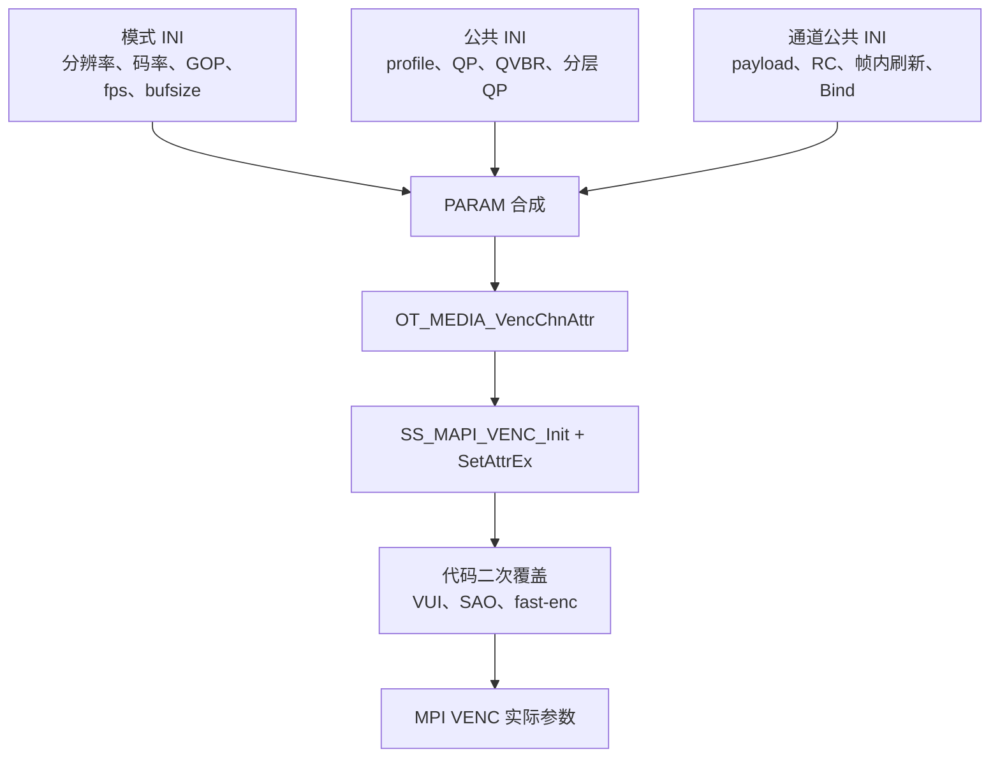

# HC112 H.264/H.265 参数学习与修改路径

> 学习顺序第 3 篇，对应原任务第 4 项。  
> 本篇区分“INI 能调”“参数合成时写死”“VENC 创建后代码再次覆盖”三层。只做学习分析，不改工程。

## 1. 当前编码事实

| 项目 | VENC0 主码流 | VENC1 子码流 |
|---|---|---|
| 输入 | VPSS0 port0 | VPSS0 port1 |
| 分辨率 | 3840×2160 | 1024×576 |
| 帧率 | 25→25 fps | 25→25 fps |
| 编码 | H.265 Main | H.264 High |
| 码控 | QVBR | CBR |
| 目标/设定码率 | 22528 kbps | 2048 kbps |
| GOP | 25 | 25 |
| 统计周期 | 2 s | 2 s |
| QP 范围 | QVBR：I/P 25–51 | CBR：P 10–51，I 10–45 |
| 帧内刷新 | 关闭 | 关闭 |
| 分层 QP | 全局关闭 | 全局关闭 |
| 业务 | TS 录像 + RTSP 主流 | RTSP 子流 |

来源：

- `config_product_mediamode_cam0_comm_record.ini:83-114`：payload、RC mode、绑定、帧内刷新。
- `config_product_mediamode_cam0_record_2160p30.ini:117-136`：分辨率、GOP、帧率、码率、统计周期。
- `config_product_mediamode_common.ini:3-97`：profile 和各 RC 模式的 QP 范围。
- `config_product_mediamode_common.ini:121-130`：分层 QP。

当前 valueset 还允许切到 1080P30；codec、profile、RC 和 QP 模板不变，VENC0 改为 1920×1080@30、10240 kbps、GOP30，VENC1 改为 1024×576@30、2048 kbps、GOP30。来源为 `config_product_valueset.ini:27-32` 和 `config_product_mediamode_cam0_record_1080p30.ini:117-136`。

录像类型切到 LAPSE 时还有一层运行时覆盖：`product_statemng_msgproc_rec.c:461-489` 把 VENC0 QVBR 的 `srcFrameRate` 和 `gop` 都改为 5，并调整 ISP 帧率，然后只重置 VENC。因此 LAPSE 的实际 proc 不能继续按默认 25 fps/GOP25 判断。SLOW 主要改封装的播放帧率，当前 `slowrec_playfps=-1` 的实际解释需上板确认。

## 2. 先理解六个核心参数

### 2.1 Codec：H.264 与 H.265

- H.265 通常在相近主观质量下比 H.264 更省码率，但编码复杂度和解码端要求更高。
- H.264 兼容性更广。HC112 因此用 H.265 做 4K 主流、H.264 做低分辨率预览子流。
- 切换 codec 不能只考虑 VENC：RTSP 客户端、TS 播放器、录像修复、文件命名/媒体信息也必须识别目标编码。

### 2.2 Profile

- H.264：0 Baseline、1 Main、2 High；当前主/子模板都是 High。
- H.265：当前只配置 Main（0）。

Profile 决定可用编码工具和解码兼容性。它不是“质量档位”；同一码率下不能简单认为 High 一定更清晰。

### 2.3 Bitrate

码率是每秒输出的压缩数据量，INI 单位为 kbps。

粗略文件体积：

```text
每分钟视频 MiB ≈ bitrate(kbps) × 60 / 8 / 1024
```

VENC0 22528 kbps 仅视频约：

```text
22528 × 60 / 8 / 1024 ≈ 165 MiB/min
```

实际 TS 文件还包含 AAC、TS 封装开销、缩略图/GPS 等数据，且 QVBR 输出会波动。

### 2.4 GOP

GOP 是关键帧间隔。当前 25 fps、GOP 25，大约每秒一个 I 帧。

- GOP 变小：随机接入、RTSP 首屏、拖动和损坏恢复更快；I 帧更多，码率/存储压力增大。
- GOP 变大：压缩效率通常更好；新客户端可能等待更久，错误传播时间更长。

`gop` 是间隔；`gopMode` 是帧结构。当前代码固定 `NORMALP`，两者不能混为一谈。

### 2.5 QP

QP 越小，量化越细，通常质量更好、码流更大；QP 越大则相反。

- `min_qp`：编码器能使用的最低 P 帧 QP，决定它最多愿意花多少码率。
- `max_qp`：最高 P 帧 QP，限制最差压缩程度。
- `min_iqp`、`max_iqp`：I 帧范围。

范围写宽不代表输出恒定。实际 QP 由 RC 根据复杂度、目标码率、缓冲状态等选择。

### 2.6 `stat_time`

码率统计/控制窗口，当前 2 秒。窗口短，响应通常更快但波动可能更明显；窗口长，平均更平滑但对场景变化响应更慢。它不是录像切片时间。

## 3. CBR、VBR、QVBR 怎么选

| 模式 | INI 值 | 控制目标 | 适合场景 | HC112 当前 |
|---|---:|---|---|---|
| CBR | 0 | 围绕设定码率控制 | 带宽上限明确、直播 | VENC1 |
| VBR | 1 | 以最大码率为约束，复杂场景多给码 | 存储、画面复杂度波动 | 未选 |
| QVBR | 2 | 以目标码率为参考并尽量稳定主观质量 | 行车录像等复杂场景 | VENC0 |

代码映射在 `source\camera\component\media\src\component\media_venc.c:93-161`。

具体参数合成：

- H.264：`...\param\core\src\product_param_videoin.c:260-307`。
- H.265：同文件 `:310-357`。

CBR 使用 `bitRate`，VBR 使用 `maxBitRate`，QVBR 使用 `targetBitRate`。所以把 `rcmode` 从 2 改成 0 后，同一个 `h265bitrate` 数值的语义也随之变化。

## 4. QVBR 高级参数

HC112 主流 H.265 QVBR：

```ini
[venc.video.main.h265.qvbr]
max_qp            = "51"
min_qp            = "25"
max_iqp           = "51"
min_iqp           = "25"
bit_percent_ul    = "100"
bit_percent_ll    = "45"
psnr_fluctuate_ul = "30"
psnr_fluctuate_ll = "23"
```

这些参数在 `product_iniparam_mediacomm.c:80-115` 解析，在 `media_venc.c:183-193` 进入 MAPI RC 参数。

初学时这样理解：

- `bit_percent_ul/ll`：QVBR 允许的码率百分比控制边界。
- `psnr_fluctuate_ul/ll`：质量波动控制边界。
- 它们共同影响“复杂场景多给多少码、简单场景少给多少码”。

不要单独大幅调整其中一个。应固定测试片段，比较平均码率、峰值码率、I/P QP、PSNR/主观质量和运动细节。

## 5. 参数的三层来源



### 5.1 模式 INI

`config_product_mediamode_cam0_record_2160p30.ini:117-136`：

- `res_width/res_height`
- `bufsize`
- `gop`
- `src_framerate/dst_framerate`
- `h265bitrate/h264bitrate`
- `stat_time`

虽然当前 payload 固定，两个 codec 的 bitrate 都保留，便于切换 payload 时取对应值。

### 5.2 媒体公共 INI

`config_product_mediamode_common.ini:3-97`：

- `scene_mode`
- H.264/H.265 `profile`
- CBR/VBR/QVBR 的 QP 范围
- QVBR 四个高级阈值

`:121-130` 是全局分层 QP。

### 5.3 通道公共 INI

`config_product_mediamode_cam0_comm_record.ini:83-146`：

- `payload`
- `isByFrame`
- `rcmode`
- `type`
- `intraRefresh.*`

## 6. 代码固定的高级参数

这些不是改当前 INI 就能覆盖的。

### 6.1 GOP 模式固定 NORMALP

`product_param_videoin.c:401-403`：

```text
gopMode = NORMALP
iPQpDelta = 1
firstFrameStartQp = -1
```

`firstFrameStartQp=-1` 表示沿用底层默认/自动值。若要使用 DualP、SmartP 等其他 GOP 模式，当前 INI 没有对应字段，需要扩展参数结构和解析链。

### 6.2 场景变化检测关闭

`media_venc.c:277`（H.265）和 `:295`（H.264）把：

```text
sceneChangeDetect.detectSceneChange = TD_FALSE
```

因此即使底层默认打开，这里也会关闭。

### 6.3 重编码次数固定为 0

`media_venc.c:164-229` 对 H.264/H.265 的 CBR/VBR/QVBR 都设置：

```text
maxReEncodeTimes = 0
```

含义是这条封装链不让 RC 为满足目标再次重编码。优点是时延/算力可控；代价是在突发复杂画面中少一种码率/质量修正手段。

### 6.4 VUI 色彩范围固定 limited range

`media_venc.c:469-477` 和 `:486-494`：

```text
video_full_range_flag = 0
```

即码流 VUI 标记为 limited range。若输入、ISP、编码和播放器对 full/limited 的理解不一致，会出现黑位发灰或高光截断。不要只改标志而不核对像素实际范围。

### 6.5 VENC0 快速编码开启

H.264 或 H.265 的 VENC0 都执行：

```text
ss_mpi_venc_set_fast_enc_param(... enable=1)
```

位置为 `media_venc.c:478-484`、`:502-505`。它只针对 handle 0，即主码流。通常用于降低负载/时延，可能牺牲部分压缩效率或质量，需要实测。

### 6.6 VENC0 H.265 SAO 关闭

`media_venc.c:495-501`：

```text
slice_sao_chroma_flag = 0
slice_sao_luma_flag = 0
```

SAO 是 H.265 环路滤波工具。关闭可降低一定复杂度，但可能影响边缘/纹理处的压缩质量。

### 6.7 编码模块低功耗模式开启

`media_sys.c:63-67` 将 H.264/H.265 encoder low-power mode 都设为 1，再通过系统媒体初始化传入 MAPI。这是模块级策略，不是单通道 INI。

### 6.8 一个需要复核的代码点

`media_venc.c:488-489` 定义 `ot_venc_h265_vui h265_vui`，但 `memset_s` 的目标大小参数使用了 `sizeof(ot_venc_h264_vui)`。随后 `ss_mpi_venc_get_h265_vui()` 会填写结构，所以不在本文断言它必然造成故障；若后续修改这里，应先核对两个结构的真实大小并做静态/运行验证。

## 7. 分层 QP 和帧内刷新

### 7.1 Hierarchical QP

当前公共配置：

```ini
enable    = 0
qp_delta0 = -2
qp_delta1 = -4
qp_delta2 = 0
qp_delta3 = 0
frame_num0 = 1
frame_num1 = 1
frame_num2 = 0
frame_num3 = 0
```

当启用时，不同层的 P 帧使用不同 QP delta，让参考价值较高的帧获得更多码率。`media_venc.c:252-264` 通过 `OT_MAPI_VENC_CMD_HIERARCHICAL_QP` 下发。

风险：

- GOP 结构、帧层级与 delta 必须匹配；
- 负 delta 提高质量并增加码流；
- 对低延迟、丢帧恢复和第三方码流分析都要重新验证。

初学阶段不建议在没有固定测试序列和码流分析工具时开启。

### 7.2 Intra Refresh

四个通道的 `refreshEnable=0`。开启后，每个 P 帧刷新若干行/列的帧内块，逐步完成全画面刷新。

参数：

- `intraRefreshMode`：行或列；
- `refreshNum`：每帧刷新的行/列数；
- `reqIQp`：刷新块使用的 I QP。

它能降低单个大 I 帧造成的码率尖峰、改善持续传输中的错误恢复，但不等于常规 IDR；客户端随机接入和录像索引仍要验证。解析位置 `product_iniparam_cammedia.c:784-811`，启动时设置位置 `media_venc.c:878-893`。

## 8. 参数怎样真正下到底层

```text
INI
 └─ product_iniparam_cammedia.c / product_iniparam_mediacomm.c
     └─ PARAM 结构
         └─ product_param_videoin.c:PDT_PARAM_GetVideoVencAttr
             └─ OT_MEDIA_VencChnAttr
                 └─ media_venc.c:MEDIA_InitVencChn
                     ├─ SS_MAPI_VENC_Init
                     │   └─ ss_mpi_venc_create_chn
                     ├─ SS_MAPI_VENC_SetAttrEx
                     │   ├─ ss_mpi_venc_set_rc_param
                     │   ├─ ss_mpi_venc_set_intra_refresh
                     │   └─ ss_mpi_venc_set_hierarchical_qp
                     └─ 直接 MPI 定制：VUI / SAO / fast_enc
```

关键代码：

- INI 通道解析：`product_iniparam_cammedia.c:851-898`。
- 模式参数解析：`:1735-1787`。
- 公共 RC 解析：`product_iniparam_mediacomm.c:19-188`。
- 参数合成：`product_param_videoin.c:260-425`。
- 创建和扩展设置：`media_venc.c:454-508`。
- MAPI→MPI：`mapi_venc_adapt.c:393-405` 创建通道，`:492-502` 设置 RC，`:1519` 设置帧内刷新，`:1587` 设置分层 QP。

## 9. 修改方法：按目标选最小改动

| 目标 | 首选修改点 | 是否通常重建 VENC | 必查 |
|---|---|---:|---|
| 改主码率 | 2160P25 INI `h265bitrate` | 是/完整媒体重启最稳妥 | `/proc/umap/rc`、文件码率 |
| 改子码率 | 2160P25 INI VENC1 `h264bitrate` | 同上 | RTSP 带宽、画质 |
| 改 GOP | 2160P25 INI `gop` | 同上 | IDR 间隔、首屏 |
| 改 QP 边界 | common INI 对应 codec+RC 节点 | 同上 | QP 是否触边、码率 |
| CBR↔VBR↔QVBR | comm_record INI `rcmode` | 是 | 对应 RC 参数分支 |
| H.264↔H.265 | comm_record INI `payload` | 是 | TS/RTSP/播放器兼容 |
| 开帧内刷新 | 通道 `intraRefresh` | 通道启动会设置 | 码率尖峰、随机接入 |
| 开分层 QP | common INI | 设置扩展属性 | GOP/参考层匹配 |
| 改 VUI/SAO/fast-enc | `media_venc.c` | 是 | 色彩、CPU、画质、码率 |

工程存在运行时重建入口：`source\camera\component\media\src\ss_media_setting.c:26-40` 的 `SS_MEDIA_SetVencAttr()` 调 `MEDIA_RebuildVencChn()`。状态管理切换 payload 时在 `product_statemng_media.c:1000-1094` 使用它。

这不表示任意高级参数都可无损在线修改：当前实现本质上会重建通道，消费者回调、IDR、录像连续性和 RTSP 客户端都需处理。

## 10. 推荐实验顺序

每次只改变一个变量，并保留同一段道路/运动测试视频：

1. 保持 H.265 QVBR，主码率从 22528 调到一个候选值；比较大小、细节和 `/proc/umap/rc`。
2. 保持码率，分别收紧/放宽 `min_qp`、`max_qp`，观察是否频繁碰边界。
3. 比较 GOP 25 与 50：文件体积、RTSP 首屏、快速运动恢复。
4. 比较 H.265 QVBR 与 CBR，确认峰值带宽和复杂场景质量。
5. 最后才测试 fast-enc、SAO、分层 QP、帧内刷新等高级项。

每组至少记录：

```text
codec/profile/RC
resolution/fps/GOP
target or max bitrate/stat_time
I/P QP range
实际平均/峰值码率
I 帧间隔
VENC/RC proc
CPU/温度（若可取）
主观画质和异常日志
```

## 11. 上板只读验证

```sh
cat /proc/umap/venc
cat /proc/umap/h265e
cat /proc/umap/h264e
cat /proc/umap/rc
```

重点对应：

| 预期 | INI/代码来源 |
|---|---|
| VENC0 3840×2160 H.265 by-frame | 2160P25 INI + comm_record |
| VENC1 1024×576 H.264 by-frame | 同上 |
| profile | common INI |
| GOP 25、25 fps | 2160P25 INI |
| VENC0 QVBR 22528 kbps | `rcmode=2` + `h265bitrate` |
| VENC1 CBR 2048 kbps | `rcmode=0` + `h264bitrate` |
| QP 范围 | common INI 对应节点 |
| NORMALP / IP QP delta 1 | `product_param_videoin.c:401-403` |
| H.265 SAO off / fast enc on | `media_venc.c:495-505`，proc 是否展示取决于 SDK |

不能只看 `/proc/umap/venc`：通道公共信息、codec 私有信息和 RC 信息分散在不同 proc 节点。

## 12. COM3 第一轮实测结论

| 参数 | VENC0 主码流 | VENC1 副码流 |
|---|---|---|
| codec/profile | H.265 Main | H.264 High |
| 分辨率 | 3840×2160 | 1024×576 |
| RC | QVBR | CBR |
| fps/GOP/stat time | 25/25/2 s | 25/25/2 s |
| bitrate | 22,528 kbps | 2,048 kbps |
| QP | 25–51，I 25–51 | 10–51，I 10–45 |
| GOP mode/IP delta | normal_p / 1 | normal_p / 1 |
| 采样时状态 | 正在编码 | 已创建、未启动 |

高级项也已在 proc 中核实：

- H.265 `fast_enc=Y`，H.264 `fast_enc=N`；
- H.265 SAO luma/chroma 均关闭；
- 两路 scene mode 都是 `scene_2`，bitrate strategy 为 `auto`；
- hierarchical QP、debreath、scene-change detect、自适应插 IDR 均关闭；
- re-encode 上限为 0，采样期也没有实际 recode；
- H.265 编码 lost/discard/p-skip/recode 全为 0。

VENC0 当时瞬时码率约 23,463 kbps，高于 22,528 kbps 目标值约 4%。QVBR 允许随画面复杂度波动，不能用一个瞬时值判定码率配置失效；应看一段文件的平均码率、峰值、QP 和画质。

首轮 VENC1 没有副 RTSP 消费者，因此 `inst_fr=0`、`inst_br=0` 和编码计数为 0 是正确的空闲状态。

用户随后保持主、副 RTSP 同时连接，补充快照确认：

- VENC1 `started=Y`、25 fps；
- H.264 瞬时码率约 2016 kbps，与 2048 kbps CBR 目标相差约 1.6%；
- `enc_start=2482`、`enc_succeed=2481`，一帧处于正常在途状态；
- lost、discard、p-skip、recode、unread 均为 0；
- 码流 `data_len=0`，取流与释放计数一致，没有消费者积压；
- H.265 与 H.264 在同一个 VEDU 调度器中同时为 run，硬件 `err_cnt=0`；
- 同期 H.265 仍为 25 fps，QVBR 瞬时约 23,997 kbps。

因此当前 4K25 主 H.265 + 576P25 副 H.264 的双编码路径已经完成动态验证。

## 13. 本篇参考

- `MPP 媒体处理软件 V6.0 开发参考.pdf`：VENC、H.264E、H.265E、RC 与 proc。
- `MAPI V1.0 媒体处理开发参考.pdf`：VENC MAPI、属性与回调。
- HC112 的 `product_iniparam_*`、`product_param_videoin.c`、`media_venc.c`、`mapi_venc*.c`。
