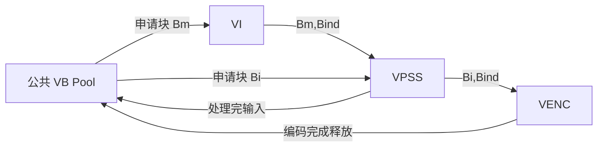
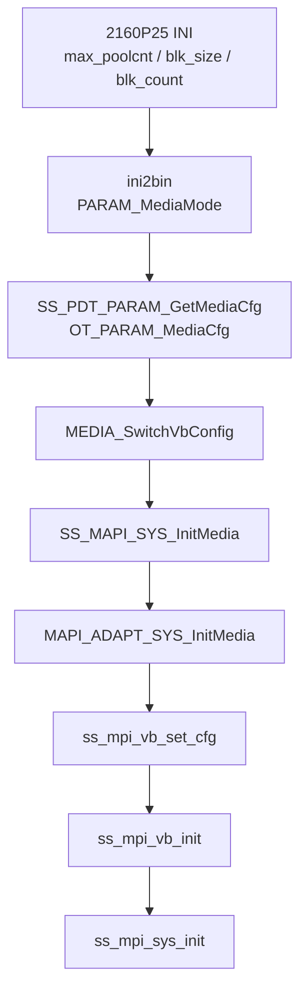
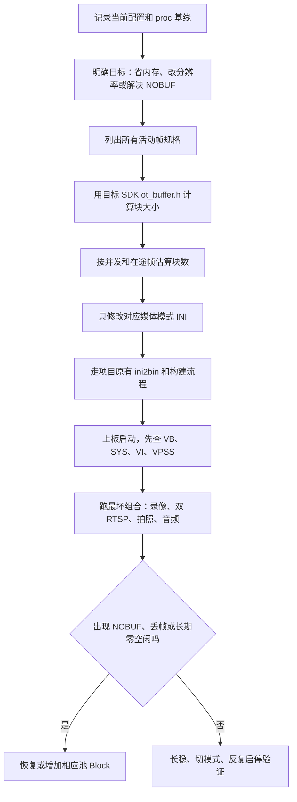

# HC112 VB 配置与修改学习

> 学习顺序第 2 篇，对应原任务第 3 项。  
> 本篇只做分析和修改方法设计，不实际改 HC112 的 INI、源码或固件。

## 1. VB 到底是什么

VB（Video Buffer）是 MPP 管理的大块连续物理内存。VI 采到的帧、VPSS 的输出帧、某些压缩头或模块私有数据，都需要可被硬件访问的内存。它不是普通 `malloc()` 堆内存。

三个量：

- **Pool**：一组同规格 Block 的池。
- **Block size**：每块能容纳多大的帧/缓冲。
- **Block count**：池中同时可借出的块数。

关系：

```text
一个 Pool 占用 ≈ blk_size × blk_count
公共 VB 总量 ≈ 所有公共 Pool 占用之和
```

实际 MMZ 占用还会有页对齐、管理信息、模块私有池和码流缓存，不能把这个和式当成整机媒体内存的全部。

MPP 文档给出的典型生命周期是：



同一块内存沿绑定链传递，最后一个使用者完成后归还。若任一模块长期占块、处理太慢或 Block 数不够，上游可能丢帧、超时或报 `VB_NOBUF`。

## 2. HC112 当前 VB 是怎样生效的



对应代码：

- INI 解析：`Z:\HC1XX_SPC020\source\camera\demo\dronecam\modules\param\ini2bin\src\product_iniparam_cammedia.c:1087-1118`。
- 参数合成：`...\param\core\src\ss_product_param_comm.c:346` 的 `PDT_PARAM_GetMediaCfg()`，公共入口在 `:1942`。
- 结构转换：`source\camera\component\media\src\component\media_sys.c:46-60`。
- MAPI 入口：同文件 `:69-80`。
- 底层应用：`platform\middleware\ndk\code\mediaserver\adapt\h9\mapi_sys_adapt.c:169-225`；其中 `ss_mpi_vb_set_cfg()` 在 183，`ss_mpi_vb_init()` 在 194，`ss_mpi_sys_init()` 在 197。

**重要结论：公共 VB 必须在 SYS 初始化前配置。** 所以公共 VB 不是运行中随便改一个 INI 就立即生效；正常做法是改参数、重新生成参数资源/固件，并在下一次完整媒体初始化时应用。

## 3. 默认 2160P25 的当前配置

文件：

`Z:\HC1XX_SPC020\source\camera\demo\dronecam\modules\param\inicfg\hi3516cv610\nonescreen\gc8613_128M\config_product_mediamode_cam0_record_2160p30.ini`

虽然文件名带 `2160p30`，文件 `:3` 的真实媒体枚举是 `OT_PARAM_MEDIAMODE_2160P_25`，帧率也为 25。学习时以内容为准。

| Pool | INI 行 | `blk_size` | `blk_count` | 静态占用 |
|---:|---:|---:|---:|---:|
| 0 | 15–17 | 10,575,360 | 0 | 0 |
| 1 | 18–20 | 8,311,768 | 3 | 24,935,304 B |
| 2 | 21–23 | 884,736 | 4 | 3,538,944 B |
| 3 | 24–26 | 86,400 | 3 | 259,200 B |
| 合计 | | | 10 个有效 Block | 28,733,448 B ≈ **27.40 MiB** |

`max_poolcnt=4` 表示读取四个池槽；Pool0 的 `blk_count=0` 意味着它不实际提供公共块。它不是 10 MiB 已被占用。

### 不要仅凭注释反推 Block 用途

该 INI 的注释与数值并不完全构成可证明的计算关系。例如 `blk_size=8311768` 不是简单的 `3840×2160×1.5`。原因可能包括压缩、stride、header、wrap 或版本定制。

正确判断池用途要同时看：

1. `ot_buffer.h` 的目标版本计算函数；
2. 实际帧属性：分辨率、像素格式、位宽、压缩模式、对齐；
3. `/proc/umap/vb` 中每块的模块占用；
4. `/proc/umap/media-mem` 中 MMZ 名称和大小。

不能按“看起来像 4K YUV”直接改小。

## 4. 1080P30 配置为什么反而更大

`config_product_mediamode_cam0_record_1080p30.ini:13-26`：

| Pool | `blk_size` | `blk_count` |
|---:|---:|---:|
| 0 | 10,368,000 | 2 |
| 1 | 8,311,768 | 2 |
| 2 | 884,736 | 3 |
| 3 | 86,400 | 2 |

静态合计约 **38.32 MiB**，比 2160P25 的 27.40 MiB 大。这说明 VB 不能只按输出分辨率直觉比较：

- Sensor/ISP 输入仍可能使用 4K 级缓存；
- offline/online 模式和并发深度不同；
- 某模式可能为稳定性预留更多 Block；
- Pool0 在 2160P25 为 0，而在 1080P30 为 2。

因此“降低录像分辨率就一定能减少 VB”在这套配置中不成立。

## 5. Block size 应怎样计算

### 5.1 通用原则

至少需要这些输入：

```text
width, height
pixel_format        # YVU420SP / YUV422 / RAW10 ...
bit_width
compress_mode       # NONE / SEG / ...
video_format
align               # 本平台通常至少 32 字节，但以实际接口为准
```

SDK 已提供计算函数，不建议手算后直接写入。当前 SDK：

`Z:\HC1XX_SPC020\platform\sdk\smp\a7_linux\source\out\include\ot_buffer.h`

- `ot_common_get_pic_buf_cfg()`：19 行；
- `ot_common_get_pic_buf_size()`：38 行；
- `ot_comm_get_vpss_venc_wrap_buf_size()`：47 行；
- `ot_venc_get_pic_buf_size()`：229 行。

MAPI 创建用户 VB Pool 时也遵循此方法：`platform\middleware\ndk\code\mediaserver\adapt\h9\mapi_comm_adapt.c:204-214` 先计算 `ot_vb_calc_cfg`，再把 `vb_size` 和 Block 数传给 `ss_mpi_vb_create_pool()`。

### 5.2 为什么 `width × height × 1.5` 不够

它只近似描述无压缩、无额外对齐的 8-bit YUV420 有效像素：

```text
Y  = width × height
UV = width × height / 2
合计 = width × height × 1.5
```

实际还有：

- 每行 stride 向上对齐；
- 图像高度或 plane 对齐；
- 分段压缩 header；
- 10/12/14/16 bit 打包；
- wrap 只按若干行分配；
- 模块要求的最小块大小。

所以手算值只能做数量级检查，不能替代 `ot_buffer.h`。

## 6. Block count 应怎样估

Block count 不是“通道数”。它由同时在途的帧数决定：

```text
需求 ≈ VI 在途 + VPSS 输入/输出 + 下游处理延迟 + 业务并发 + 安全余量
```

对 HC112 要考虑：

- VENC0 主录像/RTSP 主流共享 VPSS0 port0；
- VENC2 拍照也绑定 port0；
- VENC1 子 RTSP 和 VENC3 缩略图共享 port1；
- 拍照、录像、RTSP 同时发生时峰值更高；
- TS 写卡抖动不直接占 YUV VB，但编码/消费者阻塞会间接增加压力；
- `media_vproc.c:250-299` 对部分分辨率开启 VPSS-VENC wrap，可能改变内存模型。

经验只能用来提出候选值，最终必须靠最坏业务组合实测。

## 7. 安全修改流程



### 修改前记录

```sh
cat /proc/umap/vb
cat /proc/umap/media-mem
cat /proc/umap/sys
cat /proc/umap/vi
cat /proc/umap/vpss
cat /proc/umap/venc
```

同时记录：

- 空闲内存；
- 启动录像前、录像中、RTSP 主/子同时连接、拍照瞬间；
- `blk_cnt`、`free`、`min_free`；
- 相关模块错误日志和丢帧计数。

### 修改规则

1. 一次只改一个模式和一个假设。
2. `blk_size` 改动前先计算，不能用“减 10%”试探。
3. `blk_count` 可以逐步调，但每次必须跑最坏并发。
4. 分辨率、像素格式、压缩模式变化时重新计算 Block size。
5. 不要把一个较大 Pool 拆成多个相同总字节的小 Pool：小块不能满足大帧申请。
6. 不要只看总空闲内存；关键是是否有**足够大的匹配 Block**。
7. 公共池修改后应完整重启媒体/SYS；初学阶段建议整机重启验证。

## 8. 怎么读 `/proc/umap/vb`

MPP 的典型输出包含：

| proc 字段 | 含义 | 如何判断 |
|---|---|---|
| `max_pool_cnt` | 系统允许的池上限 | 不是当前有效池数量 |
| common pool `size/count` | 公共池规格 | 应与生效配置相符 |
| `pool_id` | 池编号 | 与 INI 槽位不一定可仅凭编号机械对应，要看 size |
| `blk_sz` | 实际块大小 | 应不小于申请规格 |
| `blk_cnt` | 块总数 | 与配置及私有池创建有关 |
| `free` | 当前空闲块数 | 瞬时值 |
| `min_free` | 运行以来最低空闲数 | 判断余量比单次 `free` 更有价值 |
| `vi/vpss/venc/...` | 每块被哪些模块占用 | 可追踪 Block 生命周期 |
| `owner` / `pool_type` | 池归属和类型 | 区分公共池、模块池、私有池 |

诊断示例：

- `free=0` 偶发但 `min_free=0` 且无报错：可能只是瞬间吃满，需结合丢帧/错误。
- 长期 `free=0` 并出现 `VB_NOBUF`：Block 数通常不足，或下游未及时释放。
- 大池有很多 free，小池 NOBUF：总内存足够也无用，规格匹配错误。
- proc 中 size 与 INI 不同：可能没烧入新参数、进入了别的媒体模式、INI 被转成 binary 后未更新，或运行时创建了模块池。

## 9. COM3 第一轮实测结论

采样状态为 4K25 普通录像正在进行、副 RTSP 未连接、未触发大图抓拍。

| INI Pool | INI size/count | proc size/count | 采样时占用 |
|---:|---:|---:|---|
| 0 | 10,575,360 × 0 | 不创建公共池 | 历史/规格占位 |
| 1 | 8,311,768 × 3 | 8,311,808 × 3 | free=1；VENC、VPSS 各持有一块 |
| 2 | 884,736 × 4 | 884,736 × 4 | free=3；VPSS 持有一块 |
| 3 | 86,400 × 3 | 86,528 × 3 | free=3 |

`8,311,768→8,311,808` 和 `86,400→86,528` 是驱动向上对齐后的块大小。以后验证 INI 是否生效时，应比较“是否对齐到合理的不小于原值”，不能要求所有字节数机械相等。

本次还确认：

- VI 使用独立私有池，不全从公共池拿帧；
- H.265/H.264 都创建了私有信息块和重构帧池；
- JPEG 码流 buffer、VENC 码流 buffer、OSD、AI/AENC/AO 内存单独出现在 `media-mem`；
- MMZ 共 82 MiB，采样时余约 3 MiB + 224 KiB；
- 关键公共池未出现申请失败，VI/VPSS/VENC 的 VB/error 计数为 0。

尚不能用本快照证明“最坏并发余量足够”，因为副 RTSP 和大图抓拍当时没有同时运行。VB 修改前仍要补“双 RTSP + 抓拍瞬间”的 `free/min_free` 快照。

### 9.1 双 RTSP 补充结果

主、副 RTSP 同时连接后：

- 884,736 池从 free=3 变为 free=2，新增的一块由 VENC1 使用；
- 8,311,808 池仍为 free=1；
- 86,528 池仍为 free=3；
- H.264 的两个 1,280 私有信息块从空闲变为被 H.264E 持有；
- H.264 的 953,600 重构池持续由 H.264E 持有；
- VENC/VB 申请失败、队列满和 over-load 计数仍为 0。

这回答了一个重要问题：副码流活动主要增加 884,736 公共池和 H.264 私有池占用，不会再申请一块 8,311,808 的 4K公共 Block。

目前仍缺“主录像 + 双 RTSP + 4K JPEG 抓拍瞬间”快照，因此还不能据此减少任何 `blk_count`。

## 10. 常见误区

- **误区：VB 越大越好。** 过大浪费 MMZ，可能挤压码流缓存、应用或其他模块。
- **误区：Block 总字节够就行。** 分配按块规格匹配，大帧不能使用多个小块拼起来。
- **误区：把 `count=0` 当作一个空闲块。** 它是不创建公共 Block。
- **误区：只跑开机预览验证。** HC112 的峰值是录像、双 RTSP、拍照等并发。
- **误区：复制 Hi3519DV500 的池值。** SoC、压缩和模块能力不同。
- **误区：只改 INI 就算生效。** 本工程从 INI 生成参数资源，需确认构建和烧录链。

## 11. 本篇参考

- `MPP 媒体处理软件 V6.0 开发参考.pdf`，2.3.1 视频缓存池、`ot_buffer.h` 计算接口、12.3 VB proc。
- `MAPI V1.0 媒体处理开发参考.pdf`，系统/VB 初始化和 MMZ 调试。
- HC112 当前 INI、`media_sys.c`、`mapi_sys.c`、`mapi_sys_adapt.c`。
