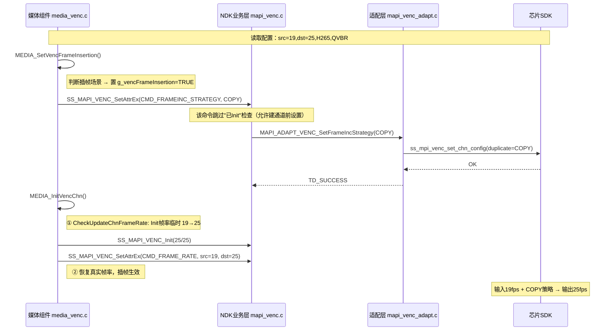

# HC112_B 插帧（重复帧）策略——修改代码详解与逐段注释

> 文档日期：2026-08-11
> 分析工程：`Z:\HC112_B_SPC020`
> 配套文档：`HC112_B_3K加1K插帧实现4K加1K原理与代码说明.md`（看原理），本文件（看代码）

---

## 0. 这次改动到底做了什么（一句话）

为了在 Hi3516CV610 上实现 **4K 录像**：传感器降为 `19fps` 采集，VPSS 放大到 4K，VENC 通过 **COPY（复制帧）策略**把输出补到 `25fps`。本次代码改动就是**打通一条"插帧策略"命令链路**，并让媒体组件初始化时**自动识别并启用**它。

### 涉及文件清单（共 6 个）

| 文件 | 层面 | 改了什么 |
|---|---|---|
| `platform/middleware/ndk/code/include/ot_mapi_venc_define.h` | 定义层 | 新增"重复帧策略"枚举 + 新命令号 |
| `platform/middleware/ndk/code/mediaserver/adapt/h9/mapi_venc_adapt.c` | 适配层 | `FRAME_BUF_RATIO 80→70`；新增 `MAPI_ADAPT_VENC_SetFrameIncStrategy` |
| `platform/middleware/ndk/code/mediaserver/adapt/include/mapi_venc_adapt.h` | 适配层 | 声明新函数 |
| `platform/middleware/ndk/code/mediaserver/venc/mapi_venc.c` | 业务层 | 新增命令分支；该命令允许"未 Init 前"设置 |
| `source/camera/component/media/src/component/media_venc.c` | 组件层 | 自动识别插帧场景并下发策略、调整帧率 |
| `source/camera/demo/dronecam/modules/param/inicfg/hi3516cv610/nonescreen/gc4653_ahd_128M/config_product_mediamode_cam0_record_1440p30.ini` | 配置层 | 3K30 → 4K25（19fps 采集 + 插帧），重排 VB |

### 调用链总览（从上到下）

```text
MEDIA_InitVenc / MEDIA_PartiallyInitVenc   （组件层：初始化入口）
   │  ①
   ▼
MEDIA_SetVencFrameInsertion()              （判断是否插帧场景，置全局标志，下发策略）
   │   调用 SS_MAPI_VENC_SetAttrEx(CMD_FRAMEINC_STRATEGY, COPY)
   ▼
MEDIA_InitVencChn()                        （初始化编码通道）
   │  ② MEDIA_CheckUpdateChnFrameRate() 临时把 Init 帧率改为 25/25
   │  ③ SS_MAPI_VENC_Init()              以 25/25 建通道
   │  ④ SS_MAPI_VENC_SetAttrEx(CMD_FRAME_RATE, 19→25) 恢复真实帧率
   ▼
SS_MAPI_VENC_SetAttrEx()                   （业务层：加锁、校验、分发命令）
   ▼
MAPI_ADAPT_VENC_SetFrameIncStrategy()      （适配层：直连芯片 SDK）
   ▼
ss_mpi_venc_set_chn_config(duplicate_frame_strategy=COPY)
```

---

## 1. 定义层：`ot_mapi_venc_define.h`

### 1.1 新增"重复帧策略"枚举

```c
/* 编码器输入帧率不足时的处理策略（插帧/补帧方式） */
typedef enum {
    OT_MAPI_VENC_DUPLICATE_FRAME_STRATEGE_RECODE = 0, /* 模式0：重复帧时"重新编码"最近一帧再输出，画质好但耗算力 */
    OT_MAPI_VENC_DUPLICATE_FRAME_STRATEGE_COPY,       /* 模式1：直接"复制"上一帧编码结果输出，几乎不耗算力（本方案采用） */
    OT_MAPI_VENC_DUPLICATE_FRAME_STRATEGE_BUTT        /* 哨兵值，用于校验取值范围 */
} OT_MAPI_VENC_DuplicateFrameStrategy;
```

> 复习要点：
> - **RECODE**：重复帧重新编码 → 质量高、算力高；
> - **COPY**：重复帧直接复制 → 省算力、速度快；
> - 本方案 4K 档选 **COPY**，因为 Hi3516CV610 算力有限，4K 下没余量做重编码。

### 1.2 命令枚举中新增命令号

```c
typedef enum {
    OT_MAPI_VENC_CMD_H264_RC_ATTR_EX,
    OT_MAPI_VENC_CMD_H265_RC_ATTR_EX,
    OT_MAPI_VENC_CMD_MJPEG_RC_ATTR_EX,
    OT_MAPI_VENC_CMD_GOP_MODE,
    OT_MAPI_VENC_CMD_INTRA_REFRESH,
    OT_MAPI_VENC_CMD_FRAME_RATE,
    OT_MAPI_VENC_CMD_HIERARCHICAL_QP,
    OT_MAPI_VENC_CMD_FRAMELOST_STRATEGY,
    OT_MAPI_VENC_CMD_INTERVAL_GETFRAME,
    OT_MAPI_VENC_CMD_FRAMEINC_STRATEGY,   /* ★ 新增：设置插帧（重复帧）策略 */
    OT_MAPI_VENC_CMD_BUTT
} OT_MAPI_VENC_Cmd;
```

> 注意：`FRAMEINC_STRATEGY` 插在 `BUTT` 之前，枚举值顺延 +1，属于**向后兼容**的做法（旧固件不会错位）。

---

## 2. 适配层：`mapi_venc_adapt.c` / `mapi_venc_adapt.h`

### 2.1 `FRAME_BUF_RATIO` 80 → 70（省内存）

```c
/* 编码器参考帧缓冲比例（%）。调低 = 编码缓冲占用的 VB 内存更少。
 * 原因：升级 4K 后内存紧张，把省下的内存分给 4K 大帧缓冲。
 * 注意：参考帧变少，极端运动场景下编码质量会略降。 */
#define FRAME_BUF_RATIO 70
```

> 该宏用在这里（`mapi_venc_adapt.c` 内）：
> ```c
> vencChnAttr->venc_attr.h264_attr.frame_buf_ratio = FRAME_BUF_RATIO;
> vencChnAttr->venc_attr.h265_attr.frame_buf_ratio = FRAME_BUF_RATIO;
> ```
> SDK 示例默认值 `SAMPLE_FRAME_BUF_RATIO_DEFAULT = 75`，本次设为 70，低于默认。

### 2.2 新增 `MAPI_ADAPT_VENC_SetFrameIncStrategy`（直连芯片）

```c
/* 设置编码通道的"重复帧策略"（插帧方式），最底层实现，直接操作芯片 SDK */
TD_S32 MAPI_ADAPT_VENC_SetFrameIncStrategy(TD_HANDLE vencHdl, OT_MAPI_VENC_DuplicateFrameStrategy strategy)
{
    ot_venc_chn_config chnCfg;
    TD_S32 ret = ss_mpi_venc_get_chn_config(vencHdl, &chnCfg);   /* 1. 读回当前通道配置 */
    if (ret == TD_SUCCESS) {
        /* 2. 幂等检查：策略已经一致就不重复设置，直接成功 */
        if (chnCfg.duplicate_frame_strategy == (ot_venc_duplicate_frame_strategy)strategy) {
            return TD_SUCCESS;
        }
        /* 3. 必须关闭与插帧互斥的三个高级功能，否则设置失败 */
        chnCfg.composite_enc_en = TD_FALSE;   /* 关复合编码 */
        chnCfg.mosaic_en = TD_FALSE;          /* 关马赛克 */
        chnCfg.quality_level = 0;             /* 质量档复位 */
        /* 4. 写入目标策略并下发到芯片 */
        chnCfg.duplicate_frame_strategy = (ot_venc_duplicate_frame_strategy)strategy;
        ret = ss_mpi_venc_set_chn_config(vencHdl, &chnCfg);
        if (ret != TD_SUCCESS) {
            MAPI_ERR_TRACE(OT_MAPI_MOD_VENC,
                "Venc set chn config (composite encode = %d duplicate_frame_strategy:%d) failed ret = 0x%x\n",
                chnCfg.composite_enc_en, chnCfg.duplicate_frame_strategy, ret);
        }
    } else {
        MAPI_ERR_TRACE(OT_MAPI_MOD_VENC, "Venc get chn config failed! ret = 0x%x\n", ret);
    }
    return ret;
}
```

> 复习要点：
> - 三个被关闭的字段：`composite_enc_en`（复合编码）、`mosaic_en`（马赛克）、`quality_level`（质量档）——它们与插帧**互斥**；
> - 幂等判断：已设置相同策略就直接返回成功，避免重复下发引发问题。

### 2.3 头文件新增声明（`mapi_venc_adapt.h`）

```c
/* 暴露给业务层的接口：设置插帧策略 */
TD_S32 MAPI_ADAPT_VENC_SetFrameIncStrategy(TD_HANDLE vencHdl, OT_MAPI_VENC_DuplicateFrameStrategy strategy);
```

---

## 3. 业务层：`mapi_venc.c`（NDK 中间件）

### 3.1 关键改动：该命令"跳过 Init 检查"

```c
MAPI_MUTEX_LOCK(g_vencFuncLock[vencHdl]);

CHECK_MAPI_VENC_CHECK_PREINIT_UNLOCK_RET(g_vencContext.vencInited);
/* ★ 只有 FRAMEINC_STRATEGY 允许在通道 Init 之前设置。
 * 原因：插帧策略必须在 SS_MAPI_VENC_Init 之前设置才有效（Init 之后设置会失败或需重建通道）。
 * 这对应组件层"先 MEDIA_SetVencFrameInsertion 再 MEDIA_InitVencChn"的调用顺序。 */
if (cmd != OT_MAPI_VENC_CMD_FRAMEINC_STRATEGY) {
    CHECK_MAPI_VENC_CHECK_INIT_UNLOCK_RET(g_vencContext.vencChnCfg[vencHdl].inited);
}
```

### 3.2 新增命令分支 `OT_MAPI_VENC_CMD_FRAMEINC_STRATEGY`

```c
case OT_MAPI_VENC_CMD_FRAMEINC_STRATEGY:
    /* ① 校验参数长度，防止越界/非法参数 */
    if (attrLen < sizeof(OT_MAPI_VENC_DuplicateFrameStrategy)) {
        MAPI_ERR_TRACE(OT_MAPI_MOD_VENC, "VENC pAttr attrLen:%x is small\n", attrLen);
        MAPI_MUTEX_UNLOCK(g_vencContext.vencChnCfg[vencHdl].vencChnLock);
        MAPI_MUTEX_UNLOCK(g_vencFuncLock[vencHdl]);
        return OT_MAPI_VENC_EILLEGAL_PARAM;
    }

    /* ② 校验策略值只能为 RECODE 或 COPY，其它一律非法 */
    OT_MAPI_VENC_DuplicateFrameStrategy *strategy = (OT_MAPI_VENC_DuplicateFrameStrategy *)attr;
    if ((*strategy) != OT_MAPI_VENC_DUPLICATE_FRAME_STRATEGE_RECODE &&
        (*strategy) != OT_MAPI_VENC_DUPLICATE_FRAME_STRATEGE_COPY) {
        MAPI_ERR_TRACE(OT_MAPI_MOD_VENC, "VENC pAttr duplicate frame strategy:%x illegal\n", *strategy);
        MAPI_MUTEX_UNLOCK(g_vencContext.vencChnCfg[vencHdl].vencChnLock);
        MAPI_MUTEX_UNLOCK(g_vencFuncLock[vencHdl]);
        return OT_MAPI_VENC_EILLEGAL_PARAM;
    }

    /* ③ 调用适配层真正下发到芯片；失败返回错误码 */
    ret = MAPI_ADAPT_VENC_SetFrameIncStrategy(vencHdl, *strategy);
    if (ret != TD_SUCCESS) {
        MAPI_ERR_TRACE(OT_MAPI_MOD_VENC, "SetFrameIncStrategy failed:0x%x\n", ret);
        MAPI_MUTEX_UNLOCK(g_vencContext.vencChnCfg[vencHdl].vencChnLock);
        MAPI_MUTEX_UNLOCK(g_vencFuncLock[vencHdl]);
        return ret;
    }
    break;
```

> 复习要点：
> - 两层锁：`vencFuncLock`（功能级）＋ `vencChnLock`（通道级），出错路径必须**成对解锁**再返回；
> - 三段式校验：`attrLen` 长度 → 策略取值 → 下发结果。

---

## 4. 组件层：`media_venc.c`（自动启用插帧，核心业务逻辑）

### 4.1 全局标志

```c
/* 记录当前是否处于"插帧模式"，供后续初始化通道时判断 */
static td_bool g_vencFrameInsertion = TD_FALSE;
```

### 4.2 `MEDIA_IsVencFrameInsertionAttr` —— 判断是否启用插帧

```c
/* 判断该编码通道是否属于"插帧场景"，只有同时满足才启用 */
static td_bool MEDIA_IsVencFrameInsertionAttr(const OT_MEDIA_VencAttr *attr)
{
    /* 条件1：必须是 H265（当前只对主码流 4K H265 生效） */
    if (attr->vencChnAttr.payloadTypeAttr.type != OT_MAPI_PAYLOAD_TYPE_H265) {
        return TD_FALSE;
    }

    /* 条件2：必须是 QVBR 码控模式 */
    if (attr->vencChnAttr.rcAttr.rcMode != OT_MAPI_VENC_RC_MODE_QVBR) {
        return TD_FALSE;
    }

    /* 条件3：帧率组合必须是"输出>输入"的插帧场景：
     *   - 25/19：4K 档，19fps 采集 → 插帧到 25fps
     *   - 30/25：预留场景，25fps 采集 → 插帧到 30fps
     */
    const OT_MAPI_VENC_QvbrAttr *qvbrAttr = &attr->vencChnAttr.rcAttr.vencAttr.h265QvbrAttr.qvbrAttr;
    if ((qvbrAttr->dstFrameRate == 25 && qvbrAttr->srcFrameRate == 19) ||
        (qvbrAttr->dstFrameRate == 30 && qvbrAttr->srcFrameRate == 25)) {
        return TD_TRUE;
    }

    return TD_FALSE;
}
```

> 复习要点：三个硬性条件 **H265 + QVBR + (dst25/src19 或 dst30/src25)**，写死在这，只对特定主码流场景生效。

### 4.3 `MEDIA_SetVencFrameInsertion` —— 下发策略

```c
/* 设置插帧策略（在 MEDIA_InitVencChn 之前调用） */
static td_s32 MEDIA_SetVencFrameInsertion(const OT_MEDIA_VencAttr *attr)
{
    g_vencFrameInsertion = TD_FALSE;                 /* 先复位全局标志 */
    if (!MEDIA_IsVencFrameInsertionAttr(attr)) {
        return TD_SUCCESS;                           /* 非插帧场景：保持关闭直接返回 */
    }

    g_vencFrameInsertion = TD_TRUE;                  /* 是插帧场景：置标志 */
    OT_MAPI_VENC_DuplicateFrameStrategy strategy = OT_MAPI_VENC_DUPLICATE_FRAME_STRATEGE_COPY; /* 采用 COPY 策略 */
    td_s32 ret = SS_MAPI_VENC_SetAttrEx(attr->vencHdl, OT_MAPI_VENC_CMD_FRAMEINC_STRATEGY,
        &strategy, sizeof(OT_MAPI_VENC_DuplicateFrameStrategy));
    MLOGI("Set frame insertion strategy venc[%u] strategy[%d] ret[0x%x]\n", attr->vencHdl, strategy, ret);
    return ret;
}
```

> 复习要点：这里在 Init **之前**下发策略，所以业务层必须放开"未 Init"限制（见 3.1）。

### 4.4 `MEDIA_CheckUpdateChnFrameRate` —— 插帧的算法核心

```c
/* 插帧场景下，临时调整给 VENC_Init 使用的输入帧率。
 * 返回值：是否需要 Init 后再用 CMD_FRAME_RATE 恢复真实帧率。 */
static td_bool MEDIA_CheckUpdateChnFrameRate(OT_MAPI_PayloadType type, OT_MAPI_VENC_RcAttr *attr,
    td_u32 *srcFrameRate, td_u32 *dstFrameRate)
{
    /* 只对 H264/H265 生效 */
    if (type != OT_MAPI_PAYLOAD_TYPE_H265 && type != OT_MAPI_PAYLOAD_TYPE_H264) {
        return TD_FALSE;
    }

    /* 未开启插帧则不动 */
    if (g_vencFrameInsertion == TD_FALSE) {
        return TD_FALSE;
    }

    /* 核心逻辑：当 src <= dst（如 19<=25）时，
     * 把给 Init 的 srcFrameRate 临时改成 = dstFrameRate（25/25 建通道），
     * 同时把原始帧率(19/25)保存到出参，供 Init 后用 CMD_FRAME_RATE 恢复。 */
    td_bool needSetChnParam = TD_FALSE;
    if (attr->rcMode == OT_MAPI_VENC_RC_MODE_CBR) {
        if (attr->cbrAttr.srcFrameRate <= attr->cbrAttr.dstFrameRate) {
            *srcFrameRate = attr->cbrAttr.srcFrameRate;      /* 保存原始 src（19） */
            *dstFrameRate = attr->cbrAttr.dstFrameRate;      /* 保存原始 dst（25） */
            attr->cbrAttr.srcFrameRate = attr->cbrAttr.dstFrameRate; /* Init 输入帧率改为 25 */
            needSetChnParam = TD_TRUE;
        }
    } else if (attr->rcMode == OT_MAPI_VENC_RC_MODE_VBR) {
        if (attr->vbrAttr.srcFrameRate <= attr->vbrAttr.dstFrameRate) {
            *srcFrameRate = attr->vbrAttr.srcFrameRate;
            *dstFrameRate = attr->vbrAttr.dstFrameRate;
            attr->vbrAttr.srcFrameRate = attr->vbrAttr.dstFrameRate;
            needSetChnParam = TD_TRUE;
        }
    } else if (attr->rcMode == OT_MAPI_VENC_RC_MODE_CVBR) {
        if (attr->cvbrAttr.srcFrameRate <= attr->cvbrAttr.dstFrameRate) {
            *srcFrameRate = attr->cvbrAttr.srcFrameRate;
            *dstFrameRate = attr->cvbrAttr.dstFrameRate;
            attr->cvbrAttr.srcFrameRate = attr->cvbrAttr.dstFrameRate;
            needSetChnParam = TD_TRUE;
        }
    } else if (attr->rcMode == OT_MAPI_VENC_RC_MODE_QVBR) {   /* 本方案实际走这里 */
        if (attr->qvbrAttr.srcFrameRate <= attr->qvbrAttr.dstFrameRate) {
            *srcFrameRate = attr->qvbrAttr.srcFrameRate;      /* 19 */
            *dstFrameRate = attr->qvbrAttr.dstFrameRate;      /* 25 */
            attr->qvbrAttr.srcFrameRate = attr->qvbrAttr.dstFrameRate; /* Init 用 25/25 */
            needSetChnParam = TD_TRUE;
        }
    } else if (attr->rcMode == OT_MAPI_VENC_RC_MODE_AVBR) {
        if (attr->avbrAttr.srcFrameRate <= attr->avbrAttr.dstFrameRate) {
            *srcFrameRate = attr->avbrAttr.srcFrameRate;
            *dstFrameRate = attr->avbrAttr.dstFrameRate;
            attr->avbrAttr.srcFrameRate = attr->avbrAttr.dstFrameRate;
            needSetChnParam = TD_TRUE;
        }
    }

    return needSetChnParam;
}
```

> 复习要点（理解插帧原理的关键）：
> - 为什么 Init 要临时用 25/25？让编码器认为"输入=输出=25fps"，配合 COPY 策略，当实际只有 19 帧输入时，编码器自动复制帧补足到 25fps；
> - 为什么 Init 后还要恢复 19→25？把真实的码控帧率关系告诉编码器，保证码率/帧率分配正确；
> - 支持 5 种码控：CBR / VBR / CVBR / QVBR / AVBR，逻辑完全一致。

### 4.5 `MEDIA_InitVencChn` —— 组装时序

```c
static td_s32 MEDIA_InitVencChn(const OT_MEDIA_VencAttr *attr)
{
    td_s32 ret;
    OT_MAPI_VENC_Attr mapiVencAttr = {0};
    OT_MAPI_VENC_HierarchicalQp hierarchicalQp = {0};
    mapiVencAttr.payloadTypeAttr = attr->vencChnAttr.payloadTypeAttr;
    MEDIA_DebugVencTypeAttr(attr->vencHdl, &mapiVencAttr.payloadTypeAttr);
    MEDIA_SwitchRcTypeAttr(&attr->vencChnAttr, &mapiVencAttr.rcAttr, &hierarchicalQp);

    /* ① 先探测：是否插帧场景，若是则临时把 srcFrameRate 改为 25，并保存原始 19/25 */
    td_u32 srcFps = 30;
    td_u32 dstFps = 30;
    td_bool needSetChnParam = MEDIA_CheckUpdateChnFrameRate(attr->vencChnAttr.payloadTypeAttr.type,
        &mapiVencAttr.rcAttr, &srcFps, &dstFps);

    /* ② 用调整后的 25/25 初始化编码通道（内部会走 SS_MAPI_VENC_Init） */
    ret = SS_MAPI_VENC_Init(attr->vencHdl, &mapiVencAttr);
    OT_APPCOMM_RETURN_IF_FAIL(ret, ret);

    /* ③ 设置扩展属性、绑定输入源 */
    ret = MEDIA_SetVencAttrEx(attr, &hierarchicalQp);
    OT_APPCOMM_RETURN_IF_FAIL(ret, ret);
    ret = MEDIA_BindVencChn(attr->vencHdl, &attr->bindSrc);
    OT_APPCOMM_RETURN_IF_FAIL(ret, ret);

    /* ④ 恢复真实帧率 19→25：通过 CMD_FRAME_RATE 下发，让插帧真正生效 */
    if (needSetChnParam == TD_TRUE) {
        OT_MAPI_FrameRateCtrl vencFrameRate;
        vencFrameRate.srcFrameRate = srcFps;   /* 19 */
        vencFrameRate.dstFrameRate = dstFps;   /* 25 */
        ret = SS_MAPI_VENC_SetAttrEx(attr->vencHdl, OT_MAPI_VENC_CMD_FRAME_RATE,
            &vencFrameRate, sizeof(OT_MAPI_FrameRateCtrl));
        MLOGI("Set frame insertion fps venc[%u] srcFps[%u] dstFps[%u] ret[0x%x]\n",
            attr->vencHdl, srcFps, dstFps, ret);
        OT_APPCOMM_RETURN_IF_FAIL(ret, ret);
    }

    /* ...其余 H264/H265 VUI、fast_enc 等配置不变... */
}
```

### 4.6 两条初始化入口各加一处调用

```c
/* 全量初始化：在初始化每个通道前，先设置插帧策略 */
td_s32 MEDIA_InitVenc(const OT_MEDIA_VencCfg *cfg)
{
    /* ... */
    ret = MEDIA_SetVencFrameInsertion(mediaVencAttr);   /* ★ 新增 */
    OT_APPCOMM_RETURN_IF_FAIL(ret, ret);
    ret = MEDIA_InitVencChn(mediaVencAttr);
    OT_APPCOMM_RETURN_IF_FAIL(ret, ret);
    /* ... */
}

/* 局部增量初始化（热切换档位）：逻辑与上面一致 */
td_s32 MEDIA_PartiallyInitVenc(const OT_MEDIA_VencCfg *oldCfg, const OT_MEDIA_VencCfg *newCfg)
{
    /* ... */
    if (newVencAttr->enable) {
        ret = MEDIA_SetVencFrameInsertion(newVencAttr);  /* ★ 新增 */
        OT_APPCOMM_RETURN_IF_FAIL(ret, ret);
        ret = MEDIA_InitVencChn(newVencAttr);
        OT_APPCOMM_RETURN_IF_FAIL(ret, ret);
    }
    /* ... */
}
```

> 复习要点：两条初始化路径（开机全量 `MEDIA_InitVenc`、档位热切 `MEDIA_PartiallyInitVenc`）都必须**先设置策略、再建通道**，顺序不能反。

---

## 5. 配置层：ini 改动要点（`config_product_mediamode_cam0_record_1440p30.ini`）

```ini
; ============= VB Configure（为 4K 大帧重排内存） =============
[vb]
max_poolcnt        = "5"          ; 池数量 6→5
[vb.pool.0]
blk_size           = "5529600"    ;2560*1440*3/2（主码流帧缓冲）
blk_count          = "5"          ; 3→5，主码流多分配帧缓冲
[vb.pool.2]
blk_size           = "884736"     ;1024*576*3/2 grp0 chn1
blk_count          = "6"          ; 3→6
[vb.pool.3]
blk_size           = "687872"     ; 单块加大 515840→687872
blk_count          = "1"          ; 数量 2→1
[vb.pool.4]                       ; 被删除（原 345600 池）
[vb.pool.5]
blk_size           = "115200"     ;320*240*3/2
blk_count          = "1"          ; 6→1

; ============= Vcapture（传感器降到 19fps 采集） =============
[vcap.dev]
sensor_type        = "30"         ; 29:imx258 → 30:gc4653（修正注释）
[vcap.pipe.0]
src_framerate      = "19"         ; 30→19
dst_framerate      = "19"         ; 30→19
isp_framerate      = "19"         ; 30→19

; ============= Vprocessor（分辨率升到 4K） =============
[vpss.0]
src_framerate      = "19"         ; 30→19
dst_framerate      = "19"
[vpss.0.vport.0]
res_width          = "3840"       ; 2880→3840（放大到 4K）
res_height         = "2160"       ; 1620→2160
[vpss.0.vport.1]
src_framerate      = "19"         ; 25→19
[vpss.0.vport.2]                  ; 320x240 通道被删除（省内存）

; ============= Vcoder（编码输出 4K@25fps，插帧 19→25） =============
[venc.0]                          ; 主码流
res_width          = "3840"       ; 2880→3840
res_height         = "2160"       ; 1620→2160
bufsize            = "3110400"    ; 2560*1440*3/4 bytes
gop                = "19"         ; 30→19（GOP 与采集帧率对齐）
src_framerate      = "19"         ; 30→19
dst_framerate      = "25"         ; 30→25（★ 插帧目标帧率）
h265bitrate        = "18432"      ; kbps 20480→18432
[venc.1]                          ; 次码流
gop                = "19"         ; 25→19
src_framerate      = "19"         ; 25→19
dst_framerate      = "19"         ; 25→19
```

### `config_product_valueset.ini`（对外档位描述）

```ini
[cam.0.mediamode.recordnowdr_double];插上后拉
description0       = "4K25fps+1080P25fps"   ; 3K30fps+1080P25fps → 4K25fps+1080P25fps
value0             = "OT_PARAM_MEDIAMODE_1440P_30"
```

> 复习要点：
> - 主码流配置里 **`dst_framerate=25` 而 `src_framerate=19`** 正是插帧触发的信号源（对应代码 `MEDIA_IsVencFrameInsertionAttr` 的 `dst25/src19` 判断）；
> - GOP 改为 19（与采集帧率一致），插帧发生在编码端；
> - VB 重排的目标：给 4K 主码流多分缓冲（pool0: 3→5）。

---

## 6. 完整时序总结（复习图）



---

## 7. 一句话复习清单

1. **为什么插帧**：Hi3516CV610 算力/内存不够直接跑 4K@30，传感器降到 19fps，编码端补到 25fps。
2. **插帧方式**：`duplicate_frame_strategy = COPY`（复制上一帧码流），不是重新编码。
3. **命令链路**：`CMD_FRAMEINC_STRATEGY` → 定义层枚举 → 业务层校验分发 → 适配层写芯片。
4. **关键时序**：先 `SetFrameIncStrategy`（Init 前），再 `Init(25/25)`，最后 `CMD_FRAME_RATE` 恢复 `19→25`。
5. **触发条件**（写死在代码）：`H265 + QVBR + (25/19 或 30/25)`。
6. **省内存手段**：`FRAME_BUF_RATIO 80→70`、VB 池重排、删 320x240 vport。
7. **互斥项**：插帧开启时必须关闭 `composite_enc` / `mosaic` / `quality_level`。

---

*本文件为代码注释复习文档，可与 `HC112_B_3K加1K插帧实现4K加1K原理与代码说明.md` 配合阅读。*
