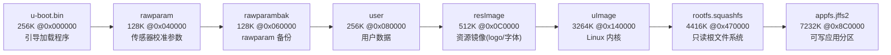
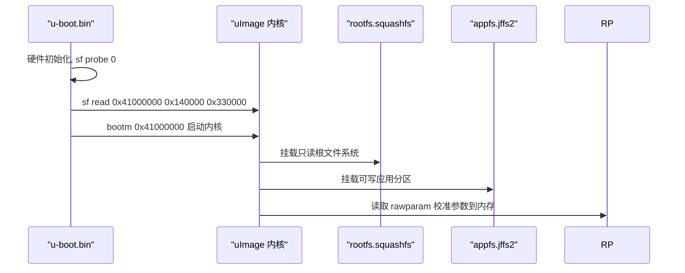

# Hi3516CV610 DroneCam SPI NOR Flash 分区说明

> 适用型号：Hi3516CV610 DroneCam（无屏 / demb / gc8613）
> Flash 总容量：16MB（0x1000000）

---

## 1. 分区总览

本机的 SPI NOR Flash 划分为 8 个分区，分区表定义在 U-Boot 的 `bootargs` 环境变量中：

```
mtdparts=sfc:256K(u-boot.bin),128K(rawparam),128K(rawparambak),256K(user),512K(resImage),3264K(uImage),4416K(rootfs.squashfs),7232K(appfs.jffs2)
```



---

## 2. 各分区详细说明

### 2.1 u-boot.bin（256K @ 0x000000）

| 项目 | 内容 |
|---|---|
| 大小 / 地址 | 256K，0x000000 ~ 0x03FFFF |
| 头部特征 | `ea ff 00 00`（ARM 分支跳转指令，U-Boot 入口代码） |
| 文件系统 | 无（裸二进制） |

**作用**：引导加载程序（Bootloader）。

- 完成硬件初始化（时钟、DDR、外设等）。
- 通过 `sf probe 0` 初始化 SPI NOR Flash。
- 将内核镜像从 Flash 读取到内存并跳转启动 Linux。

对应启动命令：

```
setenv bootcmd 'sf probe 0; sf read 0x41000000 0x140000 0x330000; bootm 0x41000000';
```

其中 `0x140000` 正是 uImage 分区起始地址，`0x330000`（3264K）是内核长度。

---

### 2.2 rawparam（128K @ 0x040000）

| 项目 | 内容 |
|---|---|
| 大小 / 地址 | 128K，0x040000 ~ 0x05FFFF |
| 头部特征 | `6c 63 79 63`("lcyc")、`73 63 79 63`("scyc") 参数段标记；其后 `1f 8b 08` 为 gzip 压缩数据 |
| 配置项 | `CONFIG_FLASH_RAWPARAM_OFFSET="0x100000"` |

**作用**：保存传感器（sensor）校准、ISP 等**原始参数**。

- 上电后由系统读取并拷贝到内存中使用（`RAWPARAM_MEM_BASE`，本配置为 `0x42C00000`）。
- 内容以 gzip 压缩存放，减小 Flash 占用。

---

### 2.3 rawparambak（128K @ 0x060000）

| 项目 | 内容 |
|---|---|
| 大小 / 地址 | 128K，0x060000 ~ 0x07FFFF |
| 头部特征 | 与 rawparam 完全一致（字节级相同） |
| 配置项 | `CONFIG_FLASH_RAWPARAM_BAK_OFFSET="0x200000"` |

**作用**：rawparam 的**备份分区**。

- 主参数区损坏时用于恢复，避免设备因参数丢失而无法正常工作。
- 属于"参数区 + 备份"的可靠性设计。

---

### 2.4 user（256K @ 0x080000）

| 项目 | 内容 |
|---|---|
| 大小 / 地址 | 256K，0x080000 ~ 0x0BFFFF |

**作用**：用户分区。

- 通常存放用户自定义配置、升级标志等可擦写数据。
- 供应用层自由使用。

---

### 2.5 resImage（512K @ 0x0C0000）

| 项目 | 内容 |
|---|---|
| 大小 / 地址 | 512K，0x0C0000 ~ 0x13FFFF |
| 头部特征 | `72 65 73 73`="ress"，与资源打包脚本魔数 `PDT_RES_MAGIC_START=0x72657373` 一致 |
| 生成脚本 | `source/camera/demo/dronecam/modules/resource/script/res2img.sh` |

**作用**：**资源镜像**，由 `res2img.sh` 打包生成，内部包含（按 purpose 编号）：

| 编号 | 资源类型 | 示例参数 |
|---|---|---|
| 1 | boot logo（开机画面） | arg0=宽 arg1=高 |
| 2 | boot sound（开机声音） | arg0=采样率 arg1=声道 |
| 3 | OSD 字体库 | — |
| 4 | OSD logo（主码流） | — |
| 5 | OSD logo（子码流） | — |

> 打包结束魔数：`PDT_RES_MAGIC_END=0x72657364`("resd")。

---

### 2.6 uImage（3264K @ 0x140000）

| 项目 | 内容 |
|---|---|
| 大小 / 地址 | 3264K，0x140000 ~ 0x46FFFF |
| 头部特征 | `d0 0d fe ed`（U-Boot legacy image 魔数），内含 "Linux Kernel" 字符串 |

**作用**：**Linux 内核镜像**（U-Boot legacy image 格式）。

- 由 U-Boot 通过 `sf read` 读取到 `0x41000000` 后 `bootm` 引导。
- 分区地址与 `bootcmd` 中的偏移完全对应。

---

### 2.7 rootfs.squashfs（4416K @ 0x470000）

| 项目 | 内容 |
|---|---|
| 大小 / 地址 | 4416K，0x470000 ~ 0x8BFFFF |
| 头部特征 | `68 73 71 73`="hsqs"（squashfs 文件系统魔数） |
| 配置项 | `CONFIG_ROOTFS_SQUASHFS=y`，`CONFIG_ROOTFS_JFFS2 未设置` |
| 挂载方式 | 只读，root=`/dev/mtdblock6` |

**作用**：**只读根文件系统**。

- 挂载为 `/`，包含系统二进制、库、`/etc` 等只读内容。
- 使用 squashfs（只读压缩文件系统），体积小、不易损坏。

---

### 2.8 appfs.jffs2（7232K @ 0x8C0000）

| 项目 | 内容 |
|---|---|
| 大小 / 地址 | 7232K，0x8C0000 ~ 0xFFFFFF |
| 文件系统 | jffs2（可读写） |
| 配置项 | `CONFIG_APPFS_JFFS2=y`，`CONFIG_APPFS_UBIFS/APPFS_YAFFS 未设置` |

**作用**：**可读写应用分区**。

- 挂载为 `/app`（或类似挂载点），存放录像、照片、日志、升级包等运行期产生的数据。
- 内部子区域偏移见 `CONFIG_FLASH_APPFS_OFFSET="0xF00000"`（15MB 处，用于存放配置 / 升级镜像等）。

---

## 3. 启动流程



---

## 4. 关键点小结

1. **启动链路**：`u-boot.bin` → `uImage`（内核）→ `rootfs.squashfs`（只读根文件系统）→ `appfs.jffs2`（可写数据区）。
2. **双份保护**：`rawparam` 有独立的 `rawparambak` 备份，防止校准参数丢失导致设备异常。
3. **内容识别依据**：各分区头部魔数均可直接验证身份：
   - `ress` → resImage（资源镜像）
   - `hsqs` → squashfs（rootfs）
   - `d0 0d fe ed` + "Linux Kernel" → uImage（内核）
   - `ea ff 00 00` → u-boot.bin（引导程序）
4. **容量校验**：256+128+128+256+512+3264+4416+7232 = 16192KB ≈ 15.8MB，与 16MB Flash（`CONFIG_FLASH_TOTAL_SIZE=0x1000000`）一致。

---

## 5. 相关配置项索引（config.conf）

| 配置项 | 值 | 说明 |
|---|---|---|
| `CONFIG_FLASH_TOTAL_SIZE` | `0x1000000` | Flash 总容量 16MB |
| `CONFIG_FLASH_UBOOT_ENV_OFFSET` | `0x80000` | U-Boot 环境变量偏移 |
| `CONFIG_FLASH_RAWPARAM_OFFSET` | `0x100000` | rawparam 偏移 |
| `CONFIG_FLASH_RAWPARAM_BAK_OFFSET` | `0x200000` | rawparambak 偏移 |
| `CONFIG_FLASH_APPFS_OFFSET` | `0xF00000` | appfs 内子区域偏移 |
| `CONFIG_FLASH_PARAM_SIZE` | `0x100000` | 参数区大小 |
| `CONFIG_ROOTFS_SQUASHFS` | `y` | 根文件系统为 squashfs |
| `CONFIG_APPFS_JFFS2` | `y` | 应用分区为 jffs2 |
| `CONFIG_MEM_PARAM_BASE` | `0x42C00000` | rawparam 运行期内存基址 |

---

*文档整理日期：2026-08-06*
