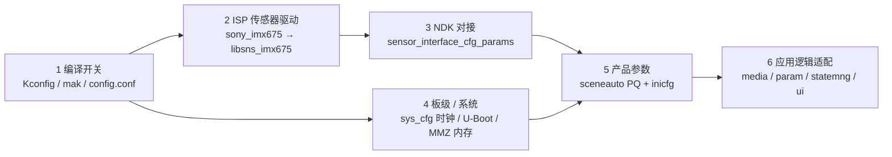

# IMX675 移植代码逐层分析

> 分析对象：`HC1XX_SPC020` 仓库"适配IMX675"提交（杨豪，2026-09-18，commit `01526aae34956abdcff684f2b861eefdd75e46fc`）
> 规模：69 个文件，+18505 / -64 行
> 本文从补丁 diff 出发，逐层解释"一次 sensor 移植到底改了什么、为什么这么改、代码在哪里"。
> 同目录《如何移植一个新摄像头——以IMX675适配HC112为例》侧重流程、验证与验收；本文侧重代码结构与关键算法实现，两份可配合阅读。
> 增补（2026-09-20）：新增 1.5 节「lane 划分模式全链路调查」，回答"为什么必须是 Mode_1"以及"GC8613 和 IMX675 有什么区别"。

---

## 0. 总览

一次 sensor 移植的本质，是让下面五层都"认识"这颗新 sensor：**编译得出、驱动得了、接收得对、板级配合、产品能用**。



| 层 | 负责什么 | 关键文件 |
| --- | --- | --- |
| 1 编译开关 | 让代码编译得出来，配置错误时直接编译失败 | `cmake/menuconfig/Kconfig.board`、`config.conf`、`cmake/build/base*.mak`、`kconfig.mak` |
| 2 ISP 驱动 | 寄存器上电时序、AE/AWB 算法、ISP 默认参数 | `platform/sdk/.../sony_imx675/`（4 个源文件 + Makefile） |
| 3 NDK 对接 | MIPI 接收参数、模式表、lane 映射、注册进媒体框架 | `platform/middleware/ndk/.../sensor/hi3516cv610/imx675/` 等 |
| 4 板级/系统 | 37.125MHz 时钟、U-Boot bootargs、128MiB 内存布局 | `sys_cfg.c`、`script/config_uboot.sh`、`script/config_imx675_memory.sh` |
| 5 产品参数 | 场景 PQ、媒体模式、工作模式、取值表 | `sceneauto/.../sensor_imx675/` + 两套 `inicfg` |
| 6 应用适配 | Exif、VPSS wrap、模式归一化、切换失败回滚等 | `media_*`、`product_*`、`ss_*` |

**代码量构成**：真正手写的逻辑约 2400 行（`imx675_cmos.c` 1395 + `imx675_sensor_ctl.c` 721 + 其余适配），另有约 1.6 万行是标定/生成类配置（`imx675_cmos_param.h` 4048 行 + 场景 ini 7142 行 + 整机 ini 约 7000 行）。阅读时抓住 4 个传感器文件即可，ini 都是数据。

---

## 1. 编译开关层：先让工程"认识"这颗 sensor

### 1.1 新增 Kconfig 选项，并用依赖锁死硬件连接方式

IMX675 只能用 Mode_1 两 lane、且第二路 sensor 必须未使用，这两个约束直接写进了 Kconfig 依赖：

```kconfig
config HI3516CV610_LANE_DIVIDE_MODE_1
    bool "Mode_1[Dev0 2-lane]"
    depends on HI3516CV610
...
config SNS0_IMX675
    bool "sony_imx675"
    depends on HI3516CV610 && DRONECAM && HI3516CV610_LANE_DIVIDE_MODE_1
    help
        HC112 single camera, two-lane DOL WDR capture.
        1080P30 sensor crop or 4K25 with VPSS upscaling.
        Select Mode_1[Dev0 2-lane] and leave Dev 1 UNUSED.
```

> 这个 `depends on` 为什么是硬性要求、为什么不能沿用 GC8613 时代 config.conf 里的 `Mode_0`，详见 1.5 节深入专题。

### 1.2 `config.conf`：从 GC8613 切到 IMX675

```diff
 # CONFIG_HI3516CV610_LANE_DIVIDE_MODE_0 is not set
-CONFIG_HI3516CV610_LANE_DIVIDE_MODE_0=y
+CONFIG_HI3516CV610_LANE_DIVIDE_MODE_1=y
 ...
-CONFIG_SNS0_GC8613=y
+# CONFIG_SNS0_GC8613 is not set
+CONFIG_SNS0_IMX675=y
```

### 1.3 各 makefile 注册：类型名、NDK 编译列表、场景参数目录

```make
# cmake/build/base.mak —— 加入 NDK 编译列表
else ifeq ($(CONFIG_SNS0_GC8613), y)
NDK_COMPILE_SENSOR_LIST    += GC8613
+else ifeq ($(CONFIG_SNS0_IMX675), y)
+NDK_COMPILE_SENSOR_LIST    += IMX675
```

```make
# cmake/build/kconfig.mak —— 定义 CFG 类型名，供各层 -D 使用
+else ifeq ($(CONFIG_SNS0_IMX675), y)
+CFG_SENSOR_TYPE0 := imx675
+KCONFIG_CFLAGS   += -DCONFIG_SNS0_IMX675
```

```make
# cmake/build/base_hi3516cv610_smp.mak —— 挂场景参数目录
 ifeq ($(CONFIG_SNS0_GC8613), y)
 MAIN_SENSOR_SCENE_PARAM_DIR := $(SOURCE_TREE)/source/camera/component/sceneauto/param/hi3516cv610/sensor_gc8613
+else ifeq ($(CONFIG_SNS0_IMX675), y)
+MAIN_SENSOR_SCENE_PARAM_DIR := $(SOURCE_TREE)/source/camera/component/sceneauto/param/hi3516cv610/sensor_imx675
```

### 1.4 编译期防呆：配置错了直接 `$(error)`

不把错误留到板子上跑起来才发现，这是这次移植的一个好习惯：

```make
# cmake/build/base_hi3516cv610_smp.mak
+ifeq ($(CONFIG_SNS0_IMX675), y)
+ifneq ($(CONFIG_HI3516CV610_LANE_DIVIDE_MODE_1), y)
+$(error IMX675 requires Mode_1[Dev0 2-lane] in Sensor Configure)
+endif
+ifneq ($(CONFIG_SNS1_NONE), y)
+$(error HC112 IMX675 requires Dev 1 UNUSED)
+endif
+endif
```

另外 `kconfig.mak` 加了一个守卫：纯 Linux 下 PARAM 分区被收回（`CONFIG_MEM_PARAM_SIZE="0x0"`）时，不再计算时间戳地址，避免除零/负值宏：

```make
+# Pure Linux may reclaim the PARAM DDR reservation.
+ifneq ($(CONFIG_MEM_PARAM_SIZE),"0x0")
 KCONFIG_CFLAGS   += -DTIME_STAMP_BASE_ADDR_LITEOS=...
 KCONFIG_CFLAGS   += -DTIME_STAMP_BASE_ADDR_LINUX=...
+endif
```

### 1.5 深入专题：为什么 IMX675 必须用 Mode_1[Dev0 2-lane]？——lane 划分模式全链路调查

> 本节回答两个问题：**"为什么不能把 config.conf 里的 `CONFIG_HI3516CV610_LANE_DIVIDE_MODE_0=y` 留着复用？"**、**"GC8613 与 IMX675 在 lane 上到底有什么区别？"**
>
> 结论先行：Mode_0/Mode_1 描述的是 **SoC 接收端 4 条物理 lane 的分组方式**，不是传感器型号开关；IMX675 的整套配置（2-lane、dev0、物理 lane 0/2、Dev1 不用）只在 Mode_1 语义下成立。而 GC8613 时代 config.conf 里的 Mode_0 是一条**从未被代码消费的历史记录**。

#### 1.5.1 两个选项的物理含义（SDK 驱动源码为证）

```c
/* platform/sdk/smp/a7_linux/source/interdrv/mipi_rx/source/include/ioctl/ot_mipi_rx.h */
typedef enum {
    LANE_DIVIDE_MODE_0 = 0,     /* 4lane */
    LANE_DIVIDE_MODE_1 = 1,     /* 2lane + 2lane */
    LANE_DIVIDE_MODE_BUTT
} lane_divide_mode_t;
```

内核 MIPI 驱动对"哪个 dev 能用哪几条物理 lane"的合法性校验（分组方式在代码里写死）：

```c
/* platform/sdk/smp/a7_linux/source/interdrv/mipi_rx/source/drv/drv_mipirx_kapi.c */
static td_bool mipi_rx_check_lane_valid(td_u8 port_id, td_s8 lane_id, mipirx_lane_mode mode)
{
    td_bool lane_valid = TD_FALSE;

    switch (mode) {
        case MODE_4_LANE:            /* ← LANE_DIVIDE_MODE_0 */
            if (port_id == 0 && (lane_id >= 0 && lane_id <= 3)) { /* mipi_dev 0: lane 0,1,2,3 */
                lane_valid = TD_TRUE;
            }
            break;
        case MODE_2_PLUS_2_LANE:     /* ← LANE_DIVIDE_MODE_1 */
            if (port_id == 0 && (lane_id == 0 || lane_id == 2)) { /* mipi_dev 0: lane 0,2 */
                lane_valid = TD_TRUE;
            } else if (port_id == 1 && (lane_id == 1 || lane_id == 3)) { /* mipi_dev 1: lane 1,3 */
                lane_valid = TD_TRUE;
            }
            break;
        default:
            break;
    }
    return lane_valid;
}
```

PHY 层的差异（`.../mipi_rx/source/drv/hal/v100/hal_mipirx_phy.c`）：Mode_0 只开 CLK0，Mode_1 开 2L2L 分组 + CLK0/CLK1 双时钟，HS_MODE 寄存器分别为 0x7 / 0xB：

```c
if (lane_mode == MODE_4_LANE) {
    hal_mipirx_reg_writeb(phy_addr, REG_PHY_MODE_LINK, CFG_PHY_RG_EN_CLK0_M, 1);   /* 仅 CLK0 */
} else if (lane_mode == MODE_2_PLUS_2_LANE) {
    hal_mipirx_reg_writeb(phy_addr, REG_PHY_MODE_LINK, CFG_PHY_RG_EN_2L2L_M, 1);   /* 2+2 分组 */
    hal_mipirx_reg_writeb(phy_addr, REG_PHY_MODE_LINK, CFG_PHY_RG_EN_CLK0_M, 1);
    hal_mipirx_reg_writeb(phy_addr, REG_PHY_MODE_LINK, CFG_PHY_RG_EN_CLK1_M, 1);
}
/* REG_HS_MODE_SELECT：MODE_4_LANE = 0x7，MODE_2_PLUS_2_LANE = 0xB */
```

| 模式（menuconfig 标签） | 含义 | dev0 可用物理 lane | 时钟 |
| --- | --- | --- | --- |
| `Mode_0[Dev0]` | 4-lane 整组 | 0, 1, 2, 3 | 仅 CLK0 |
| `Mode_1[Dev0 2-lane]` | 2+2 分组 | **0 和 2** | CLK0（dev1 用 CLK1） |

**"2 lane 用 0/2 而不是 0/1"不是板子随便接的，而是 Mode_1 分组的固定定义**——这就是 NDK 里到处出现 `{0, 2}` 的原因。

#### 1.5.2 IMX675 的配置为什么只与 Mode_1 兼容

```c
/* platform/middleware/ndk/code/mediaserver/configs/sensor/hi3516cv610/imx675/sensor_interface_cfg_params.c */
/* HC112 reuses the GC8613 connector: only dev0, physical lanes 0/2. */
.laneId = {
    {   /* dev0 */
        { 0, 2, -1, ... },   /* mode 0 Linear */
        { 0, 2, -1, ... },   /* mode 1 1440p30 WDR */
        { 0, 2, -1, ... } }, /* mode 2 1440p25 WDR */
    { { -1, -1, ... } },     /* dev1 不用 */
    ...
```

`{0,2}` 的语义就是 Mode_1 的 dev0；Mode_0 是"整组 4 lane"语义，与"两条 lane + 第二路不用"的事实冲突。因此 Kconfig 依赖 + make 守卫双重锁定：

```kconfig
config SNS0_IMX675
    bool "sony_imx675"
    depends on HI3516CV610 && DRONECAM && HI3516CV610_LANE_DIVIDE_MODE_1
```

```make
# cmake/build/base_hi3516cv610_smp.mak —— 双重防呆
ifeq ($(CONFIG_SNS0_IMX675), y)
ifneq ($(CONFIG_HI3516CV610_LANE_DIVIDE_MODE_1), y)
$(error IMX675 requires Mode_1[Dev0 2-lane] in Sensor Configure)
endif
ifneq ($(CONFIG_SNS1_NONE), y)
$(error HC112 IMX675 requires Dev 1 UNUSED)
endif
endif
```

- menuconfig 里选了 Mode_0，IMX675 选项根本**选不出来**（依赖不满足，灰色不可选）；
- 手改 config.conf 凑出矛盾组合，编译**直接死在 `$(error)`**。

#### 1.5.3 关键发现：这个 Kconfig 选项在 CV610 构建里没有代码消费者

全仓库搜索（`git grep "HI3516CV610_LANE_DIVIDE"`）只有三类命中：`Kconfig.board` 的选项定义/依赖、`config.conf` 的值本身、上面新增的 `$(error)` 守卫。**没有任何 C 代码或构建宏读取它。**

真正打到硬件上的 lane 模式是另一条链（对 CV610 恒定，与 Kconfig 选择无关）：

```make
# cmake/build/base_hi3516cv610_smp.mak:108
SENSOR_CABLE_TYPE := LANE_DIVIDE_MODE_1
```
```make
# cmake/build/base.mak:117 —— 传给 NDK 构建
NDK_COMPILE_OPT += SENSOR_CABLE_TYPE=$(SENSOR_CABLE_TYPE)
```
```make
# platform/middleware/ndk/Makefile.param:105 —— 变成编译宏
CFLAGS += -DLANE_DIVIDE_MODE=$(SENSOR_CABLE_TYPE)    # 另有 -DCFG_LANE_DIVIDE_MODE_1
```
```c
/* comm_sensor_intf_cfg_params.c:20 —— NDK 侧唯一入口 */
static const OT_MAPI_SensorCommCfg g_allCommSnsIntfCfg = {
    .laneIdMode = LANE_DIVIDE_MODE,        /* = LANE_DIVIDE_MODE_1 */
    .snsClkSource = { 0, -1, 1, -1 },      /* Mode_1 分支：dev0 用 clk0，dev2 用 clk1 */
    ...
```

```c
/* platform/middleware/ndk/code/mediaserver/vcap/mapi_vcap.c —— 启动 VI 时下发给内核 MIPI 驱动 */
lane_divide_mode_t hsMode = g_commSnsIntfCfg.laneIdMode;
...
ret = ioctl(fd, OT_MIPI_SET_HS_MODE, &hsMode);   /* 真正改 PHY 分组的地方 */
```

也就是说：**GC8613 当年跑的时候，硬件实际用的也是 Mode_1（2+2）**。

#### 1.5.4 历史追溯：Mode_0 是怎么来的

git 历史（`git log -- config.conf`、`git show cbcdb9154a -- config.conf`）：

| 提交 | 日期 | lane 选择 | 说明 |
| --- | --- | --- | --- |
| 上一代（GC4023 + AHD） | — | `CONFIG_HI3516CV610_LANE_DIVIDE_MODE_1_AHD=y` | AHD 模拟输入产品 |
| `cbcdb9154a` 添加GC8613，修改内存 | 2026-05-07 | 改为 `MODE_0=y`，`SNS1_NONE=y` | 切换 GC8613 单摄 |
| `01526aae` 适配IMX675 | 2026-09-18 | 改回 `MODE_1=y` + 新增守卫 | 本次移植 |

Mode_0 这条记录从 2026-05 起就没有参与过实际配置（真正生效的是固定不变的 `SENSOR_CABLE_TYPE`），属于"名不副实"的历史遗留。本次移植把它修正为与板级事实一致的 Mode_1，并用 `$(error)` 固定住，防止再退回自相矛盾的组合。

另外注意 NDK 单独编译时还有兜底默认值（工程顶层构建会覆盖它）：

```make
# platform/middleware/ndk/build/config_hi3516cv610.mak:10 —— 仅 NDK 单编示例用
SENSOR_CABLE_TYPE ?= LANE_DIVIDE_MODE_0
```

这也说明 Mode_0 更像"老习惯默认值"，而不是任何产品验证过的配置。

#### 1.5.5 GC8613 与 IMX675 在 lane 上的异同

| 对比项 | GC8613 | IMX675 |
| --- | --- | --- |
| 连接方式（HC112） | 同一个连接器，2 条数据 lane（物理 0/2、dev0） | 同左（注释 "reuses the GC8613 connector"） |
| NDK lane 表（Mode_1 分支） | `{0, 2}` | `{0, 2}`（一字不差） |
| 驱动寄存器表 | 4K 的 4-lane 表（`MIPI4L`）+ 1080p 的 2-lane 表（`MIPI2L`） | 仅 2-lane 1440Mbps 配置 |
| 工作方式 | 线性（linear only） | DOL2 双曝光 WDR（VC 模式） |
| 曝光/时序 | 单曝光 | SHR0/SHR1/RHS1 双曝光时序、REGHOLD 原子组包、固定帧率约束 |
| 时钟 | 27MHz（驱动注释） | 37.125MHz（sys_cfg 0x8001） |

结论：**在"lane 划分"这件事上，两者没有本质区别**——都是同一连接器上的 2-lane 器件。"不能复用 Mode_0"不是因为"IMX675 比 GC8613 多了或少了一条 lane"，而是：

1. **Kconfig 语义上**：IMX675 依赖 Mode_1，`Mode_0 + IMX675` 是自相矛盾的组合；
2. **工程一致性上**：运行时实际是 Mode_1，配置文件写 Mode_0 只会误导后来的维护者；
3. **防雷**：如果将来有人把 `SENSOR_CABLE_TYPE` 与 Kconfig 选项绑定（让它"按配置走"），Mode_0 会真的把 PHY 配成 4-lane，IMX675 立刻收不到数据——守卫提前堵死了这条路。

> 若将来真要移植 4-lane 器件，必须**同时**改 `SENSOR_CABLE_TYPE` 与 NDK lane 表（如 `{0,1,2,3}`），仅改 config.conf 是不够的。

---

## 2. ISP 传感器驱动层（核心，`sony_imx675/`）

目录：`platform/sdk/smp/a7_linux/source/mpp/cbb/isp/user/sensor/hi3516cv610/sony_imx675/`

| 文件 | 行数 | 职责 |
| --- | --- | --- |
| `imx675_cmos.h` | 90 | 模式表结构、模式枚举、时序常量 |
| `imx675_cmos.c` | 1395 | AE/AWB/ISP 回调 + 曝光/增益寄存器计算（改造最重） |
| `imx675_sensor_ctl.c` | 721 | I2C 读写、standby/restart、上电寄存器序列 |
| `imx675_cmos_param.h` | 4048 | ISP 静态标定参数（BLC/DPC/LSC/Gamma/AWB CCM 等，标定产物） |
| `Makefile` | 73 | 产出 `libsns_imx675.a/.so`，拷贝到 `REL_LIB` |

对象通过 `ot_sns_ctrl.h` 暴露给 ISP 框架：

```c
extern ot_isp_sns_obj g_sns_imx675_obj;
```

```c
ot_isp_sns_obj g_sns_imx675_obj = {
    .pfn_register_callback     = sensor_register_callback,
    .pfn_un_register_callback  = sensor_unregister_callback,
    .pfn_standby               = imx675_standby,
    .pfn_restart               = imx675_restart,
    .pfn_mirror_flip           = TD_NULL,
    .pfn_set_blc_clamp         = TD_NULL,
    .pfn_write_reg             = imx675_write_register,
    .pfn_read_reg              = imx675_read_register,
    .pfn_set_bus_info          = imx675_set_bus_info,
    .pfn_set_init              = sensor_set_init
};
```

### 2.1 模式定义：三个模式，30/25fps 靠 VMAX 区分

```c
/* imx675_cmos.h */
#define IMX675_I2C_ADDR    0x34
#define IMX675_ADDR_BYTE   2
#define IMX675_DATA_BYTE   1

#define IMX675_FULL_LINES_MAX 0xFFFFF
/* No3: 2 lanes, RAW10, INCK 37.125 MHz, HMAX 1100 at 74.25 MHz. */
#define IMX675_LINEAR_HMAX 1100
#define IMX675_TIMING_CLK 74250000
#define IMX675_LINEAR_MAX_FPS 30
#define IMX675_LINEAR_SHR0_MIN 4

#define IMX675_WDR_HMAX 750
#define IMX675_WDR_30FPS_VMAX 1650
#define IMX675_WDR_25FPS_VMAX 1980
#define IMX675_WDR_INITIAL_RHS1 105
#define IMX675_WDR_INITIAL_SHR1 5
#define IMX675_WDR_INITIAL_LONG 1600

/* WDR IDs 1/2 share the 2560x1440 window at 30/25 FPS respectively.
 * Mode IDs also appear in the HC112 NDK sensor table (snsMode 0/1/2). */
typedef enum {
    IMX675_5M_30FPS_10BIT_LINEAR_MODE = 0,
    IMX675_1440P_30FPS_10BIT_WDR_MODE = 1,
    IMX675_1440P_25FPS_10BIT_WDR_MODE = 2,
    IMX675_MODE_BUTT
} imx675_res_mode;
```

模式表（VMAX、裁剪窗口、blanking 都在这里集中）：

```c
const imx675_video_mode_tbl g_imx675_mode_tbl[IMX675_MODE_BUTT] = {
    {2250, IMX675_FULL_LINES_MAX, 30, 2.0, 2592, 1944, 0, OT_WDR_MODE_NONE,
     IMX675_LINEAR_HMAX, 1985, 0, 0, 2608, 1964, "Linear 2592x1944 30fps"},
    /* WDR stays at the advertised frame rate; AE cannot silently enable slow FPS.
     * Physical crop includes 4 ignored + 8 top/bottom processing rows.
     * OB uses DT 0x37, separate from RAW10; receiver rect is (8,12,width,height).
     * Use BRL with before-EBD (+1) for conservative within-FSC bounds. */
    {IMX675_WDR_30FPS_VMAX, IMX675_WDR_30FPS_VMAX, 30, 30,
     2560, 1440, 1, OT_WDR_MODE_2To1_LINE,
     IMX675_WDR_HMAX, 1481, 16, 252, 2576, 1460, "DOL2 VC 2560x1440 30fps"},
    {IMX675_WDR_25FPS_VMAX, IMX675_WDR_25FPS_VMAX, 25, 25,
     2560, 1440, 2, OT_WDR_MODE_2To1_LINE,
     IMX675_WDR_HMAX, 1481, 16, 252, 2576, 1460, "DOL2 VC 2560x1440 25fps"},
};
```

`cmos_set_image_mode` 的选择规则：线性模式按"≤ 尺寸"匹配，WDR 按"精确尺寸 + fps 区间"区分 30/25 两档：

```c
for (i = 0; i < IMX675_MODE_BUTT; i++) {
    const imx675_video_mode_tbl *mode = &g_imx675_mode_tbl[i];
    if (mode->wdr_mode == OT_WDR_MODE_NONE) {
        size_match = sensor_image_mode->width <= mode->width && sensor_image_mode->height <= mode->height;
    } else {
        /* SDK supplies NDK snsSize (effective image). Match it exactly;
         * the fixed FPS bounds below distinguish the two WDR modes. */
        size_match = sensor_image_mode->width == mode->width && sensor_image_mode->height == mode->height;
    }
    if (size_match && sns_state->wdr_mode == mode->wdr_mode &&
        sensor_image_mode->fps >= mode->min_fps && sensor_image_mode->fps <= mode->max_fps) {
        break;
    }
}
```

### 2.2 WDR 曝光算法（本次移植技术含量最高的部分）

AE 每帧先给短曝光（SEF）再给长曝光（LEF），驱动用 `short_pending` 配对，并在约束内动态计算 RHS1：

```c
static td_u32 cmos_wdr_rhs_min(ot_vi_pipe vi_pipe, const ot_isp_sns_state *sns_state)
{
    /* DOL p16: RHS(N) + 2*BRL + 4 <= FSC + RHS(N+1).
     * Signed arithmetic prevents underflow at small previous RHS. */
    td_s32 minimum = (td_s32)g_imx675_state[vi_pipe].rhs1_prev +
        2 * (td_s32)g_imx675_state[vi_pipe].brl + 4 -
        (td_s32)MIN2(sns_state->fl[0], sns_state->fl[1]);
    return cmos_rhs_up((td_u32)MAX2(minimum, 9));
}

static td_void cmos_inttime_update_2to1_line(ot_vi_pipe vi_pipe, td_u32 int_time)
{
    ...
    /* Hi3516 AE supplies SEF then LEF. Pairing is per pipe and reset per mode. */
    if (!state->short_pending) {
        state->pending_short = int_time;
        state->short_pending = TD_TRUE;
        return;
    }
    state->short_pending = TD_FALSE;
    fsc = MIN2(sns_state->fl[0], sns_state->fl[1]);
    rhs_min = cmos_wdr_rhs_min(vi_pipe, sns_state);
    short_time = cmos_even_down(MIN2(MAX2(state->pending_short, 2), state->rhs1_max - 5));
    rhs1 = MIN2(MAX2(cmos_rhs_up(short_time + 5), rhs_min), state->rhs1_max);
    short_time = MIN2(short_time, cmos_even_down(rhs1 - 5));
    shr1 = rhs1 - short_time; /* odd and >= 5 */
    long_time = cmos_even_down(MIN2(MAX2(int_time, short_time), fsc - rhs1 - 5));
    shr0 = fsc - long_time; /* even, >= RHS1+5, <= FSC-2 */
    cmos_set_reg20(sns_state, WDR_SHR0, shr0);
    cmos_set_reg20(sns_state, WDR_SHR1, shr1);
    cmos_set_reg20(sns_state, WDR_RHS1, rhs1);
    sns_state->wdr_int_time[0] = short_time;
    sns_state->wdr_int_time[1] = long_time;
    state->rhs1_prev = rhs1;
}
```

其中 4n+1 对齐与偶数化工具函数：

```c
static td_u32 cmos_rhs_down(td_u32 value) { return ((value - 1U) / 4U) * 4U + 1U; }
static td_u32 cmos_rhs_up(td_u32 value)   { return ((value + 2U) / 4U) * 4U + 1U; }
static td_u32 cmos_even_down(td_u32 value) { return value & ~1U; }
```

`snsMode=1/2` 的初始值在 `cmos_reset_mode_state` 里复位（每次模式切换都清零状态，不跨模式残留）：

```c
state->rhs1_max = cmos_rhs_down(MIN2(2 * state->brl - 1,
    sns_state->fl_std - 2 * state->brl - 1));
state->rhs1_prev = IMX675_WDR_INITIAL_RHS1;
...
sns_state->wdr_int_time[0] = IMX675_WDR_INITIAL_RHS1 - IMX675_WDR_INITIAL_SHR1;
sns_state->wdr_int_time[1] = IMX675_WDR_INITIAL_LONG;
```

### 2.3 REGHOLD 原子组包：18 个寄存器一次事务下发

WDR 模式下，SHR0/SHR1/VMAX/RHS1 是多字节寄存器，且必须"同帧生效"。这次用 0x3001（REGHOLD）把整组数据包成一个事务：

```c
/* Keep Linear indices unchanged; WDR is one REGHOLD-protected transaction. */
enum {
    WDR_HOLD = 0,
    WDR_SHR0 = 1,
    WDR_GAIN = 4,
    WDR_FDG0 = 5,
    WDR_SHR1 = 6,
    WDR_VMAX = 9,
    WDR_RHS1 = 12,
    WDR_FDG1 = 15,
    WDR_GAIN_HIGH = 16,
    WDR_RELEASE = 17,
    WDR_REG_NUM = 18
};

static const td_u32 reg_addr[WDR_REG_NUM] = {
    0x3001,                                                  /* hold */
    IMX675_SHR0_ADDR, IMX675_SHR0_ADDR + 1, IMX675_SHR0_ADDR + 2,
    IMX675_GAIN_ADDR, IMX675_HCG_ADDR,
    IMX675_SHR1_ADDR, IMX675_SHR1_ADDR + 1, IMX675_SHR1_ADDR + 2,
    IMX675_VMAX_ADDR, IMX675_VMAX_ADDR + 1, IMX675_VMAX_ADDR + 2,
    IMX675_RHS1_ADDR, IMX675_RHS1_ADDR + 1, IMX675_RHS1_ADDR + 2,
    IMX675_HCG_SEL1_ADDR, IMX675_GAIN_ADDR + 1, 0x3001       /* release */
};
```

"只要有一个字节变化，整组都标 update"，从机制上避免撕裂：

```c
static td_void cmos_sns_reg_info_update(ot_vi_pipe vi_pipe, ot_isp_sns_state *sns_state)
{
    ...
    if (sns_state->wdr_mode == OT_WDR_MODE_2To1_LINE) {
        /* Send the whole group when any byte changes, including hold/release.
         * This also prevents torn multi-byte SHR/VMAX/RHS updates. */
        for (i = 0; i < WDR_REG_NUM; i++) {
            sns_state->regs_info[0].i2c_data[i].update = changed;
        }
    }
}
```

### 2.4 增益与 HCG 转换增益

- 增益表 241 节点，0.3dB 步进，总范围 0~72dB；AGAIN 只用到第 100 个节点（32.381x），DGAIN 到第 140 个节点（128.914x）。
- 线性模式下 AGAIN 超过 25 节点后切 HCG（高转换增益），并把 again 回退 25：

```c
static td_void cmos_gains_update(ot_vi_pipe vi_pipe, td_u32 again, td_u32 dgain)
{
    ...
    if (sns_state->wdr_mode == OT_WDR_MODE_NONE) {
        if (again >= 25) {
            hcg = 1;
            again -= 25;
        }
        sns_state->regs_info[0].i2c_data[3].data = MIN2(again + dgain, 240);
        sns_state->regs_info[0].i2c_data[4].data = hcg;
        return;
    }
    /* No4 GAIN_PGC_FIDMD=1: GAIN0 applies to both exposures. Keep LCG fixed
     * during streaming until conversion-gain transitions are board-verified. */
    gain = MIN2(again + dgain, 240);
    sns_state->regs_info[0].i2c_data[WDR_GAIN].data = low_8bits(gain);
    sns_state->regs_info[0].i2c_data[WDR_GAIN_HIGH].data = high_8bits(gain);
    sns_state->regs_info[0].i2c_data[WDR_FDG0].data = 0;
    sns_state->regs_info[0].i2c_data[WDR_FDG1].data = 0;
}
```

### 2.5 固定帧率保护：WDR 下拒绝 slow framerate

产品承诺固定 30/25fps，因此 AE 即使调用了 slow-fps 回调也直接忽略（防止 RHS1 被破坏或帧率被悄悄减半）：

```c
if (sns_state->wdr_mode == OT_WDR_MODE_2To1_LINE) {
    /* Product WDR modes promise fixed 30/25 FPS. AE may still invoke this
     * callback; refuse a slow frame instead of corrupting RHS1 or halving FPS. */
    if (full_lines != sns_state->fl_std && !g_imx675_state[vi_pipe].slow_fps_warned) {
        isp_err_trace("IMX675 WDR slow FPS disabled: requested FSC %u, using %u\n",
            full_lines, sns_state->fl_std);
        g_imx675_state[vi_pipe].slow_fps_warned = TD_TRUE;
    }
    sns_state->fl[0] = sns_state->fl_std;
    cmos_config_vmax(sns_state, sns_state->fl[0] / 2);
    ae_sns_dft->max_int_time = sns_state->fl[0] - 14;
}
```

### 2.6 上电序列（`imx675_sensor_ctl.c`）

I2C 走 `/dev/i2c-N`，地址口径 8-bit `0x34`（Linux 7-bit 即 `0x1A`）：

```c
td_s32 imx675_write_register(ot_vi_pipe vi_pipe, td_u32 addr, td_u32 data)
{
    ...
    td_u8 buf[IMX675_ADDR_BYTE + IMX675_DATA_BYTE] = {(addr >> 8) & 0xff, addr & 0xff, data & 0xff};
    if (write(g_fd[vi_pipe], buf, sizeof(buf)) != (ssize_t)sizeof(buf)) {
        isp_err_trace("IMX675 I2C write failed at 0x%x!\n", addr);
        return TD_FAILURE;
    }
    return TD_SUCCESS;
}
```

线性模式是 SUNNIC 工具 No3 全表（约 170 条写寄存器，`imx675_linear_5m_register`），WDR 以 No4 表为基准，**停机状态下再覆盖**窗口/时序/初始曝光：

```c
static td_s32 imx675_wdr_crop_init(ot_vi_pipe vi_pipe)
{
    ...
    for (i = 0; i < sizeof(g_imx675_no4_registers) / sizeof(g_imx675_no4_registers[0]); i++) {
        if (imx675_write_register(vi_pipe, g_imx675_no4_registers[i].addr,
            g_imx675_no4_registers[i].data) != TD_SUCCESS) {
            return TD_FAILURE;
        }
    }
    ret += imx675_write_register(vi_pipe, 0x3018, 0x04); /* window crop */
    ret += imx675_write_value(vi_pipe, 0x3028, mode->ver_lines, 3);    /* VMAX   */
    ret += imx675_write_value(vi_pipe, 0x302C, mode->hmax, 2);         /* HMAX   */
    ret += imx675_write_value(vi_pipe, 0x303C, mode->pix_hst, 2);      /* PIX_HST   = 16  */
    ret += imx675_write_value(vi_pipe, 0x303E, mode->pix_hwidth, 2);   /* PIX_HWIDTH= 2576 */
    ret += imx675_write_value(vi_pipe, 0x3044, mode->pix_vst, 2);      /* PIX_VST   = 252 */
    ret += imx675_write_value(vi_pipe, 0x3046, mode->pix_vwidth, 2);   /* PIX_VWIDTH= 1460 */
    ret += imx675_write_value(vi_pipe, 0x3050, mode->ver_lines * 2 - IMX675_WDR_INITIAL_LONG, 3);
    ret += imx675_write_value(vi_pipe, 0x3054, IMX675_WDR_INITIAL_SHR1, 3);
    ret += imx675_write_value(vi_pipe, 0x3060, IMX675_WDR_INITIAL_RHS1, 3);
    ...
    imx675_write_register(vi_pipe, 0x3000, 0x00);  /* standby release */
    delay_ms(24);                                  /* Software Ref Manual: >= 24 ms */
    imx675_write_register(vi_pipe, 0x3002, 0x00);  /* master mode start */
}
```

`standby / restart` 也按手册最小实现：

```c
void imx675_standby(ot_vi_pipe vi_pipe)
{
    ret += imx675_write_register(vi_pipe, 0x3000, 0x01);  /* STANDBY */
    ret += imx675_write_register(vi_pipe, 0x3002, 0x01);  /* XTMSTA  */
}

void imx675_restart(ot_vi_pipe vi_pipe)
{
    ret += imx675_write_register(vi_pipe, 0x3000, 0x00);
    delay_ms(24);
    ret += imx675_write_register(vi_pipe, 0x3002, 0x00);
}
```

代码注释里明确写下的边界（读者需留意）：

- "Every mode start enters standby and replays the complete table. Product switching must stop/rebuild VI/ISP; this is not a seamless WDR switch." —— **模式切换不是无缝的**，产品切模式必须走 stop/rebuild 流程；
- "No4 itself is full-pixel ~25.009 FPS; the two derived windows are within-FSC." —— No4 基准表是约 25fps 全像素，30/25fps 两档都是在其 FSC 之内重新配时序；
- "Calibration requires the actual module." —— 场景 PQ 参数需要用真实模组重新标定。

### 2.7 标定参数头（`imx675_cmos_param.h`）

4048 行全部是 ISP 静态默认参数，与 `imx675_cmos.c` 的引用一一对应，覆盖：BLC（线性/WDR 两套，black level 800）、DPC、Demosaic、Sharpen、DRC、Bayer NR、Anti-false-color、CAC、LDCI、Gamma、Dehaze、CA、CLUT、Pregamma、LSC、ACS、Noise Calibration、AWB CCM/AGC 表、Color Sector、DNG Color Param、光圈表 `g_piris` 等。这部分属于"标定产物"，改了会影响画质但不影响通路，代码阅读时可整体跳过。

---

## 3. NDK 对接层：让媒体框架认识 sensor

### 3.1 枚举与注册

```c
/* ot_mapi_vcap_define.h —— 追加在 BUTT 之前，枚举值决定 ini 里的 sensor_type */
    OT_MAPI_VCAP_SENSOR_GC8613,
+   OT_MAPI_VCAP_SENSOR_IMX675,
    OT_MAPI_VCAP_SENSOR_BUTT
```

```c
/* register_sensor.c —— 按宏注册，成功打印 trace */
+#ifdef SENSOR_IMX675
+    CHECK_MAPI_VCAP_RET(SensorImx675Init(), "SensorImx675 param load fail!!!");
+    MAPI_INFO_TRACE(OT_MAPI_MOD_VCAP, "SensorImx675 param load success!\n");
+#endif
```

### 3.2 MIPI 接收参数与 lane 映射（`sensor_interface_cfg_params.c`）

```c
static const OT_MAPI_SENSOR_MipiIntf g_sensorMipiIntfCfg[] = {
    {
        /* No3: full 2592x1944 RAW10, 2 lanes, 37.125MHz INCK, 30fps.
         * Receive a centered 2560x1440 window; VPSS produces the 1080p stream. */
        .imgRect = { .x = 16, .y = 252, .width = 2560, .height = 1440 },
        .snsSize = { .width = 2592, .height = 1944 },
        .mipiAttr = {
            .input_data_type = DATA_TYPE_RAW_10BIT,
            .wdr_mode = OT_MIPI_WDR_MODE_NONE,
        },
    },
    {
        /* DOL VC: OB uses DT 0x37, separate from RAW10 (DT 0x2b).
         * RAW crop skips 4 ignored rows and 8 upper processing-margin rows. */
        .imgRect = { .x = 8, .y = 12, .width = 2560, .height = 1440 },
        .snsSize = { .width = 2560, .height = 1440 },
        .mipiAttr = {
            .input_data_type = DATA_TYPE_RAW_10BIT,
            .wdr_mode = OT_MIPI_WDR_MODE_VC,
        },
    },
    { /* 同 mode2，略（25fps，参数一致） */ },
};

static const OT_MAPI_VCAP_SensorMode g_sensorMode[] = {
    { .width = 2560, .height = 1440, .snsMode = 0, .wdrMode = OT_WDR_MODE_NONE,      .snsMaxFrameRate = 30.0f },
    { .width = 2560, .height = 1440, .snsMode = 1, .wdrMode = OT_WDR_MODE_2To1_LINE, .snsMaxFrameRate = 30.0f },
    { .width = 2560, .height = 1440, .snsMode = 2, .wdrMode = OT_WDR_MODE_2To1_LINE, .snsMaxFrameRate = 25.0f },
};

static OT_MAPI_SENSOR_ComboDevAttr g_sensorCfg = {
    .sensorObj = &g_sns_imx675_obj,
    .sensorType = OT_MAPI_VCAP_SENSOR_IMX675,
    .inputMode = INPUT_MODE_MIPI,
    .dataRate = MIPI_DATA_RATE_X1,
    .sensorI2cAddr = 0x34,
    .sensorInputAttr = {
        .bayerFormat = OT_ISP_BAYER_RGGB,
        .sensorCommBusType = OT_SENSOR_COMMBUS_TYPE_I2C,
    },
    ...
    /* HC112 reuses the GC8613 connector: only dev0, physical lanes 0/2. */
    .laneId = {
        {
            {  0,  2, -1, -1, -1, -1, -1, -1 }, /* mode 0 Linear */
            {  0,  2, -1, -1, -1, -1, -1, -1 }, /* mode 1 1440p30 WDR -> 1080p */
            {  0,  2, -1, -1, -1, -1, -1, -1 }, /* mode 2 1440p25 WDR -> 4K */
        },
        { { -1, -1, ... } }, { { -1, -1, ... } }, { { -1, -1, ... } },  /* dev1~3 未用 */
    },
};
```

要点：

- **物理 lane 用 0/2 而不是 {0,1}**，沿用 GC8613 的连接器走线；
- WDR 走 **VC 模式**，OB 行用 DT 0x37 与 RAW10 的 0x2b 分开；
- 接收端裁剪 `x=8, y=12` 是在"跳过 4 行忽略行 + 8 行处理边缘"之后的坐标；
- 30/25fps 两档共用同一 2560x1440 窗口，靠 `snsMaxFrameRate` 区分。

---

## 4. 板级 / 系统层

### 4.1 时钟：IMX675 要 37.125MHz，第二路显式关闭

```c
/* interdrv/sysconfig/sys_cfg.c */
#define SENSOR_NAME_IMX675 "imx675"
...
/* HC112 single-camera profile explicitly disables the unused clock. */
if (strncmp("none", name, len) == 0) {
    return 0;
}
...
} else if ((strncmp(SENSOR_NAME_IMX675, name, len) == 0) ||
           (strncmp(SENSOR_NAME_IMX335, name, len) == 0) ||
           (strncmp(SENSOR_NAME_IMX415, name, len) == 0)) {
     clock = 0x8001;/* 37.125M */
```

### 4.2 内存：128MiB DDR 重新分配（PARAM/RES 归零，MMZ 扩到 84MiB）

纯 Linux 下参数不再需要 DDR 预留（改从 Flash 读进虚拟内存），把空间全部让给 MMZ：

```diff
-CONFIG_MEM_PARAM_BASE="0x42C00000"
-CONFIG_MEM_PARAM_SIZE="0x00100000"
-CONFIG_MEM_RES_BASE="0x42D00000"
-CONFIG_MEM_RES_SIZE="0x00100000"
-CONFIG_MEM_LINUX_MMZ_SIZE="0x5200000"
+CONFIG_MEM_PARAM_BASE="0x0"
+CONFIG_MEM_PARAM_SIZE="0x0"
+CONFIG_MEM_RES_BASE="0x0"
+CONFIG_MEM_RES_SIZE="0x0"
+CONFIG_MEM_LINUX_MMZ_SIZE="0x5400000"
...
-CONFIG_MEM_LINUX_MMZ_BASE="0x42E00000"
-CONFIG_MEM_LINUX_MMZ_ANONYMOUS_SIZE="0x5200000"
+CONFIG_MEM_LINUX_MMZ_BASE="0x42C00000"
+CONFIG_MEM_LINUX_MMZ_ANONYMOUS_SIZE="0x5400000"
```

新的 128MiB 布局：

| 区域 | 基址 | 大小 | 说明 |
| --- | --- | --- | --- |
| Linux 系统内存 | 0x40000000 | 44 MiB | `mem=44M` |
| MMZ 匿名区（媒体） | 0x42C00000 | 约 76.4 MiB | 与 Linux 区无缝衔接 |
| ringbuf_mmz（录像环形缓冲） | 0x47871000 | 7740 KiB | 保持在 DDR 顶部 |
| —— 合计 MMZ —— | 0x42C00000 | 84 MiB | 到 0x48000000 正是 DDR 末尾 |

新增 `script/config_imx675_memory.sh` 负责**自检 + 生成 mmz_zones**（不是盲目写值，先校验）：

```sh
enabled() { grep -q "^$1=y$" "$config_file"; }
enabled CONFIG_SNS0_IMX675 || exit 0
enabled CONFIG_HI3516CV610 && enabled CONFIG_SMP_LINUX && enabled CONFIG_SNS1_NONE ||
    fail "requires Hi3516CV610 SMP Linux single camera"
enabled CONFIG_TIMESTAMP_ON && fail "timestamp storage requires a PARAM reservation"
...
[ "$total_mb" -eq 128 ] && [ "$linux_base" -eq $((0x40000000)) ] &&
    [ "$linux_size" -eq $((44 * 1024 * 1024)) ] || fail "expected 128 MiB DDR / 44 MiB Linux"
for key in CONFIG_MEM_PARAM_BASE CONFIG_MEM_PARAM_SIZE CONFIG_MEM_RES_BASE ...; do
    [ "$(number "$key")" -eq 0 ] || fail "$key must be zero for this layout"
done
[ "$mmz_base" -eq "$((linux_base + linux_size))" ] &&
    [ "$((mmz_base + mmz_size))" -eq $((0x48000000)) ] || fail "MMZ must cover the remaining DDR without a gap/overlap"
...
# Keep the existing single-recorder ringbuf zone at the top of DDR.
ring_kb=7740
ring_base=$((0x48000000 - ring_kb * 1024))
zones=$(printf 'anonymous,0,0x%X,%dK:ringbuf_mmz,1,0x%X,%dK' "$mmz_base" "$anonymous_kb" "$ring_base" "$ring_kb")
sed -i -E "/${prefix}/ { s/mem=[0-9]+[mM]/mem=44M/; s/mmz_zones=[^[:space:]\"']+/mmz_zones=${zones}/; }"
```

按当前数值实际生成的就是：
`anonymous,0,0x42C00000,78276K:ringbuf_mmz,1,0x47871000,7740K`

### 4.3 U-Boot：解压源码后自动同步默认 bootargs

`u-boot/Makefile` 挂钩脚本（保证干净解压后也会再执行一次）：

```make
+PROJECT_CONFIG_ROOT ?= $(abspath $(BUILD_DIR)/../../../..)
...
+	@if [ -f "$(PROJECT_CONFIG_ROOT)/config.conf" ] && [ -f "$(PROJECT_CONFIG_ROOT)/script/config_uboot.sh" ]; then \
+		sh "$(PROJECT_CONFIG_ROOT)/script/config_uboot.sh" "$(CHIP)" "$(PROJECT_CONFIG_ROOT)/config.conf" "$(BUILD_DIR)/$(UBOOT_VER)"; \
+	fi
```

`config_uboot.sh` 被重写为"只读命名值、不 source 配置"，并把 `sensors=` 与 MMZ 默认值同步进 `CONFIG_BOOTARGS`：

```sh
if config_enabled CONFIG_SNS0_IMX675; then
    config_enabled CONFIG_SNS1_NONE || { echo "IMX675 requires Dev 1 UNUSED" >&2; exit 1; }
    sensor_args='sns0=imx675,sns1=none'
elif config_enabled CONFIG_SNS0_GC8613; then
    sensor_args='sns0=gc8613,sns1=mipi_ad'
...
if config_enabled CONFIG_SNS0_IMX675 && grep -q '^CONFIG_BOOTARGS=.*mmz_zones=' "$cfg"; then
    sh "$(dirname "$0")/config_imx675_memory.sh" "$config_file" "$cfg" || exit 1
fi
```

### 4.4 烧录配置同样走脚本（`source/camera/demo/dronecam/rootfs/Makefile`）

```make
else ifeq ($(CONFIG_SNS0_IMX675), y)
	@sed -i 's/\(sensors=\)[^ ]*\( .*\)/\1sns0=imx675,sns1=none\2/' $(PDT_OUT_BURN)/config
	@sh "$(SOURCE_TREE)/script/config_imx675_memory.sh" "$(SOURCE_TREE)/config.conf" "$(PDT_OUT_BURN)/config"
endif
```

---

## 5. 产品参数层（ini）

### 5.1 sceneauto 场景 PQ：三套

`sensor_imx675/config_cfgaccess_hd.ini` 挂三套互相关联的 PQ 参数：

```ini
[scene_mode]
cfg_filename       = "config_scenemode.ini"
[scene_param_0]
cfg_filename       = "config_product_scene_imx675_linear.ini"
[scene_param_1]
cfg_filename       = "config_product_scene_imx675_1080p30_wdr.ini"
[scene_param_2]
cfg_filename       = "config_product_scene_imx675_1440p25_wdr.ini"
```

`config_scenemode.ini` 定义 scene0=linear、scene1/scene2=WDR，并且 **WDR 下曝光 pipe1 融合进主 ISP0，Scene API 只跑 pipe0**：

```ini
[pipe_comm_1]
SCENE_MODE             = "1"
; Exposure pipe1 is fused into master ISP0; Scene APIs run on pipe0 only.
[pipe_1_1]
Enable                 = "0"
```

三套 scene ini 各约 2300 行（AE/WDR 曝光、AWB、CCM、DRC、LDCI、Sharpen、3DNR 等逐项标定），属于标定产物。

### 5.2 整机参数：两套 inicfg

- `inicfg/hi3516cv610/nonescreen/imx675_128M/`：WDR 产品版（记录 1080P30 WDR / 2160P25 WDR，拍照 PHOTO_1080P_WDR）
- `inicfg/hi3516cv610/nonescreen/imx675_linear_128M/`：线性版（同名文件结构，去掉 WDR 档位）

`config_cfgaccess_entry.ini` 是模块清单，例如 WDR 版的媒体模式档：

```ini
[module]
module14           = "cam0_mediamode2"
module_num         = "14"
...
[cam0_mediamode0]
path               = "./"
cfg_filename       = "config_product_mediamode_cam0_record_1080p30_wdr.ini"
[cam0_mediamode1]
cfg_filename       = "config_product_mediamode_cam0_record_2160p25_wdr.ini"
[cam0_mediamode2]
cfg_filename       = "config_product_mediamode_cam0_photo_1080p_wdr.ini"
```

`config_product_valueset.ini` 收敛 UI 可选档位：

```ini
[cam.0.mediamode.record]
num                    = "2"
description0           = "1080P30FPS WDR"
value0                 = "OT_PARAM_MEDIAMODE_1080P_30_WDR"
description1           = "4K25FPS WDR"
value1                 = "OT_PARAM_MEDIAMODE_2160P_25_WDR"
[cam.0.mediamode.photo]
num                = "1"
value0             = "OT_PARAM_MEDIAMODE_PHOTO_1080P_WDR"
```

### 5.3 媒体模式数据流（以 record 1080p30 wdr 为例）

```ini
; IMX675 DOL2: fixed FPS, two exposures, main VI online / VPSS offline.
; Same 2560x1440 sensor window as the 4K preset, scaled to 1920x1080.
[common.vcap.pipe.0]
vcappipe_hdl       = "0"
vivpssmode         = "2"      ; vi online, vpss offline
[common.vcap.pipe.1]
vivpssmode         = "0"
[vcap.dev]
sensor_type        = "31"; 31:IMX675
sensor_mode        = "1"
sensor_width       = "2560"
sensor_height      = "1440"
wdr_mode           = "3"
wdr_pipe0          = "0"
wdr_pipe1          = "1"
...
[vpss.0]
max_width          = "2560"
max_height         = "1440"
[vpss.0.vport.0]
res_width          = "1920"
res_height         = "1080"
```

注意：**4K 档不是原生 4K 采集**，是同一个 2560x1440 窗口经 VPSS 放大到 3840x2160。

---

## 6. 应用逻辑适配点（每个都对应一个实际坑）

| 文件 | 改动 | 原因 |
| --- | --- | --- |
| `media_vcap.c` | Exif 设置移进主 ISP 分支 | WDR 二级曝光 pipe 不应再设置 Exif |
| `media_vproc.c` | `#ifndef CONFIG_SNS0_IMX675` 包住 VPSS chn wrap 逻辑 | WDR 两条通路都用普通帧缓冲，不能开卷绕 |
| `media_venc.c` | 4K JPEG 通道创建前后 dump `/proc` 快照到 `/tmp/imx675_4k_*.log` | 128MiB 内存紧，4K 编码失败时留现场（有限大小、仅调试） |
| `product_param_videoin.c` | IMX675 跳过 PAL/NTSC 刷新 | 传感器固定原生 30/25fps，不允许按制式改帧率 |
| `product_param_workmode.c` | `Imx675NormalizeMode` 归一化 + `SetMediaMode` 拒绝不支持档 | 老持久化配置可能保存了已删除的模式 |
| `ss_product_param_comm.c` | WDR 开关读恒真、写拒绝关闭 | 两档公开模式都要求 DOL2，关闭 WDR 无意义 |
| `product_iniparam_cammedia.c` | wdr_pipe_id 改循环读取 | Hi3516CV610 只有 2 个 WDR pipe，不再写死 3 个 |
| `product_statemng_media.c` | 模式切换失败**回滚旧模式**并允许重试 | 切模式失败不能把设备留在半配置状态 |
| `ss_param2flash.c` | 纯 Linux 不要求 `paramBinPhyAddr > 0` | PARAM 分区归零后参数走虚拟内存 |
| `ss_product_init_service.c`、`ss_product_main.c`、`ss_product_ui.c` | GC8613 专属条件编译扩展到 `|| CONFIG_SNS0_IMX675` | IMX675 复用 GC8613 的唤醒/停车监控等产品行为 |
| `rootfs/Makefile` | 烧录 config 写入 `sns0=imx675,sns1=none` + 调内存脚本 | 烧录侧与编译侧口径一致 |

几处关键代码：

```c
/* media_vcap.c：Exif 只挂主 ISP */
if ((attr->wdrMode == OT_MAPI_VCAP_WDR_MODE_NONE) || (vcapPipeIdx == 0)) {
    ret = SS_MAPI_VCAP_InitISP(vcapPipeAttr->pipeHdl);
    ...
    /* WDR Exif belongs to the master ISP, not the secondary exposure pipe. */
    if (strnlen((const td_char *)vcapPipeAttr->exifInfo.imageDescription, ...) > 0) {
        (td_void)SS_MAPI_VCAP_SetExifInfo(...);
    }
}
```

```c
/* product_param_workmode.c：归一化到受支持的档位 */
static OT_PARAM_MediaMode PDT_PARAM_Imx675NormalizeMode(OT_PARAM_WorkMode workMode, OT_PARAM_MediaMode mode)
{
    if (workMode == OT_PARAM_WORKMODE_PHOTO) {
        return OT_PARAM_MEDIAMODE_PHOTO_1080P_WDR;
    }
    if ((workMode == OT_PARAM_WORKMODE_NORM_REC) || (workMode == OT_PARAM_WORKMODE_PARKING_REC)
#ifdef CONFIG_USB_SUPPORT
        || (workMode == OT_PARAM_WORKMODE_UVC)
#endif
        ) {
        if (mode == OT_PARAM_MEDIAMODE_2160P_25_WDR) {
            return mode;
        }
        return OT_PARAM_MEDIAMODE_1080P_30_WDR;
    }
    return mode;
}
```

```c
/* product_statemng_media.c：切换失败回滚（保留原始错误码返回给 APP） */
ret = PDT_STATEMNG_RebuildMediaWithService(workMode, status, &mediaCfg);
#ifdef CONFIG_SNS0_IMX675
    if (ret != TD_SUCCESS) {
        modeRebuildFailed = TD_TRUE;
        MLOGE("IMX675 mode switch %d -> %d failed %#x; restoring previous mode\n", ...);
        restoreRet = SS_PDT_PARAM_SetCamParam(..., &oldMediaMode, sizeof(oldMediaMode));
        ...
        if (restoreRet == TD_SUCCESS) {
            restoreRet = PDT_STATEMNG_RebuildMediaWithService(workMode, status, &mediaCfg);
        }
        return switchRet;
    }
    modeRebuildFailed = TD_FALSE;
#endif
```

---

## 7. 结论与注意事项

### 7.1 三个核心技术点（其他都是配置搬运）

1. **REGHOLD 原子组包**：把 0x3001 hold/release 与 SHR0/SHR1/VMAX/RHS1/GAIN 共 18 个寄存器包成一个事务，整组同帧生效，防止多字节寄存器撕裂；
2. **RHS1 动态约束计算**：受 DOL 时序约束 `RHS(N) + 2*BRL + 4 ≤ FSC + RHS(N+1)`，叠加 4n+1 对齐、SHR 奇偶约束，实现长短曝光在任意比例下合法；
3. **固定帧率保护**：AE 的 slow-framerate/超范围 fps 请求在 WDR 下被显式拒绝，慢帧率告警只打一次。

### 7.2 代码里显式留下的约束 / 待验证项（移植者必须知道）

- 模式切换**不是无缝的**，产品层切模式必须 stop/rebuild VI/ISP；
- WDR 下转换增益（LCG/HCG 过渡）**保持固定，等待板级验证**后才可启用；
- 场景 PQ 参数是"可编译起点"，**需要用真实模组重新标定**；
- 4K 档 = 1440p 采集 + VPSS 放大，不是原生 4K；
- lane 划分模式对 CV610 被固定为 `LANE_DIVIDE_MODE_1`（由 `SENSOR_CABLE_TYPE` 决定，详见 1.5 节）；只改 config.conf 里的 lane 选项不会改变实际硬件行为；
- `media_venc.c` 的 `/proc` dump 是 bring-up 调试手段，量产后可移除。

### 7.3 备忘：时序计算口径（便于自查）

| 模式 | HMAX | FSC（行） | 行时间 = HMAX / 74.25MHz | 帧周期 | 帧率 |
| --- | --- | --- | --- | --- | --- |
| Linear 2592x1944 | 1100 | 2250 | 14.81 µs | 33.3 ms | 30 fps |
| WDR 30fps | 750 | 2×1650 = 3300 | 10.10 µs | 33.3 ms | 30 fps |
| WDR 25fps | 750 | 2×1980 = 3960 | 10.10 µs | 40.0 ms | 25 fps |

（WDR 的 FSC = 2×VMAX，因为一帧内放两次曝光。）

---

## 附录：本次补丁文件清单（69 个）

### A. 编译开关（5，均为修改）

| 文件 | 行数 |
| --- | --- |
| `cmake/build/base.mak` | +2 |
| `cmake/build/base_hi3516cv610_smp.mak` | +11 |
| `cmake/build/kconfig.mak` | +6 |
| `cmake/menuconfig/Kconfig.board` | +10 |
| `config.conf` | +20/-11 |

### B. ISP 驱动（5，均为新增）

| 文件 | 行数 |
| --- | --- |
| `.../hi3516cv610/sony_imx675/Makefile` | 73 |
| `.../sony_imx675/imx675_cmos.c` | 1395 |
| `.../sony_imx675/imx675_cmos.h` | 90 |
| `.../sony_imx675/imx675_cmos_param.h` | 4048 |
| `.../sony_imx675/imx675_sensor_ctl.c` | 721 |

### C. NDK 对接（5，含修改与新增）

| 文件 | 行数 | 性质 |
| --- | --- | --- |
| `ndk/code/include/ot_mapi_vcap_define.h` | +1 | 修改 |
| `.../comm/register_sensor/register_sensor.c` | +5 | 修改 |
| `.../sensor/include/sensor_interface_cfg_params.h` | +1 | 修改 |
| `.../hi3516cv610/imx675/Makefile` | 19 | 新增 |
| `.../hi3516cv610/imx675/sensor_interface_cfg_params.c` | 117 | 新增 |

### D. 板级 / 系统（4，含新增与修改）

| 文件 | 行数 | 性质 |
| --- | --- | --- |
| `script/config_imx675_memory.sh` | 44 | 新增 |
| `script/config_uboot.sh` | +72/-28 | 修改 |
| `platform/sdk/open_source/u-boot/Makefile` | +4 | 修改 |
| `interdrv/sysconfig/sys_cfg.c` | +9/-1 | 修改 |
| `mpp/cbb/isp/include/ot_sns_ctrl.h` | +1 | 修改 |

### E. 场景 PQ（5，均为新增）

| 文件 | 行数 |
| --- | --- |
| `sensor_imx675/config_cfgaccess_hd.ini` | 23 |
| `sensor_imx675/config_scenemode.ini` | 204 |
| `sensor_imx675/config_product_scene_imx675_linear.ini` | 2282 |
| `sensor_imx675/config_product_scene_imx675_1080p30_wdr.ini` | 2328 |
| `sensor_imx675/config_product_scene_imx675_1440p25_wdr.ini` | 2328 |

### F. 整机参数 ini：`imx675_128M`（WDR 版，17 个，均为新增）

`config_cfgaccess_entry.ini`(62)、`config_product_devmng.ini`(148)、`config_product_filemng.ini`(30)、
`config_product_mediamode_cam0_comm.ini`(31)、`config_product_mediamode_cam0_comm_photo.ini`(176)、
`config_product_mediamode_cam0_comm_record.ini`(167)、`config_product_mediamode_cam0_photo_1080p.ini`(156)、
`config_product_mediamode_cam0_photo_1080p_wdr.ini`(163)、`config_product_mediamode_cam0_record_1080p30.ini`(156)、
`config_product_mediamode_cam0_record_1080p30_wdr.ini`(163)、`config_product_mediamode_cam0_record_2160p25_wdr.ini`(163)、
`config_product_mediamode_common.ini`(245)、`config_product_valueset.ini`(482)、
`config_product_workmode_common.ini`(4)、`config_product_workmode_photo.ini`(126)、
`config_product_workmode_record.ini`(173)、`config_product_workmode_usb.ini`(48)

### G. 整机参数 ini：`imx675_linear_128M`（线性版，14 个，均为新增）

`config_cfgaccess_entry.ini`(56)、`config_product_devmng.ini`(148)、`config_product_filemng.ini`(30)、
`config_product_mediamode_cam0_comm.ini`(31)、`config_product_mediamode_cam0_comm_photo.ini`(177)、
`config_product_mediamode_cam0_comm_record.ini`(146)、`config_product_mediamode_cam0_photo_1080p.ini`(156)、
`config_product_mediamode_cam0_record_1080p30.ini`(156)、`config_product_mediamode_common.ini`(245)、
`config_product_valueset.ini`(480)、`config_product_workmode_common.ini`(4)、
`config_product_workmode_photo.ini`(126)、`config_product_workmode_record.ini`(173)、`config_product_workmode_usb.ini`(48)

### H. 应用与媒体适配（11 个，均为修改）

| 文件 | 行数 |
| --- | --- |
| `source/camera/component/media/src/component/media_vcap.c` | +7/-2 |
| `source/camera/component/media/src/component/media_venc.c` | +104 |
| `source/camera/component/media/src/component/media_vproc.c` | +4 |
| `.../modules/init/smp/src/ss_product_init_service.c` | +1/-1 |
| `.../modules/init/smp/src/ss_product_main.c` | +2/-2 |
| `.../modules/param/core/src/product_param_videoin.c` | +8 |
| `.../modules/param/core/src/product_param_workmode.c` | +33 |
| `.../modules/param/core/src/ss_product_param_comm.c` | +9 |
| `.../modules/param/ini2bin/src/product_iniparam_cammedia.c` | +9/-9 |
| `.../modules/param2flash/host/ss_param2flash.c` | +2/-1 |
| `.../modules/statemng/src/component/product_statemng_media.c` | +58/-2 |
| `.../modules/ui/nonescreen/src/ss_product_ui.c` | +7/-7 |
| `source/camera/demo/dronecam/rootfs/Makefile` | +4/-3 |
