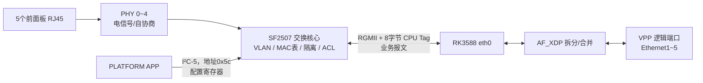

**SF2507/SF2507E 是一颗“5 个集成 PHY 电口 + 2 个扩展 GMAC 口”的千兆二层交换芯片。**

**RK3588 通过扩展口收发业务报文，同时通过 I²C 管理芯片寄存器。**

**SF2507/SF2507E 只需要一个 25MHz 的晶体或者晶振,另外可以选择通过 EEPROM 来完成内部寄存器初始化配置。**

**5个集成PHY端口**：通常直接连接5个RJ45网口。

**2个扩展GMAC端口**：通过[RGMII](#rgmii)/RMII/MII连接CPU、外部PHY或另一颗交换片。[为什么需要额外两个端口？](#why-two-ports)




1. **管理通道：I²C**

   PLATFORM APP 打开 `/dev/i2c-5`，使用从地址 `0x5c`，按照“16 位寄存器地址 + 16 位数据”读写交换片。

   调用关系是：

   `业务函数 → DRV_SF2507SetAsicReg() → DRV_SF2507WriteReg() → Drv_IICWrite() → ioctl(I2C_RDWR)`

   代码入口在 drv_sf2507.c:236。手册中的 IIC Slave 地址 `{1011,100}` 正好就是十六进制 `0x5c`。

2. **数据通道：RGMII/eth0**

   真正的以太网业务报文不走 I²C，而是从交换片扩展口，经 RGMII 进入 RK3588 的 `eth0`。

   报文中插入 8 字节 CPU Tag，记录来自哪个交换片端口，或指定要发往哪个端口。当前 DPDK 修改会：

   - 收包时识别 `0xffff` CPU Tag，去掉 Tag，按来源端口送入不同队列。
   - 发包时重新插入 CPU Tag，指定目标 SF2507 端口。
   - 将同一个物理 `eth0` 展现为五个独立的 VPP 端口。

   相关实现在AF_XDP的CPU Tag处理0002-Kevenvy-disable-promisc-oper.patch。


SF2507有两个“扩展MAC硬件端口”，板上通过其中的RGMII接口连接RK3588；项目软件当前通过Linux `eth0 + AF_XDP`使用这条链路。


| 功能                 | 执行者     | 依据               |
| -------------------- | ---------- | ------------------ |
| 同一VLAN内转发       | SF2507     | 目的MAC、VLAN、FID |
| MAC地址学习          | SF2507     | 源MAC和入口端口    |
| VLAN、PVID、端口隔离 | SF2507     | VLAN表和端口位图   |
| 不同VLAN间路由       | RK3588/VPP | 目的IP、路由表     |
| LAN访问WAN           | RK3588/VPP | IP路由、下一跳     |
| NAT                  | RK3588/VPP | 五元组及NAT会话    |
| 软件ACL              | VPP        | IP、协议、端口等   |


业务层端口号和芯片物理端口号是反向的

| 业务接口  | SF2507端口 |
| --------- | ---------- |
| Ethernet1 | 4          |
| Ethernet2 | 3          |
| Ethernet3 | 2          |
| Ethernet4 | 1          |
| Ethernet5 | 0          |


##### 启动链路

U-Boot
  ├─ 配置端口6/7的RGMII
  ├─ 配置CPU Tag
  ├─ 配置端口隔离[(Port Isolation)](#Port Isolation)、MAC学习限制
  └─ 配置最大报文长度、LED等
        ↓
Linux启动
  ├─ PLATFORM通过I2C读写寄存器
  ├─ 初始化/增量修改VLAN
  ├─ 根据WAN/LAN角色修改隔离和学习限制
  └─ 读取端口Link、速率
        ↓
AF_XDP/VPP
  └─ 根据CPU Tag拆分出5个逻辑网口


### 一个报文经过交换片的过程

以一个没有 VLAN Tag 的报文进入 Ethernet1 为例：

1. PHY4 完成电信号接收、速率和双工协商。
2. MAC4 解析出源 MAC、目的 MAC、EtherType。
3. 因为报文没有 Tag，芯片使用端口4的 PVID 确定它属于哪个 VLAN。
4. 芯片把“源 MAC → 端口4”学习进 L2/FDB 表。
5. 查找目的 MAC：
   - 已知单播：只发往对应端口。
   - 未知单播：在该 VLAN 内泛洪。
   - 广播：在该 VLAN 内广播。
6. 检查目标端口是否是该 VLAN 的 member。
7. 根据 `untag` 位图决定出口是否剥掉 VLAN Tag。


### 当前 VLAN 业务调用链

前端配置一个端口的 tagged/untagged VLAN 时，实际路径是：

`HTTP接口 vlan_port_set()`
→ `DQLite_Port_Vlan_Set()`
→ DQLite INSERT/DELETE Hook
→ `DQlite_Sdk_Add/Delete_Tbl_VLANPORT()`
→ `DRV_SF2507VlanPortSet()`
→ 修改 VLAN member/untag 位图
→ 写 SF2507 VLAN 表寄存器


| 部件                     | 作用                                                  |
| ------------------------ | ----------------------------------------------------- |
| SF2507 CPU Port          | 汇聚交换片各物理端口与CPU之间的报文                   |
| SF2507 CPU Tag           | 告诉CPU报文来自哪个端口；告诉交换片报文要发往哪个端口 |
| RGMII/RK3588 GMAC/`eth0` | 交换片与CPU之间唯一的物理数据通道                     |
| AF_XDP                   | 高速地在Linux `eth0`与用户态DPDK/VPP之间收发报文      |
| DPDK `rte_ring`          | 在一个真实AF_XDP接口和5个逻辑接口之间分发报文         |
| VPP                      | 把5个逻辑接口当成独立网口，进行路由、ACL、NAT等处理   |


##### **数据包缓存 SRAM**

交换片收到报文后，不一定能立刻发出去。例如：

- 出口正在发送其他报文
- 多个入口同时向一个出口发送
- 出口速率低于入口流量
- 芯片还在进行 VLAN、MAC、ACL 查找

“5+2端口共享缓存”表示七个端口共同使用一个缓存池，而不是每个端口固定分一块。

例如总缓存为700KB：

```
固定分配：每个端口100KB
共享分配：七个端口共同使用700KB
```

如果此时端口1流量很大、其他端口空闲：

- 固定分配：端口1只能使用自己的100KB，剩余600KB可能闲置。
- 共享缓存：端口1可以临时使用更多空闲空间。

所以共享缓存可以提高利用率、减少突发流量导致的丢包。


#####  **2K entry 表**

转发表记录。2K表示大约可以保存2048条记录。

一条记录可以简单理解为：

```
MAC地址             VLAN/FID    所在端口    类型      老化状态
AA:BB:CC:DD:EE:01   FID 0       Port 2     动态      有效
```

交换片收到报文时，会观察报文的源MAC地址。例如：

```
报文从Port 2进入
源MAC = AA:BB:CC:DD:EE:01
```

交换片自动学习：

```
AA:BB:CC:DD:EE:01 → Port 2
```

以后其他端口向这个MAC发送报文，交换片查表后就知道只需要发给Port 2。

这张表通常叫：

- MAC地址表
- L2表
- FDB，Forwarding Database
- LUT，Lookup Table

它们在这里基本是在描述同一类东西。


##### **静态entry和动态entry**

动态entry由交换片自动学习：

```
MAC A → Port 1
```

如果200～400秒内没有再次看到以MAC A为源地址的报文，这条记录就会被删除。之后别人向MAC A发送报文时，因为暂时不知道它在哪个端口，交换片会先在对应VLAN内泛洪。

静态entry通常由CPU写入：

```
MAC B → 固定从Port 4转发
```

静态记录一般不会自动老化，除非CPU主动删除。

I²C/MDIO/SPI只是CPU管理这张表的通道，可以用于：

- 添加静态MAC
- 读取动态学习结果
- 删除或清空MAC表
- 配置老化时间

正常报文转发完全由SF2507硬件完成，并不是每收到一个报文都通过I²C询问CPU。


#####  **FID是“MAC表的命名空间”**

**Filtering Database Identifier**，可以理解为“MAC 地址学习表的分组编号”。

VLAN 决定：报文允许在哪些端口之间转发。

FID 决定：学习、查询 MAC 地址时，使用哪一本 MAC 地址表。

假设设备有两个VLAN：

```
VLAN 10
VLAN 20
```

同一个MAC地址可能在两个VLAN里出现在不同端口：

```
VLAN 10：MAC A → Port 1
VLAN 20：MAC A → Port 4
```

交换片查找MAC时，需要确定这两个学习结果是共享，还是相互独立。这就是SVL和IVL解决的问题。

**SVL：共享VLAN学习**

SVL是 Shared VLAN Learning。

查表时主要使用：

```
FID + MAC
```

不区分具体VID。因此，同一个FID下的多个VLAN可以共享一条MAC记录。

例如：

```
VLAN 10 ─┐
         ├─ FID 0：共享MAC学习结果
VLAN 20 ─┘
```

优点：

- 节省MAC表项
- 适合多个VLAN本来就应该共享学习结果的场景

缺点：

- 同一MAC在不同VLAN出现在不同端口时，可能发生MAC移动或记录覆盖

**IVL：独立VLAN学习**

IVL是 Independent VLAN Learning。

查表时使用：

```
FID + VID + MAC
```

相同MAC在不同VLAN中可以分别保存：

```
MAC A + VLAN 10 → Port 1
MAC A + VLAN 20 → Port 4
```

优点是不同VLAN完全隔离，更符合常见业务需求；缺点是会消耗更多表项。

**FID的作用**

FID可以决定哪些VLAN共享学习空间：

```
VLAN 10 → FID 0
VLAN 20 → FID 0    可以共享

VLAN 30 → FID 1    与FID 0隔离
```

因此，FID是MAC地址学习和查表时使用的“分组编号”。


##### **4K VLAN**

标准 802.1Q VLAN Tag 中的 VID 是12位：

```
2^12 = 4096
VID范围：0～4095
```

但通常：

- VID 0：Priority Tag，只携带优先级；
- VID 1～4094：普通可用 VLAN；
- VID 4095：保留。

SF2507 收到带 `0x8100` VLAN Tag 的报文后，会取出 VID，并用它查找4K VLAN表。

每个 VLAN 表项主要记录：

- 哪些端口是这个 VLAN 的成员；
- 哪些端口发送时需要去掉 Tag；
- 使用 IVL 还是 SVL 学习 MAC；
- FID/MSTI；
- VLAN 优先级和限速配置。


##### 32组 Enhanced VLAN

手册说明：

- Enhanced VID 的内部取值范围是4096～8191；
- 最多同时配置32条；
- 只供芯片内部转发使用；
- 通过32组 `VLAN_MEMBER_CONFIGURATION[n]` 寄存器实现；
- 不能直接出现在标准802.1Q Tag中，因为标准 VID 只有12位。

32份“快速内部 VLAN 转发配置”。当端口 VLAN或协议 VLAN选中其中一份配置后：

- 如果配置得到的 VID ≤ 4095，继续查普通4K VLAN表；
- 如果 VID > 4095，就是 Enhanced VLAN，直接按照该组寄存器中的成员端口等配置转发。


#####  Protocol-based VLAN

它根据报文协议给未打 Tag 的报文分配 VLAN。

例如可以设计成：

```
IPv4报文  → VLAN 10
某种特殊协议报文 → VLAN 20
```

SF2507提供4个协议模板，模板可以匹配：

- Ethernet II；
- RFC1042；
- LLC Other；
- 具体协议类型，例如 EtherType。

匹配成功后，再根据“协议模板＋入端口”选择32组 `VLAN_MEMBER_CONFIGURATION` 中的一组。

需要谨慎配置。例如把 IPv4 和 ARP 分到不同 VLAN，可能导致设备无法正常完成 ARP 解析。


##### Port-based VLAN

它根据报文从哪个端口进入来分配 VLAN，主要用于未打 Tag 的报文。

例如：

```
端口0收到未打Tag报文 → 分配到VLAN 10
端口1收到未打Tag报文 → 分配到VLAN 10
端口2收到未打Tag报文 → 分配到VLAN 20
```

我们平时说的端口 PVID，基本就是这种思想：未打 Tag 的报文进入端口后，交换片先给它补上一个内部 VLAN 身份。


##### VLAN filtering

确定报文属于哪个 VLAN 后，芯片还要检查它是否有资格进入和离开端口。

入方向检查：

- 当前入端口是不是该 VLAN 的成员；
- 该端口允许所有帧、只允许 Tagged 帧，还是只允许 Untagged 帧。

出方向检查：

- 目标出端口是不是该 VLAN 的成员；
- 不是成员就不能从该端口发出。

例如VLAN 10只包含端口0、端口1和CPU端口，那么VLAN 10的报文不会从端口2发出。


#####  ACL实现灵活VLAN配置

普通端口 VLAN 只能根据入端口判断，协议 VLAN主要根据协议判断；ACL可以同时匹配：

- 物理入端口；
- 源、目的 MAC；
- VLAN；
- 源、目的 IP；
- TCP/UDP端口等。

匹配后可以给报文分配 CVLAN 或 SVLAN。


##### CPU Tag

当前项目中交换片会根据不同的RJ45口进来的报文打上不同的tag送出去,然后af_xdp再根据不同的tag放进对应的虚拟环形缓冲队列

一个真实的 `eth0/AF_XDP` 收发通道，承载5个RJ45交换端口的流量，再在软件中拆成5个逻辑接口。

使用的是SF2507私有的 **CPU Tag**，不是VLAN Tag。

分流队列是项目额外创建的DPDK `rte_ring`，不是AF_XDP原生的XSK环。

```
接收：
多个RJ45
→ SF2507添加来源端口CPU Tag
→ 一个eth0
→ AF_XDP解析Tag
→ 多个rte_ring
→ 多个VPP逻辑接口

发送：
某个VPP逻辑接口
→ AF_XDP添加目标端口CPU Tag
→ 一个eth0
→ SF2507解析Tag
→ 指定RJ45
```

代码并不是给每个RJ45使用完全不同格式的Tag，而是CPU Tag格式相同，里面的“源端口字段”不同：

```
来自端口0：CPU Tag source port = 0
来自端口1：CPU Tag source port = 1
来自端口2：CPU Tag source port = 2
```

软件读取这个字段，决定放入哪个 `rte_ring`。

另外，并不是所有RJ45之间的二层报文都必然上送CPU。SF2507可以在硬件中直接交换；只有按照当前VLAN、[Trap](#trap)、转发配置需要进入CPU/VPP路径的报文，才会走上述流程。


# 附

<a id="why-two-ports"></a>

**为什么需要额外两个端口？**

1. **给主CPU留数据通道**

   5个RJ45口收到的报文需要进入RK3588进行路由、NAT或ACL处理，因此交换片必须有一个端口连接CPU。

   如果只有5个端口，其中一个拿去接CPU，前面板就只能剩4个网口。设计成5+2后，可以保留5个完整用户网口。

2. **支持第二条扩展链路**

   另一个扩展口可以用于：

   - 连接第二个CPU或管理芯片
   - 外接一个PHY，再扩展出网口
   - 级联另一颗交换片
   - 区分数据CPU和管理CPU
   - 提供另一条上行链路

3. **扩展口不需要集成PHY**

   CPU和交换片都在PCB内部，不需要经过RJ45和网线，因此可以直接使用RGMII数字信号：

   ```
   SF2507 GMAC ←RGMII→ RK3588 MAC
   ```

   这样比“交换片PHY → 网线接口 → CPU PHY”更简单，成本和功耗也更低。

4. **避免CPU处理所有端口的物理层**

   SF2507内部的5个PHY负责自协商、电信号收发、10/100/1000M速率等工作。RK3588只需通过一条高速扩展口接收需要CPU处理的报文。


<a id="rgmii"></a>

**RGMII** 是一种芯片之间传输以太网报文的高速数字接口，全称是：

> Reduced Gigabit Media Independent Interface，精简千兆介质独立接口。


<a id="Port Isolation"></a>

**Port Isolation**可以理解为交换片内部的一张“端口转发许可表”：

> 报文从端口 n 进入后，只允许转发到该端口对应掩码中置 1 的目标端口。


报文进入端口n
    ↓
查MAC表，得到候选出口
    ↓
检查VLAN成员
    ↓
检查PORT_ISOLATION_PORT[n]_MASK
    ↓
对应出口bit为1 → 允许转发
对应出口bit为0 → 禁止转发

**U-Boot建立的初始结构**

可以简化成：

```
port0  ←────→  port6/RGMII

port1 ─┐
port2 ─┤
port3 ─┼────→ port7/RGMII/CPU
port4 ─┘
```

也就是说，U-Boot 首先把普通硬件交换路径收紧：

- port0 与 port6 构成一组。
- port1～port4主要送到 port7。
- port1～port4之间默认不能直接横向通信。
- CPU 可以通过 CPU Tag 控制报文最终送到哪个前面板端口。

“一条CPU链路承载多个逻辑网口”的结构。

**Linux业务运行时还会修改它**

在 driver_main.c中，`DEV_SF2507_PORT_SET()` 会根据端口是 WAN 还是 LAN 重新配置隔离关系。


<a id="trap"></a>

**Trap**的意思是：

> 交换片发现某个报文需要 CPU 特殊处理，强制把它送到 CPU 端口，并在 CPU Tag 里写明上送原因。

注释 1

例如：

- STP BPDU、LLDP 等控制协议报文。
- ACL 动作指定为 Trap 的报文。
- 未知源 MAC、MAC 学习数量超限等异常报文。
- IGMP/MLD 等需要软件参与的控制报文。

Trap 和普通转发的区别是：

```
普通报文：
port1 → 查MAC/VLAN → port2

普通送CPU的数据报文：
port1 → 查MAC/VLAN/隔离规则 → port7 → RK3588

Trap报文：
port1 → 命中特殊规则 → 强制送CPU_TRAP_PORT → RK3588
                              CPU Tag里带reason
```

因此，**送到 CPU 的报文不一定是 Trap 报文**。

CPU Tag 里的 `reason` 字段就是为了告诉 RK3588：

```
这是普通数据报文
还是ACL Trap
还是协议控制报文
还是其他异常原因
```