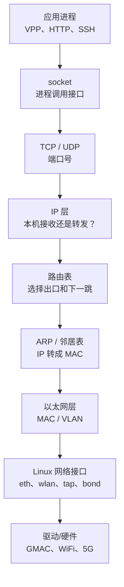

 OSI 七层模型：

| OSI 层 | 名称       | 典型内容            |
| ------ | ---------- | ------------------- |
| 第7层  | 应用层     | HTTP、SSH、DNS      |
| 第4层  | 传输层     | TCP、UDP、端口号    |
| 第3层  | 网络层     | IPv4、IPv6、路由    |
| 第2层  | 数据链路层 | Ethernet、MAC、VLAN |
| 第1层  | 物理层     | 网线、光纤、电信号  |

TCP/IP 四层模型:

| TCP/IP 模型 | 大致对应 OSI |
| ----------- | ------------ |
| 应用层      | OSI 5～7层   |
| 传输层      | OSI 第4层    |
| 网际层      | OSI 第3层    |
| 网络接入层  | OSI 第1～2层 |

**Linux 内核负责把“进程产生的数据”变成网络报文，再决定报文应该交给哪个接口；反过来，也负责把接口收到的报文交给正确的进程。**




收包方向基本是这张图的反方向。


## 1. Linux 网络里核心对象：接口

Linux 把所有可以收发报文的对象抽象成网络接口，也叫 `netdev`。

它不一定对应真实网卡：

| 类型      | 例子           | 含义                                |
| --------- | -------------- | ----------------------------------- |
| 物理接口  | `eth2`         | 由以太网驱动创建                    |
| WiFi 接口 | `wlan0`        | 由无线驱动创建                      |
| 模组接口  | `5g-modem`     | 5G 模组数据通道                     |
| 回环接口  | `lo`           | 本机 TCP/IP 通信                    |
| TAP 接口  | `Ethernet8`    | 用户态程序与 Linux 之间传递二层报文 |
| VLAN 接口 | `Vlan1@Bridge` | Linux 在某个 VLAN 中的三层入口      |
| 网桥      | `Bridge`       | 内核中的二层转发设备                |
| 聚合接口  | `bond0`        | 将多个接口组合成一个接口            |
| 隧道接口  | `gre0`         | 用 IP 网络承载另一层报文            |
| 占位接口  | `dummy`        | 没有真实链路的软件接口              |


# 2. Link、地址和路由

### Link：接口能不能工作

查看：

```
ip -br link
```

常见状态：

- `UP`：接口被启用。
- `LOWER_UP`：底层链路存在，例如网线已连接。
- `DOWN`：接口关闭或者没有可用链路。
- `UNKNOWN`：TAP、dummy 等没有物理载波可检测。

接口 UP 并不代表一定有 IP，也不代表业务一定通。

### Address：Linux 在这个接口上拥有什么 IP

查看：

```
ip -br addr
```

例如：

```
eth2  UP  10.8.80.130/24
```

表示 Linux 可以通过 `eth2` 使用地址 `10.8.80.130`。

`/24` 表示同网段范围大致为：

```
10.8.80.0 ～ 10.8.80.255
```

### Route：去某个目的地址应该走哪里

查看：

```
ip route
```

例如可能存在：

```
10.8.80.0/24 dev eth2
default via 10.8.80.1 dev eth2
```

意思是：

- 去 `10.8.80.x`，直接从 `eth2` 发送。
- 去其他未知网络，交给网关 `10.8.80.1`。

最实用的诊断命令是：

```
ip route get 8.8.8.8
```

它会直接告诉你：

- 走哪个接口；
- 使用哪个源 IP；
- 下一跳网关是谁。

添加路由的一个例子

```bash
  ip route replace 10.8.126.0/24 \
    via 10.8.80.254 \
    dev eth0 \
    src 10.8.80.114 \
    metric 10
```


# 3. 二层和三层

### 二层：MAC、Bridge、VLAN

二层关心的是：

```
目的 MAC 在哪个端口后面？
```

主要概念包括：

- MAC 地址；
- Bridge；
- MAC 学习；
- 泛洪；
- VLAN；
- 广播域。

它通常只负责同一个局域网或 VLAN 内部的传输。

### 三层：IP 和路由

三层关心的是：

```
目的 IP 属于哪个网络？
下一跳应该交给谁？
```

主要概念包括：

- IPv4/IPv6 地址；
- 子网掩码；
- 路由表；
- 默认网关；
- IP 转发。

跨 VLAN、跨网段通信通常需要三层路由。

例如：

```
192.168.1.10/24 → 192.168.1.20/24
```

同网段，可以直接通过二层通信。

而：

```
192.168.1.10/24 → 10.8.80.130/24
```

不同网段，需要路由器或 VPP 做三层转发。


# 4. ARP 是二层和三层之间的连接点

应用只知道目标 IP，例如：

```
10.8.80.1
```

但以太网发送时需要目标 MAC。

因此 Linux 会发送 ARP 广播：

```
谁拥有 10.8.80.1？请告诉 10.8.80.130。
```

对方回答：

```
10.8.80.1 的 MAC 是 AA:BB:CC:DD:EE:FF
```

Linux 保存到邻居表：

```
ip neigh
```

之后发送的数据会同时包含：

```
三层目的 IP：10.8.80.1
二层目的 MAC：AA:BB:CC:DD:EE:FF
```

需要注意：

- 路由表解决“从哪个接口、交给哪个下一跳”。
- ARP 表解决“下一跳的 MAC 是什么”。

这是两个不同步骤。


# 5.Bridge 和路由的区别

Bridge 做二层转发，依据 MAC.

路由做三层转发，依据 IP.


# 6.socket 与接口

应用一般不直接操作 `eth2`，而是：

```
socket();
bind();
connect();
send();
recv();
```

内核根据地址和路由选择接口。

例如：

```
connect(127.0.0.1) → lo
connect(10.8.80.1) → eth2
connect(192.168.1.254) → 可能是本机地址，留在本机
```

应用也可以通过 `SO_BINDTODEVICE` 强制绑定接口，但多数程序不需要这样做。

监听：

```
127.0.0.1:8080
```

表示只有本机能访问。

监听：

```
0.0.0.0:8080
```

表示监听本机所有 IPv4 接口，实际能否从外部访问还取决于路由、防火墙和业务配置。

查看当前监听端口：

```
ss -lntup
```


# 7.防火墙和 qdisc

报文经过内核网络栈时，还可能经过：

### Netfilter

用于：

- 防火墙；
- NAT；
- 连接跟踪；
- 报文过滤。

常见工具：

```
iptables
nftables
```

### qdisc

qdisc 是发送队列规则，负责：

- 排队；
- 限速；
- 优先级；
- 流量整形；
- 拥塞管理。

查看：

```
tc qdisc show
```


# 8.VPP/DPDK 为什么看起来绕开了 Linux 网络

普通 Linux 数据路径是：

```
网卡 → 内核驱动 → Linux协议栈 → socket → 应用
```

VPP/DPDK 的目标是高速转发，因此倾向于：

```
网卡队列 → DPDK/AF_XDP → VPP用户态数据面
```

这样可以减少：

- 内核协议栈处理；
- 系统调用；
- 内存复制；
- 上下文切换。

但设备仍需要 Linux 完成管理、控制面和本机服务，所以又通过 TAP、AF_PACKET、LCP 等机制连接回来：

```
高速业务报文 → VPP
需要交给Linux的报文 → TAP/LCP → Linux
```

这就是系统同时出现以下两套接口的原因：

```
底层接口：eth0、wlan0、5g-modem
业务逻辑接口：Ethernet1～Ethernet11
```


# 9.什么叫 Linux 协议栈

Linux 内核中负责网络通信的一整套代码和数据结构。

它包含：

- Ethernet 收发；
- ARP、IPv6 ND；
- IPv4、IPv6；
- ICMP；
- TCP、UDP；
- 路由查询；
- IP 转发；
- Netfilter/iptables；
- socket 缓冲区；
- qdisc；
- 网卡驱动接口。

例如程序执行：

```
connect(fd, 10.8.80.1:80);
```

Linux 协议栈负责：

```
建立TCP连接
    ↓
生成TCP头
    ↓
生成IP头
    ↓
查询路由
    ↓
查询ARP邻居表
    ↓
生成以太网头
    ↓
交给网卡驱动
```

反方向收包时，它负责解析这些协议头，最终找到正确的 socket 和进程。

| 对比     | Linux 协议栈       | VPP 用户态数据面          |
| -------- | ------------------ | ------------------------- |
| 运行位置 | 内核空间           | 用户空间进程              |
| 主要用途 | 通用主机网络       | 高速路由、交换和转发      |
| 应用接口 | 标准 socket        | VPP API、图节点、接口队列 |
| 报文结构 | 常见为 `sk_buff`   | 批量 buffer/mbuf          |
| 收发方式 | 中断、NAPI、队列   | 轮询、批量、向量处理      |
| 路由表   | Linux route/FIB    | VPP 自己的 FIB            |
| ACL      | Netfilter/iptables | VPP ACL 节点              |
| 典型对象 | SSH、HTTP、Redis   | 大量经过设备的业务流量    |