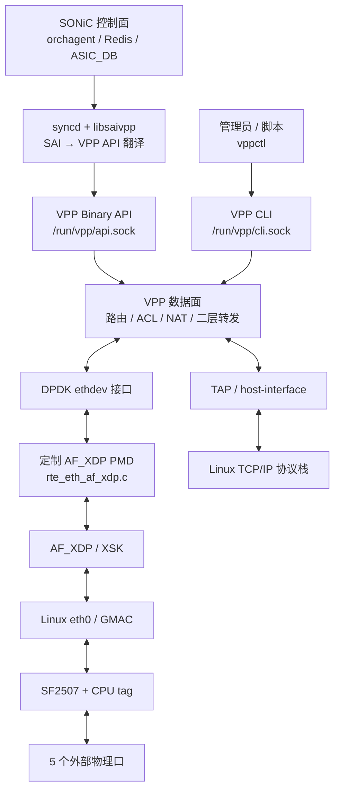
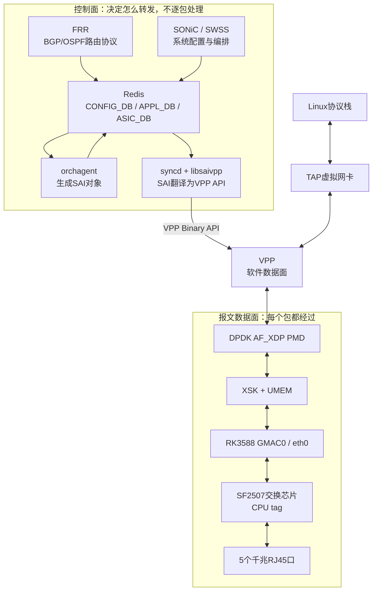
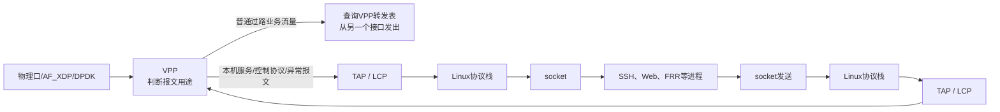
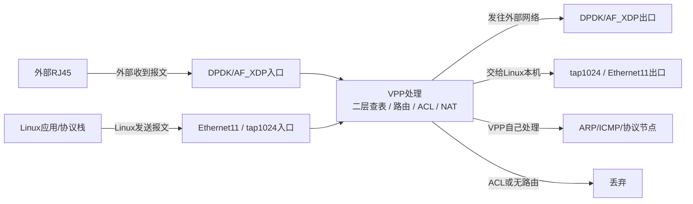
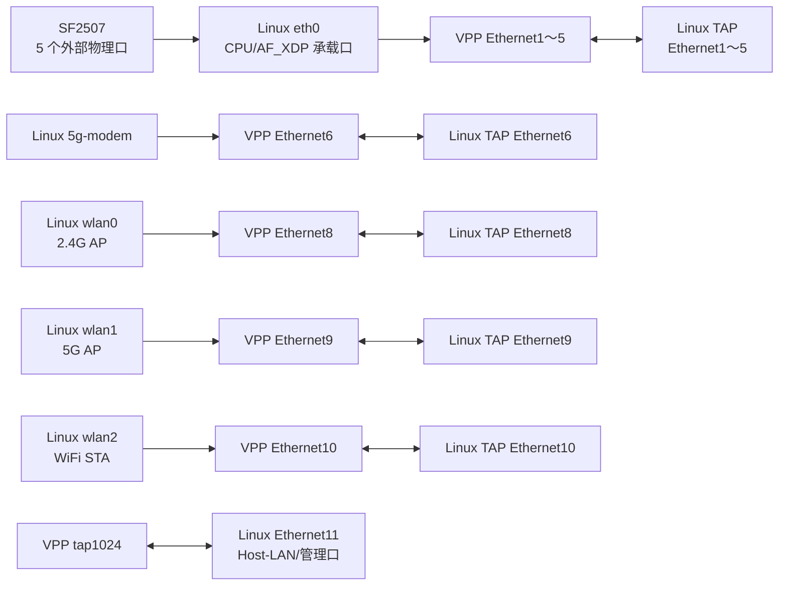
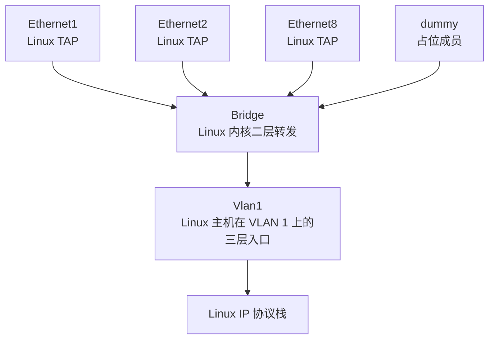

**VPP 向上提供“配置和管理接口”，向下连接“收发报文的设备驱动接口”；它本身位于控制面与实际网卡之间，执行高速数据转发。**


##### 关键词:

1. 计算机网络基础
   - MAC、IP、ARP
   - 广播域
   - VLAN
   - 二层交换、三层路由
   - TCP/UDP、socket、loopback
   - GRE、bonding
2. Linux 网络
   - `eth0`、`lo`、TAP、dummy
   - Linux Bridge
   - VLAN 子接口
   - 路由表
   - network namespace
   - `ip`、`bridge`、`ethtool` 等命令
3. 网络设备数据面开发
   - VPP
   - DPDK
   - AF_XDP
   - ring、queue
   - CPU tag
   - 报文收发与端口分流

4. 网络设备控制面开发
   - SONiC
   - SWSS、orchagent、syncd
   - SAI
   - Redis 配置数据库
   - 将业务配置下发到 VPP、交换芯片或网卡

5. 嵌入式网络平台开发
   - RK3588 SoC
   - GMAC
   - SF2507 交换芯片
   - WiFi、5G 模组
   - 驱动、设备树、启动脚本
   - ARM64 Linux


# 大纲

##### 控制面组件

| 名称               | 全称/含义                                 | 在本项目中的作用                              |
| ------------------ | ----------------------------------------- | --------------------------------------------- |
| SONiC              | Software for Open Networking in the Cloud | 网络操作系统，管理端口、VLAN、路由、ACL等配置 |
| SWSS               | Switch State Service                      | SONiC交换机状态服务组件集合                   |
| orchagent          | Orchestration Agent                       | 读取Redis配置，把它转换成SAI交换对象          |
| SAI                | Switch Abstraction Interface              | SONiC与不同交换数据面之间的统一接口           |
| syncd              | Synchronization Daemon                    | 消费ASIC_DB请求并调用具体SAI实现              |
| saivpp / libsaivpp | VPP版SAI实现                              | 把SAI对象转换成VPP Binary API调用             |
| Redis              | 内存键值数据库                            | SONiC各进程之间交换配置和状态                 |
| ASIC_DB            | ASIC Database                             | Redis中的一类数据库，保存期望下发的数据面对象 |
| FRR                | Free Range Routing                        | 运行BGP、OSPF等动态路由协议，计算路由         |
| CLI                | Command Line Interface                    | 命令行接口，例如`vppctl`                      |
| API                | Application Programming Interface         | 程序调用接口                                  |
| IPC                | Inter-Process Communication               | 进程间通信，例如saivpp与VPP之间的socket       |

传统SONiC中：

```
syncd → 厂商SAI SDK → 交换ASIC
```

当前项目中改成：

```
syncd → libsaivpp → VPP Binary API → VPP软件数据面
```

因此，SF2507虽然也是交换芯片，但SONiC主要不是通过标准SAI直接控制它；

当前代码里SF2507主要由本地驱动通过I²C配置，同时承担物理端口汇聚和CPU tag处理。


##### 数据面组件

| 名称   | 全称/含义                  | 作用                                               |
| ------ | -------------------------- | -------------------------------------------------- |
| VPP    | Vector Packet Processing   | 按批次、向量化处理报文，执行路由、ACL、NAT、隧道等 |
| DPDK   | Data Plane Development Kit | 用户态高速收发包框架                               |
| PMD    | Poll Mode Driver           | DPDK轮询驱动，不依赖传统逐包中断                   |
| AF_XDP | Address Family for XDP     | Linux提供的高速用户态报文socket机制                |
| XDP    | eXpress Data Path          | Linux网卡驱动中的高速报文处理入口                  |
| XSK    | XDP Socket                 | 一个具体AF_XDP socket实例                          |
| UMEM   | User Memory                | 内核和用户态共享的报文内存区                       |
| mbuf   | Memory Buffer              | DPDK表示一个报文及其元数据的数据结构               |
| ring   | 环形队列                   | 在生产者和消费者之间传递报文指针                   |
| VDEV   | Virtual Device             | DPDK虚拟设备，例如`net_af_xdp0`                    |
| RX     | Receive                    | 接收方向                                           |
| TX     | Transmit                   | 发送方向                                           |


##### Linux和虚拟接口

| 名称      | 含义                                     | 作用                            |
| --------- | ---------------------------------------- | ------------------------------- |
| TAP       | Linux二层虚拟网卡，不需要按缩写展开      | 模拟以太网设备，报文中包含MAC头 |
| TUN       | Linux三层虚拟网卡                        | 传递IP包，不包含以太网MAC头     |
| AF_PACKET | Linux原始二层packet socket               | 直接在Linux接口上收发以太网帧   |
| qdisc     | Queueing Discipline                      | Linux发送排队、调度和整形系统   |
| LCP       | Linux Control Plane                      | VPP与Linux协议栈接口同步机制    |
| netlink   | Linux内核与用户态之间的网络配置/事件通道 | 同步接口、地址、路由和链路状态  |


##### 硬件相关

| 名称    | 全称/含义                                   | 作用                                      |
| ------- | ------------------------------------------- | ----------------------------------------- |
| SoC     | System on Chip                              | 将CPU、内存控制器、GMAC等集成在一颗芯片中 |
| CPU     | Central Processing Unit                     | RK3588 ARM处理器核心                      |
| NIC     | Network Interface Controller                | 网络接口控制器                            |
| MAC     | Media Access Control                        | 以太网链路层控制器/地址                   |
| GMAC    | Gigabit Media Access Controller             | RK3588内部千兆以太网MAC控制器             |
| PHY     | Physical Layer Transceiver                  | 负责网线侧电气信号和速率协商              |
| RGMII   | Reduced Gigabit Media Independent Interface | SoC GMAC与交换芯片/PHY之间的千兆数字接口  |
| SF2507  | 交换芯片型号                                | 提供5个外部端口、交换功能和CPU端口        |
| CPU tag | 交换芯片私有头部                            | 标识报文来自哪个物理口或应从哪个口发出    |
| I²C     | Inter-Integrated Circuit                    | CPU配置SF2507寄存器的低速控制总线         |
| RJ45    | 常见以太网水晶头接口                        | 用户可见的网线接口                        |

##### 公司当前VPP结构:




AF_XDP PMD ：

> 把 Linux 的 AF_XDP/XSK 包装成一块 DPDK 网卡，让 VPP 能通过标准 DPDK 接口操作 Linux `eth0`。


| 对比     | Linux 协议栈       | VPP 用户态数据面          |
| -------- | ------------------ | ------------------------- |
| 运行位置 | 内核空间           | 用户空间进程              |
| 主要用途 | 通用主机网络       | 高速路由、交换和转发      |
| 应用接口 | 标准 socket        | VPP API、图节点、接口队列 |
| 报文结构 | 常见为 `sk_buff`   | 批量 buffer/mbuf          |
| 收发方式 | 中断、NAPI、队列   | 轮询、批量、向量处理      |
| 路由表   | Linux route/FIB    | VPP 自己的 FIB            |
| ACL      | Netfilter/iptables | VPP ACL 节点              |
| 典型对象 | SSH、HTTP、Redis   | 大量经过设备的业务流量    |

# VPP各类接口

### 1. VPP Binary API

这是程序访问 VPP 的主要接口。

项目中：

```
SONiC配置
 → Redis / ASIC_DB
 → syncd
 → libsaivpp
 → VPP Binary API
 → VPP
```

例如 SONiC 要创建：

- 路由
- 邻居
- VLAN
- ACL
- 隧道
- 接口地址

`libsaivpp` 会把 SAI 对象转换成一个或多个 VPP Binary API 请求。


### 2. VPP CLI

人和脚本可以通过：

```
vppctl ...
```

访问：

```
/run/vpp/cli.sock
```

例如：

```
vppctl show interface
vppctl show ip fib
vppctl set interface state Ethernet8 up
```

这是管理和调试接口，不承载实际业务报文。


### 3. 事件和统计接口

VPP还能向上提供：

- 接口 link up/down 事件
- 路由、邻居等异步通知
- 接口收发包统计
- ACL/NAT 等功能统计

`libsaivpp` 可以把这些状态再转换回 SONiC/SAI 世界。


### 4. TAP 是另一种“向上”

TAP 连接的是 Linux 网络协议栈，传递的是实际报文，不是配置命令：

```
Linux应用
 ↕
Linux TCP/IP
 ↕
TAP接口
 ↕
VPP
```

 `tap1024` 对应 Linux `Ethernet11`。


## VPP 对下的接口

严格说，VPP不是“向硬件暴露接口”，而是：

> VPP 使用设备驱动提供的收发接口，驱动再连接具体硬件。

```
VPP
 ↕
DPDK ethdev
 ↕
AF_XDP PMD
 ↕
XSK
 ↕
eth0 / RK3588 GMAC
 ↕
SF2507 CPU Port
 ↕
5个RJ45物理口
```


**SONiC通过 SAI → libsaivpp → Binary API 配置 VPP。**

**VPP内部通过 graph node 执行路由、ACL、NAT等处理。**

**VPP通过 DPDK/PMD/AF_XDP 与底层网卡和SF2507收发报文。**




# 已经有 VPP，为什么还需要把报文交给 Linux

因为这台设备既是高速转发设备，也是运行管理服务和控制程序的 Linux 计算机。



# 关于DPDK和TAP

DPDK通常是南向物理接口，TAP是VPP与Linux之间的横向主机接口。


DPDK负责让VPP高速连接外部网络

普通报文不会进入Linux TCP/IP协议栈，而是由AF_XDP PMD直接交给VPP处理。

主要用途：

- 外部物理口收发
- 路由转发
- ACL、NAT、隧道
- 端口到端口的数据面流量
- 尽量减少Linux协议栈开销

严格来说，DPDK是一套网卡I/O框架。当前具体驱动是AF_XDP PMD。


TAP是一对虚拟以太网端点：

主要用于：

- 让Linux本机应用收发报文
- 给Linux协议栈提供IP、ARP、IPv6 ND等能力
- 让SONiC或普通Linux程序连接VPP数据面
- 实现主机路径，而不是纯端口转发

它是虚拟网卡，不直接连接RJ45。


## 同一个包会同时经过两者吗？

通常不会。VPP查完路由表、二层表或策略后，决定从哪个接口输出。

##### 场景一：外部端口之间转发

```
RJ45口1
 → DPDK
 → VPP路由/ACL/NAT
 → DPDK
 → RJ45口2
```

这个包不经过TAP。

##### 场景二：外部报文交给Linux本机

```
RJ45
 → DPDK
 → VPP
 → tap1024
 → Ethernet11
 → Linux协议栈
 → 本机应用
```

这时一个报文先经过DPDK进入VPP，再通过TAP交给Linux。

##### 场景三：Linux应用向外发送

```
Linux应用
 → Linux协议栈
 → Ethernet11
 → tap1024
 → VPP路由/NAT
 → DPDK
 → 外部RJ45
```

这时TAP是入口，DPDK是出口。

因此VPP需要两者的原因是：

> DPDK让VPP接触“设备外面的网络”，TAP让VPP接触“设备里面的Linux主机”。


# 这套架构的资源占用

### 1. RK3588 CPU

当前设备树显示RK3588共有8个CPU核心：

- 4个Cortex-A55小核：Linux CPU 0～3
- 4个Cortex-A76大核：Linux CPU 4～7

当前VPP配置：

```
main-core 2
corelist-workers 3
```

在 /opt/code/platform/config/startup.conf:27。

含义是：

- CPU 2：VPP主线程，处理管理、定时器、接口控制等
- CPU 3：一个VPP worker，承担主要报文处理

按当前设备树编号，CPU 2和CPU 3都是A55小核。

所以当前数据面主要是：

> 一个A55 worker + 一个AF_XDP队列处理五个物理口。

这可能比MAC分配方式更早成为性能瓶颈。


### 2. 内存

VPP配置了：

```
main-heap-size 2G
```

见/opt/code/platform/config/startup.conf:22。

这表示VPP主堆上限/预留配置为2 GiB

板载DRAM总容量无法从当前源码可靠确定，需要板上执行：

```
free -h
grep -E 'MemTotal|HugePages|Hugepagesize' /proc/meminfo
vppctl show memory
```


### 3. RK3588以太网控制器

设备树启用了：

- GMAC0：通常形成Linux `eth0`
- GMAC1：通常形成Linux `eth1`
- 两条fixed-link都配置为1000 Mbps、全双工

见 /opt/code/kernel-2026/arch/arm64/boot/dts/rockchip/lz-rk3588-pc.dtsi:554。

但当前VPP只启用：

```
iface=eth0
```

`eth1`的mode0配置仍被注释，见/opt/code/platform/config/startup.conf:53。

因此：

- 硬件具备两套GMAC资源
- 当前VPP数据通路实际只使用GMAC0/eth0
- 第二条GMAC/CPU链路目前没有进入这套AF_XDP转发路径


### 4. SF2507和外部网口

当前驱动定义了物理端口：

```
0、1、2、3、4、6、7
```

端口5无效。

其中：

- 0～4：5个外部UTP/RJ45物理口
- 6、7：CPU/扩展侧端口
- 当前代码明确把port 6称为CPU port
- 端口速率支持10/100/1000 Mbps

见/opt/code/platform/code/RSP/DRIVER/drv_sf2507.c:3111。

SF2507寄存器控制使用：

```
/dev/i2c-1
I²C地址 0x5c
```

I²C只用于配置寄存器、读取链路状态和统计；真正的业务报文走RGMII/GMAC。


### 5. AF_XDP和队列资源

当前配置创建6个DPDK vdev：

- 1个`mode=1`承载设备
- 5个`mode=2`逻辑物理端口

但实际只有：

- 1个真正的XSK
- 1个AF_XDP RX/TX队列
- 5个端口分流`rte_ring`
- 每个内部ring深度1024
- 1个VPP worker

```
5个物理口
 → SF2507汇聚
 → 一条1Gbps CPU链路
 → 一个eth0
 → 一个XSK
 → 软件按CPU tag分成5个VPP逻辑口
```

对于所有需要进入VPP的流量，这意味着五个外部口共享：

- 一条活动的1Gbps全双工CPU链路
- 一个XSK队列
- 一个A55 worker

因此，即使5个外部口各自都是千兆，**它们同时经过VPP时的汇聚吞吐上限仍首先受这条活动CPU链路和单worker限制**，不会得到5 Gbps的CPU转发能力。SF2507内部不经过CPU的硬件交换流量则另当别论。


# 为什么有的包进dpdk,有的包进tap?

正确理解是：

> **报文从哪里来，决定它从哪个接口进入VPP；VPP处理后查表，决定它从哪个接口出去。**




# IP指令查接口


`eth0/eth1/eth2、wlan*、5g-modem`：Linux 驱动直接创建的底层接口，接近真实硬件。

`Ethernet1...Ethernet11`：产品给 SONiC/VPP 定义的业务逻辑端口，其中多数在 Linux 里表现为 TAP 接口。它们不等于 11 块物理网卡。

`Bridge、Vlan1、dummy*、gre*`：Linux 网络栈为了桥接、VLAN、占位和隧道功能创建的虚拟接口。

##### Ethernet详解图




因此，同一个业务端口可能同时出现三个层次：

```
底层驱动接口       VPP 数据面接口       Linux 业务/TAP接口
wlan0       →      Ethernet8      ↔     Ethernet8
wlan2       →      Ethernet10     ↔     Ethernet10
5g-modem    →      Ethernet6      ↔     Ethernet6
```

虽然 VPP 接口和 Linux TAP 可能都叫 `Ethernet8`，但它们属于不同的接口表，不是同一个内核对象。


## 为什么创建这么多 `Ethernet`

产品源码把业务端口号固定成了：

| 业务接口     | 含义                               | 这次板上状态        |
| ------------ | ---------------------------------- | ------------------- |
| Ethernet1～5 | SF2507 的五个有线物理口            | 全部 DOWN           |
| Ethernet6    | 5G 蜂窝网络                        | UNKNOWN，有 IPv4    |
| Ethernet7    | StarFlash                          | 没有创建出来        |
| Ethernet8    | 2.4G WiFi AP                       | UNKNOWN             |
| Ethernet9    | 5G WiFi AP                         | DOWN                |
| Ethernet10   | WiFi STA                           | UNKNOWN，有 IPv4    |
| Ethernet11   | Host-LAN，即 `tap1024` 的 Linux 侧 | UNKNOWN，有管理地址 |

一个稳定的产品端口模型。Web、SONiC 数据库、SAI、VPP 都可以始终用同一个名字表示同一种业务资源。

这个映射直接写在/opt/code/platform/code/application/https_handlers/dyn_port_sync.c:523 中。`Ethernet7` 没出现在当前输出里，说明它虽然被产品模型保留，但对应的 `wt_vap0/StarFlash` 实例当前没有创建成功或没有启用。


## `eth` 和 `Ethernet` 有什么区别

接口名字本身只是字符串，而且区分大小写；真正的区别来自谁创建它、它处于哪一层。

### `eth0、eth1、eth2`

通常是 Linux 硬件驱动创建的 netdev：

- `eth0`：当前配置中的 AF_XDP/SF2507 CPU 承载口。五个外部有线口的流量集中经过这里。
- `eth1`：另一个硬件以太网资源，但当前 `startup.conf` 中对应配置被注释，没有作为活动 AF_XDP 口使用。
- `eth2`：当前 UP，地址为 `10.8.80.130/24`。仅凭名称和当前静态源码，我还不能准确断定它连接的是板载 GMAC、USB 网卡还是专用管理链路，需要查询它的驱动。

### `Ethernet1...Ethernet11`

这是产品/SONiC/VPP采用的业务名称：

- 不一定对应独立硬件；
- Linux 中多数是 TAP；
- VPP 中则是实际的数据面接口；
- 同名 Linux 接口和 VPP 接口可以通过 LCP 配对。


# Linux 软件网桥与二层交换机

现实中的交换机芯片会做：

1. 从某个端口收到以太网帧。
2. 学习源 MAC 在哪个端口。
3. 查询目的 MAC。
4. 把帧转发到对应端口。

Linux `Bridge` 做的事情基本一样，只不过：

- 硬件交换机：交换芯片执行，速度快。
- Linux Bridge：内核代码在 CPU 上执行。
- 它的“端口”可以是物理网卡，也可以是 TAP、veth、dummy 等虚拟接口。



假设 Bridge 从 `Ethernet1` 收到：

```
源 MAC = AA
目的 MAC = BB
```

它会学习：

```
AA 在 Ethernet1 后面
```

之后查 FDB 表：

```
BB 在 Ethernet2 后面
```

然后只发给 `Ethernet2`。如果不知道 BB 在哪里，就向同 VLAN 的其他端口泛洪。

但要注意：在公司项目这套系统里，VPP 是主要高速数据面；

​					Linux Bridge 是 Linux/SONiC 这一侧的二层与 VLAN 基础设施。

​		说它“相当于交换机”是描述其功能，并不是说所有外部业务报文都必须经过 Linux Bridge。


# GRE 是干什么的

GRE 全称是 Generic Routing Encapsulation，作用是把一个报文包在另一个 IP 报文里面，通过现有 IP 网络运输到远端。

例如两个异地网络要传二层报文：


几个默认接口的区别：

- `gre0`：主要承载三层 IP 报文。
- `gretap0`：可以承载完整二层以太网帧。
- `erspan0`：主要把端口镜像报文通过 IP 网络送到远程抓包/分析设备。


# lo接口

进程使用 socket，为什么还需要 `lo`

`socket` 是进程使用的编程接口；`lo` 是内核为本机网络通信选择的数据通路。两者不是同一层。

例如程序里只写：

```
connect(fd, 127.0.0.1:6379);
```

代码没有写 `lo`，但内核会依次做：

```
进程调用 socket/connect
        ↓
目的地址是 127.0.0.1
        ↓
查询本机路由表
        ↓
路由结果选择 lo
        ↓
报文在内核中送给本机另一个进程
```

因此，应用通常不需要直接操作或写出接口名 `lo`。

不同进程间通信方式与 `lo` 的关系如下：

| 通信方式                                   | 是否经过 lo |
| ------------------------------------------ | ----------- |
| SysV 消息队列                              | 不经过      |
| POSIX 消息队列                             | 不经过      |
| 共享内存                                   | 不经过      |
| Unix domain socket，`AF_UNIX`              | 不经过      |
| TCP/UDP 访问 `127.0.0.1`                   | 经过 lo     |
| TCP/UDP 访问 `::1`                         | 经过 lo     |
| 服务监听 `0.0.0.0`，客户端访问 `127.0.0.1` | 经过 lo     |

例如：

```
curl http://127.0.0.1:8080
redis-cli -h 127.0.0.1
```

都会使用 `lo`，但应用代码里一般只体现 IP 地址，不会出现字符串 `"lo"`。

`lo` 的价值是：让本机进程可以使用标准 TCP/IP 协议互通，同时报文完全不离开机器。


# bonding 的主备、负载均衡和聚合是什么意思

Bonding 是把多张底层网卡包装成一个逻辑接口。

例如：

```
ethA ─┐
      ├── bond0 ── IP地址/路由/上层应用
ethB ─┘
```

上层只配置和使用 `bond0`，bonding 驱动再决定具体走 `ethA` 还是 `ethB`。

#### 主备模式

主备就是一张工作，另一张待命：

```
正常：
bond0 → ethA → 交换机
        ethB 待命

ethA 故障：
bond0 → ethB → 交换机
```

好处是：

- 网线断了可以自动切换。
- 一个交换机端口故障时业务还能继续。
- 上层 IP 不用改变。

但正常情况下通常只有一条链路传输，所以主要提升可靠性，不一定提升带宽。

#### 负载均衡模式

两张网卡可以同时工作：

```
连接1 → ethA
连接2 → ethB
连接3 → ethA
连接4 → ethB
```

假设两张都是 1 Gbit/s 网卡，多条连接合计吞吐有机会超过单张网卡的 1 Gbit/s。

但通常不能简单理解成“一个 TCP 下载从 1G 变成 2G”，因为系统一般按源/目的 MAC、IP、端口等对连接进行哈希，同一个连接通常固定走一条链路。

常见的 802.3ad/LACP 模式还要求对端交换机也把对应端口配置成同一个聚合组。

#### 为什么要聚合

主要有三个目的：

- 冗余：一张网卡坏了还有另一张。
- 扩展总带宽：不同连接分散到不同网卡。
- 简化配置：IP和路由只配置在 `bond0`，应用不关心底下有几张网卡。


# Bridge 的“学习”是什么意思

自动记录“某个 MAC 地址在哪个端口后面”，形成 MAC 地址表，也叫 FDB。

假设 Bridge 有两个端口：

```
Ethernet1 ← 设备 A，MAC=AA
Ethernet2 ← 设备 B，MAC=BB
```

第一次通信：

```
设备A发送：源MAC=AA，目的MAC=BB
              ↓
Bridge 从 Ethernet1 收到
              ↓
记录：AA → Ethernet1
              ↓
但还不知道 BB 在哪里
              ↓
向同一个 VLAN 的其他端口泛洪
```

设备 B 回包后：

```
Bridge 从 Ethernet2 收到源MAC=BB的报文
              ↓
记录：BB → Ethernet2
```

此后 A 再发给 B，Bridge 已经知道：

```
AA → Ethernet1
BB → Ethernet2
```

所以只会从 `Ethernet2` 转发，不再向其他端口泛洪。

这张表可以这样查看：

```
bridge fdb show br Bridge
```

动态学习到的条目会老化。如果一段时间没再看到该 MAC，或者设备换了端口，Bridge 会删除或更新记录。


# 二层广播域

广播域就是：一个二层广播报文能够传播到的全部接口和设备范围。

典型的广播目的 MAC 是：

```
ff:ff:ff:ff:ff:ff
```

例如主机需要知道 `192.168.1.10` 的 MAC，会发送 ARP 广播：

```
谁是 192.168.1.10？
```

同一个广播域内的其他端口都可能收到它。

#### 什么情况下虚拟网卡属于同一个广播域

需要同时满足：

1. 接入同一个二层 Bridge。
2. 被配置到同一个 VLAN。
3. 端口处于可转发状态。

例如：

```
Ethernet1 ─┐
           ├── Bridge，VLAN 10
Ethernet2 ─┘
```

此时 `Ethernet1` 收到的 VLAN 10 广播，可以转发给 `Ethernet2`，所以它们属于同一个广播域。

但如果：

```
Ethernet1 → Bridge，VLAN 10
Ethernet2 → Bridge，VLAN 20
```

虽然都连接到同一个 Bridge，仍属于不同广播域：

```
Ethernet1 的 VLAN 10 广播
不会传播到
Ethernet2 的 VLAN 20
```

路由器或三层转发也会切断广播域。二层广播通常不会被路由到另一个 VLAN。

